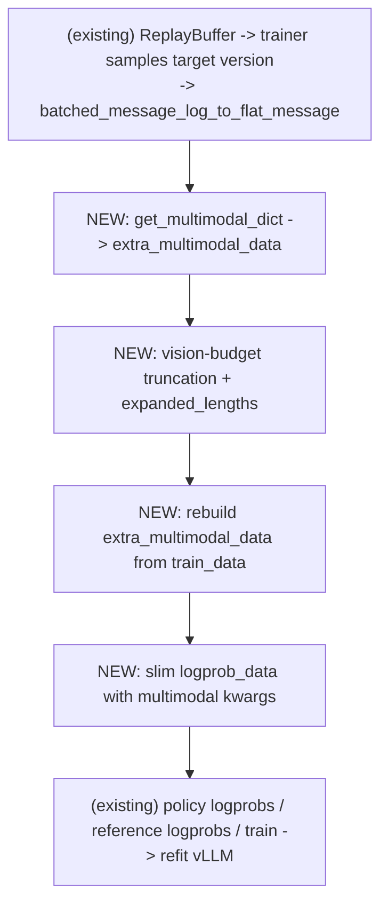

# Async GRPO Multimodal Support (NeMo Gym Path)

This design document describes the work required to add multimodal rollout and
training support to async GRPO **on the NeMo Gym path only**. The target
workload is the Nano v3 Omni vision RL run launched by
`batch_nanov3_gym_grpo.sh`, which currently runs **sync** GRPO with vision data
through NeMo Gym (`examples/nemo_gym/run_grpo_nemo_gym.py` +
`examples/nemo_gym/grpo_nanov3omni.yaml`). The non-gym async VLM path is
out of scope and is captured in its own section at the end.

## Summary

NeMo Gym + async generation is already fully plumbed for text rollouts. The
gym rollout helper, `run_async_nemo_gym_rollout`, also already preserves VLM
multimodal payloads (`pixel_values`, `imgs_sizes`, etc.) end-to-end via
`_postprocess_nemo_gym_to_nemo_rl_result` (primary) and
`_reattach_multimodal_payloads` (safety net). The only blocker for running
`batch_nanov3_gym_grpo.sh`-style workloads in async mode is on the **trainer
side**: `async_grpo_train()` builds a text-only `train_data` and never
attaches the multimodal tensors that the VLM policy forward needs.

The Phase 1 change is therefore narrow:

- Add a `processor` parameter to `async_grpo_train()`.
- Port the sync multimodal block from `grpo_train()` (`grpo.py:2137–2281`)
  into `async_grpo_train()`.
- Pass `processor=processor` from `run_grpo_nemo_gym.py` into
  `async_grpo_train()`.
- Add an explicit async-side reject for `deduplicate_multimodal_data: true`
  (the existing sync guard does not cover the async branch).
- Flip async flags in the gym YAML (or via Hydra overrides) and run a tiny
  smoke.

Phase 2 (deduplication and replay-buffer memory) replaces the Phase 1 reject
with a real async dedup implementation.

Phase 3 (production stabilization) covers TIS, sequence-level IS, multi-step
runs, and `in_flight_weight_updates`.

## Goals

- Enable async GRPO for the NeMo Gym VLM workflow used by
  `batch_nanov3_gym_grpo.sh` (`grpo_nanov3omni.yaml`).
- Preserve multimodal payloads needed by NeMo Gym rollouts and policy
  training.
- Keep existing sync GRPO behavior (both gym + non-gym) unchanged.
- Keep existing async text GRPO behavior (both gym + non-gym) unchanged.
- Keep replay-buffer memory bounded and observable for the gym workload.
- Add focused tests that fail if multimodal payloads are dropped on the gym
  path.

## Non-Goals

- Do not redesign the GRPO objective.
- **Do not add async VLM support to the non-gym path**
  (`examples/run_vlm_grpo.py` + `run_async_multi_turn_rollout`). That work
  needs a rollout-side refactor that is not justified by the current
  workload and will be specified in a separate design doc.
- Do not add support for every possible media type in the first pass. Images
  are the first target because the Nano v3 Omni gym workflow uses image
  prompts.
- Do not optimize all memory-transfer paths before first correctness. The
  first implementation can be conservative but must have a path to
  dedup/compact storage before large runs.

## Current State Matrix

Four axes interact: sync vs async generation, gym vs non-gym rollout, and
text vs VLM data. The current support is:

- **Sync + non-gym + text**: works (`run_grpo.py` + `run_multi_turn_rollout`).
- **Sync + non-gym + VLM**: works (`run_vlm_grpo.py` +
  `run_multi_turn_rollout` with `vllm_content` / `vllm_images` /
  `get_multimodal_dict`).
- **Sync + gym + text**: works (`run_grpo_nemo_gym.py` +
  `run_async_nemo_gym_rollout` invoked from inside `grpo_train`). Note: gym
  always uses async generation internally; "sync" here means the training
  loop alternates generate/train.
- **Sync + gym + VLM**: works (`run_grpo_nemo_gym.py` with `is_vlm=true`
  + `_postprocess_nemo_gym_to_nemo_rl_result` + `_reattach_multimodal_payloads`).
  This is the current `batch_nanov3_gym_grpo.sh` workload.
- **Async + non-gym + text**: works (`run_grpo.py` with
  `grpo.async_grpo.enabled=true` + `async_grpo_train`).
- **Async + gym + text**: works (`run_grpo_nemo_gym.py` with
  `grpo.async_grpo.enabled=true` — see `run_grpo_nemo_gym.py:255–299`).
- **Async + gym + VLM**: missing on **trainer** side only. **This is the
  sole target of this design.**
- **Async + non-gym + VLM**: missing on **rollout** and **trainer** sides.
  **Out of scope for this doc** — see "Out of Scope: Non-Gym Async VLM".

## Current Sync Gym VLM Flow

The current production launcher for vision is:

```text
batch_nanov3_gym_grpo.sh
```

It runs:

```text
uv run --no-sync examples/nemo_gym/run_grpo_nemo_gym.py \
  --config examples/nemo_gym/grpo_nanov3omni.yaml ...
```

`examples/nemo_gym/run_grpo_nemo_gym.py` already handles VLM end-to-end at
`run_grpo_nemo_gym.py:155–172`:

- checks `policy.is_vlm`
- if VLM, calls `get_tokenizer(..., get_processor=True)` and exposes
  `processor.tokenizer` as the tokenizer
- asserts `policy.generation.vllm_cfg.skip_tokenizer_init=false`
- calls `setup_response_data(processor, ...)` (line 187)
- calls `setup(..., processor=processor)` (line 230)

It also already has the async branch at `run_grpo_nemo_gym.py:255–299`:

- if `grpo.async_grpo.enabled`, rejects DAPO features (dynamic sampling,
  reward scaling, reward shaping) and calls `async_grpo_train(...)`
- else calls `grpo_train(...)`

The gym VLM dataset processor is:

```text
nemo_rl/data/processors.py::nemo_gym_data_processor  (lines 722–766)
```

When given an `AutoProcessor`, it detects VLM mode (`is_multimodal_processor`)
and delegates to `nemo_gym_example_to_nemo_rl_datum_spec`. The resulting
`DatumSpec` has a `message_log` whose user message carries the HF-processor
token layout (`/<image>×N/</img>`) **and** the multimodal `PackedTensor`
fields (`pixel_values`, `imgs_sizes`, ...) Megatron needs.

Unlike `vlm_hf_data_processor`, the gym path does **not** populate
`vllm_content` / `vllm_images`. Gym builds prompts server-side from
`responses_create_params` in `extra_env_info`; image refs flow through the
gym-side request payload, not through `vllm_content`.

The sync rollout path is:

```text
grpo_train()
  -> _should_use_nemo_gym() == true
  -> run_async_nemo_gym_rollout(input_batch=repeated_batch, ...)   # grpo.py:1924–1940
     -> nemo_gym_environment.run_rollouts.remote(
            nemo_gym_rows,
            tokenizer,
            ...,
            original_message_logs=input_batch.get("message_log"),
        )
        -> _postprocess_nemo_gym_to_nemo_rl_result(...)  # nemo_gym.py:441–523
            # PRIMARY attach: extracts non-text user-message keys from
            # original_message_log at lines 449–458 and attaches them to
            # the first-turn user message of the result at lines 520–523
     -> _tensorize_by_key(...)
     -> _reattach_multimodal_payloads(results, input_batch.get("message_log"))  # rollouts.py:1378
        # SAFETY NET: re-runs the same attach if the gym side missed it
```

The **primary** multimodal carry-through happens inside the NeMo Gym worker
at `nemo_gym.py:441–523`. `_postprocess_nemo_gym_to_nemo_rl_result` extracts
every non-text key (`pixel_values`, `imgs_sizes`, etc.) from the user
message of `original_message_log` and attaches it onto the first-turn user
message of the result. `_reattach_multimodal_payloads` in
`rollouts.py:1056–1072` is an additional safety pass that re-attaches the
same data on the trainer-call side in case the gym post-processing missed
it. Together they make sync gym VLM work without any extra rollout-side
wiring.

The sync training path is rollout-agnostic. `grpo_train` flattens
`repeated_batch["message_log"]`, calls `get_multimodal_dict`, applies
vision-budget truncation, and builds a slim `logprob_data` — exactly the same
path as the non-gym sync VLM run. This is the behavior async GRPO must match.

## Current Async Gym Text Flow

For gym + async + text, the path is:

```text
examples/nemo_gym/run_grpo_nemo_gym.py
  -> async_grpo_train()
     -> AsyncTrajectoryCollector.start_collection(dataloader)
        -> _process_batch() slices one prompt, repeat_interleave(N), spawns worker
        -> _run_prompt_group_worker():
             if _should_use_nemo_gym(master_config):
                 run_async_nemo_gym_rollout(...)            # async_utils.py:1153–1185
             else:
                 run_async_multi_turn_rollout(...)
     -> ReplayBuffer
```

The collector already dispatches between gym and non-gym rollout helpers based
on `_should_use_nemo_gym(master_config)`. For text, no multimodal handling is
needed. For VLM, **the gym rollout already preserves `pixel_values`** via
`_reattach_multimodal_payloads` — so the replay buffer entries contain
multimodal `message_log` payloads. The only thing the trainer does wrong is
ignoring them.

## Current Async Non-Gym Text Flow (Reference Only)

Brief background for readers comparing dispatchers; **this path is not
modified by this design**.

```text
examples/run_grpo.py
  -> async_grpo_train()
     -> AsyncTrajectoryCollector
        -> _run_prompt_group_worker -> run_async_multi_turn_rollout()  # non-gym branch
     -> ReplayBuffer
```

The collector samples one prompt, repeats N times, runs
`run_async_multi_turn_rollout`, pushes the group to replay. The trainer
samples groups, concatenates with `BatchedDataDict.from_batches`, builds
text-only `train_data`, runs logprob/train/refit. For text this is
production-ready. Adding VLM to this path requires a rollout-side refactor
that is outside this design — see "Out of Scope: Non-Gym Async VLM".

## Existing Code Touch Points

The implementation will modify these locations. Line numbers are from the
current `nemo-rl-super-vllm0.20` checkout and may drift; treat them as anchors
for `grep`.

### For gym + async + VLM (Phase 1, primary)

**Entry point — already async-capable**:

- `examples/nemo_gym/run_grpo_nemo_gym.py:155–172` already handles `is_vlm`,
  builds `processor`, passes it into `setup()` (line 230).
- `examples/nemo_gym/run_grpo_nemo_gym.py:255–299` already dispatches to
  `async_grpo_train(...)` when `grpo.async_grpo.enabled` is true. **Needs to
  start passing `processor=processor` to that call.**

**Async rollout — already preserves multimodal payloads**:

- `nemo_rl/algorithms/async_utils.py:1153–1185` already dispatches to
  `run_async_nemo_gym_rollout` for gym mode.
- `nemo_rl/experience/rollouts.py:1056–1072` (`_reattach_multimodal_payloads`)
  copies non-text user-message keys (`pixel_values`, `imgs_sizes`, ...) back
  onto results.
- `nemo_rl/experience/rollouts.py:1378` calls `_reattach_multimodal_payloads`
  inside `run_async_nemo_gym_rollout`.
- `nemo_rl/algorithms/async_utils.py:974–975` (`_process_batch`)
  `slice(prompt).repeat_interleave(num_generations)` already deep-copies
  `message_log[i]` (Python list of dicts) per repeat, which propagates the
  `PackedTensor` per-message payloads cleanly (same mechanism sync GRPO uses at
  `grpo.py:1833`).

**Async trainer — the gap**:

- `nemo_rl/algorithms/grpo.py:3030` (`async_grpo_train` signature) lacks
  `processor`.
- `nemo_rl/algorithms/grpo.py:3555–3574` builds a text-only `train_data` (no
  `extra_multimodal_data`, no vision-budget truncation, no `expanded_lengths`).
- `nemo_rl/algorithms/grpo.py:3600–3616` calls `policy.get_logprobs` and
  `policy.get_reference_policy_logprobs` with that text-only data.

**Sync references to mirror**:

- `nemo_rl/algorithms/grpo.py:2137–2252` `extra_multimodal_data`,
  `_dedup_prompt_idx` dedup, vision-budget truncation, `expanded_lengths`.
- `nemo_rl/algorithms/grpo.py:2264–2281` slim `logprob_data` construction with
  `**extra_multimodal_data`.

### Existing guards (also relevant to the deferred non-gym path)

- `nemo_rl/algorithms/grpo.py:1766–1775` rejects
  `grpo.deduplicate_multimodal_data` for async — **but** this check is inside
  `def grpo_train(...)` at line 1699 (the sync branch). When
  `async_grpo_train` runs, it never fires. So today an async config with
  `deduplicate_multimodal_data: true` silently runs without dedup instead of
  erroring. Phase 1 must **add** an equivalent reject inside
  `async_grpo_train` (or the entrypoint dispatchers) so users see an immediate
  error. Phase 2 replaces that reject with a real async-side dedup
  implementation.
- `nemo_rl/algorithms/grpo.py:826–828` rejects FP8 KV cache for async
  rollouts. Keep as-is.
- `nemo_rl/models/generation/vllm/vllm_worker_async.py:959–963` asserts
  `batch_size == 1`. The async per-sample rollout already complies; do not
  break this in any micro-batching refactor.
- `nemo_rl/distributed/batched_data_dict.py:824–827` raises
  `NotImplementedError` for `PackedTensor.repeat_interleave`. See "Hidden
  Constraints" below.

## Problem Statement

The gym async path delivers full multimodal replay entries (`pixel_values`
attached to the user message of `message_log[i]`) via
`_postprocess_nemo_gym_to_nemo_rl_result` + `_reattach_multimodal_payloads`.
But `async_grpo_train()` builds a text-only `train_data`. The VLM policy
forward then has no image tensors to consume, and the run crashes inside
`policy.get_logprobs(...)` or the Megatron sequence packer.

Specifically, `async_grpo_train` at `grpo.py:3565–3574` constructs:

```python
train_data = BatchedDataDict[ClippedPGLossDataDict]({
    "input_ids":           flat_messages["token_ids"],
    "input_lengths":       input_lengths,
    "generation_logprobs": flat_messages["generation_logprobs"],
    "token_mask":          flat_messages["token_loss_mask"],
    "sample_mask":         repeated_batch["loss_multiplier"],
})
```

It is missing the entire multimodal block that sync `grpo_train` performs at
`grpo.py:2137–2281`: `extra_multimodal_data`, optional vision-budget
truncation, `expanded_lengths`, and a slim `logprob_data` carrying the
multimodal kwargs.

The trainer-side gap is the **only** blocker for the
`batch_nanov3_gym_grpo.sh` workload. Every other piece (entry-point async
branch, collector dispatch, rollout-side multimodal carry-through) is
already in place.

### Hidden Constraints

These are not data-contract gaps but they constrain how the data is wired:

1. **`PackedTensor` cannot live at the top level of the per-prompt batch.**
   `BatchedDataDict.repeat_interleave` raises `NotImplementedError` for
   `PackedTensor` values (`batched_data_dict.py:824–827`). The collector at
   `nemo_rl/algorithms/async_utils.py:974–975` slices one prompt and calls
   `repeat_interleave(num_generations)`; image tensors must therefore stay as
   `PackedTensor` inside `message_log[i]` (deep-copied per repeat, dedup applied
   later in the trainer) and `vllm_images` must remain a Python list of refs.

2. **Async dedup is currently gated off.** `grpo.py:1772–1775` raises
   `ValueError` when both `grpo.deduplicate_multimodal_data: true` and async
   rollouts are configured. Phase 2 must lift this and replace it with an
   async-compatible dedup pipeline.

3. **vLLM async worker is strictly per-sample.** `vllm_worker_async.py:959–963`
   asserts `batch_size == 1`. The async per-sample rollout already complies;
   future micro-batching of generation must not break this without also
   refactoring the worker.

4. **Single-turn VLM only.** `run_multi_turn_rollout`'s env step
   (`rollouts.py:512–517`) tokenizes env observations as text-only and does not
   append new images to `message_log`. `vllm_content` / `vllm_images` are also
   never updated turn-over-turn. Nano v3 vision RL therefore runs with
   `max_rollout_turns: 1`. The async path should preserve this invariant (or
   assert it) until multi-turn VLM is designed.

5. **FP8 KV cache is incompatible with async rollouts.** Already enforced at
   `grpo.py:826–828`. No change required, but it limits which Nano v3 configs
   can be ported as-is.

## Design Principles

- Reuse sync VLM data contracts instead of introducing a separate async-only
  payload format.
- Keep generation payloads and training payloads separate:
  - vLLM generation needs `vllm_content`, `vllm_images`, and related
    lightweight prompt metadata.
  - policy logprob/training needs `PackedTensor` multimodal tensors from
    flattened message logs.
- Make the replay buffer store complete prompt groups, but avoid multiplying
  large media tensors when possible.
- Preserve text-only async behavior by making all multimodal handling optional.
- Add diagnostics before adding aggressive memory optimizations.

## Proposed Architecture (Gym Path)

The thesis of this design is "only the trainer-side multimodal block is
new." Existing async gym text flow stays unchanged; the four boxes below
are the entire delta in `async_grpo_train`:



Everything upstream (dataloader → collector → gym rollout → replay buffer)
and downstream (policy forward → refit) is unchanged. The gym rollout
already attaches `pixel_values` to `message_log[0]` via
`_postprocess_nemo_gym_to_nemo_rl_result` (primary) and
`_reattach_multimodal_payloads` (safety net), so the trainer only needs
to consume what's already there.

## Data Contract

### Prompt Batch Fields

The async collector must preserve these optional fields from the dataloader
batch:

- `message_log`
- `extra_env_info`
- `task_name`
- `idx`
- `length`
- `loss_multiplier`
- `stop_strings`
- `vllm_content`
- `vllm_images`
- `vllm_videos`
- `vllm_max_num_tiles`
- `vllm_max_num_patches`
- multimodal `PackedTensor` fields inside `message_log`

The first pass should support images. Video/audio fields can follow the same
pass-through design but need separate smoke tests.

### Replay Entry

Replay should continue to store one entry per prompt group:

```text
1 prompt x num_generations_per_prompt completions
```

For a VLM prompt with 16 generations, all 16 responses for that prompt remain in
one replay entry. This is required so GRPO can compute per-prompt advantages.

Each replay entry contains:

- `batch`: final rollout batch moved to CPU
- `rollout_metrics`
- `timestamp`
- generation weight version
- target training weight version

For multimodal data, the batch must include enough information to later rebuild:

- generation logprobs from generated assistant messages
- prompt-only ids for advantage grouping
- multimodal tensors/metadata for policy logprob and training
- original `vllm_*` prompt fields only if needed for logging or future
  multi-turn generation

## Entry Point Changes

### `examples/nemo_gym/run_grpo_nemo_gym.py`

Already async-capable and already VLM-aware. The only change required is to
forward `processor` into the async branch:

```python
async_grpo_train(
    policy=policy,
    policy_generation=policy_generation,
    dataloader=dataloader,
    val_dataloader=val_dataloader,
    tokenizer=tokenizer,
    loss_fn=loss_fn,
    task_to_env=task_to_env,
    val_task_to_env=val_task_to_env,
    logger=logger,
    checkpointer=checkpointer,
    grpo_save_state=grpo_state,
    master_config=master_config,
    max_trajectory_age_steps=async_config["max_trajectory_age_steps"],
    processor=processor,  # NEW
)
```

The sync branch at `run_grpo_nemo_gym.py:300–318` already passes `processor`
to `grpo_train`, so this is the analogous wiring.

Existing assertions already cover what async needs:

- `is_vlm` block asserts `skip_tokenizer_init=False`
  (`run_grpo_nemo_gym.py:169–172`).
- DAPO features (dynamic sampling, reward scaling, reward shaping) are
  already rejected for async (`run_grpo_nemo_gym.py:255–278`).

### `examples/run_grpo.py` (text path, signature consistency)

Update the `async_grpo_train(...)` call site (lines 132–176) to pass
`processor=None` so the new signature is consistent. No behavior change.

## Rollout Changes

**None for this design.** The gym async rollout helper
`run_async_nemo_gym_rollout` already preserves multimodal payloads via
`_postprocess_nemo_gym_to_nemo_rl_result` (`nemo_gym.py:441–523`, primary)
and `_reattach_multimodal_payloads` (`rollouts.py:1378`, safety net). Phase
1 needs zero changes to any rollout helper.

## Async Trainer Changes (Phase 1, Primary)

This is the core of the gym + async + VLM work. The trainer must:

1. Accept a `processor` parameter (new in `async_grpo_train` signature at
   `grpo.py:3030`).
2. After flattening `repeated_batch["message_log"]`, build
   `extra_multimodal_data` and merge it into `train_data`.
3. Apply vision-budget truncation + `expanded_lengths` when `imgs_sizes` is
   present and `processor` is non-None.
4. Build a slim `logprob_data` carrying multimodal kwargs and pass it (not
   `train_data`) to `policy.get_logprobs` and
   `policy.get_reference_policy_logprobs`.

The source `pixel_values` arrive via
`_postprocess_nemo_gym_to_nemo_rl_result` (and `_reattach_multimodal_payloads`
as a safety net) on the rollout side and survive
`BatchedDataDict.from_batches` in the trainer because each replay entry's
`message_log` is a Python list of dicts.

### Build Multimodal `train_data`

Port the sync multimodal block into `async_grpo_train()` after message
flattening:

```python
flat_messages, input_lengths = batched_message_log_to_flat_message(
    repeated_batch["message_log"],
    pad_value_dict={"token_ids": tokenizer.pad_token_id},
    make_sequence_length_divisible_by=master_config["policy"][
        "make_sequence_length_divisible_by"
    ],
)

train_data = BatchedDataDict(
    {
        "input_ids": flat_messages["token_ids"],
        "input_lengths": input_lengths,
        "generation_logprobs": flat_messages["generation_logprobs"],
        "token_mask": flat_messages["token_loss_mask"],
        "sample_mask": repeated_batch["loss_multiplier"],
    }
)

extra_multimodal_data = flat_messages.get_multimodal_dict(as_tensors=False)
train_data.update(extra_multimodal_data)
train_data.to("cpu")
```

### Trainer Implementation Notes

The sync reference block to mirror is `grpo.py:2137–2252`. The async block
should:

1. Build `extra_multimodal_data` from
   `flat_messages.get_multimodal_dict(as_tensors=False)`. When dedup is enabled
   (Phase 2), pass `pixel_dtype=torch.bfloat16` so the dedup path downcasts
   pixel tensors once.
2. Run vision-budget truncation only when both `"imgs_sizes" in train_data` and
   `processor is not None`. Without this, the Megatron sequence packer crashes
   with "Sequence length N exceeds bin capacity" on samples whose
   vision-expanded length exceeds `policy.max_total_sequence_length` — this is
   exactly the failure mode the warning at `grpo.py:2192–2208` describes. The
   async trainer must therefore receive `processor` (today
   `run_grpo_nemo_gym.py:230` passes it into `setup()`, but the async branch
   at lines 285–299 does not forward it to `async_grpo_train`).
3. Compute `train_data["expanded_lengths"]` via `compute_expanded_lengths`
   (`grpo.py:2241–2252`) for parity with the sync path. **Status as of
   this writing: `expanded_lengths` appears to be dead data — the single
   producer at `grpo.py:2241` writes it, and no consumer reads it
   anywhere in `nemo_rl/`.** Sync may rely on the packer inferring vision
   expansion from `input_lengths + imgs_sizes` directly. Either:

   - Keep computing it for forward-compat (cheap; if a future packer
     change reads it, async is ready), or
   - Drop it entirely once the sync investigation below confirms it is
     never consumed.

   **Phase 1 investigation task**: trace whether the Megatron VLM
   sequence packer consumes `expanded_lengths` via any indirect path
   (e.g., `make_sequence_length_divisible_by`, sequence-packing
   algorithms). If sync today silently drops tokens for vision-expanded
   samples that exceed budget, that is a latent sync bug; document it in
   the Phase 1 MR description and decide whether async should inherit or
   diverge.
4. **After vision-budget truncation, unconditionally rebuild
   `extra_multimodal_data` from `train_data`.** `truncate_for_expanded_budget`
   returns a new `train_data` and **can** drop image groups when a sample's
   vision-expanded length exceeds `max_total_sequence_length` (see
   `_trim_image_data_for_truncated_sample` at `multimodal.py:356–382`). The
   `extra_multimodal_data` dict captured before truncation then references
   stale `PackedTensor` objects, and the slim `logprob_data` built from it
   would ship pre-truncation pixel data to the policy while `train_data`
   carries the truncated version. Sync GRPO has the same latent fragility;
   async should fix it explicitly. Do this unconditionally (don't gate on
   `vision_truncated.any()`) — copying dict references is O(1), and the
   gate just adds nesting plus a footgun if truncation is ever extended to
   modify multimodal tensors silently:

   ```python
   if "imgs_sizes" in train_data and processor is not None:
       train_data, _ = truncate_for_expanded_budget(...)
       train_data["expanded_lengths"] = compute_expanded_lengths(...)
       # Always rebuild from train_data so logprob_data sees truncated
       # multimodal tensors (no-op when truncation didn't fire).
       extra_multimodal_data = {
           k: train_data[k]
           for k in extra_multimodal_data
           if k in train_data
       }
   ```
5. Build a slim `logprob_data = {"input_ids", "input_lengths",
   **extra_multimodal_data}` and pass that (not `train_data`) into
   `policy.get_logprobs` and `policy.get_reference_policy_logprobs`. This
   avoids shipping masks/advantages over Ray and matches sync VLM behavior.
6. Use `infer_unique_prompt_count(repeated_batch, default_rows=train_data.size)`
   (sync line 2169) before calling logprob/train so multimodal
   payload-bytes metrics stay comparable between sync and async runs.
7. **Raise on empty multimodal data (Layer B scope guard).** After
   `extra_multimodal_data` is built, if `policy.is_vlm` is true but
   `extra_multimodal_data` is empty, raise. The config-time reject
   (Phase 1 step 5) handles the common "async + VLM + non-gym"
   misconfiguration; this runtime check catches the rarer case where the
   data processor or collator silently drops multimodal data en route
   (future bug, regression).

   Use a hard raise rather than a warn-and-continue. An `<image>` token in
   `input_ids` without `pixel_values` will either crash the policy forward
   ~200 lines deeper with an opaque shape mismatch, hit the vision
   tower's "image_features is None" path, or train silently on noise — in
   every case, debugging starts from a worse position than failing at the
   trainer boundary with an informative message:

   ```python
   if master_config["policy"].get("is_vlm") and not extra_multimodal_data:
       raise RuntimeError(
           "is_vlm=True but flat_messages.get_multimodal_dict() returned "
           "empty for this replay batch. Check that the replay batch "
           "carries pixel_values on message_log[0]. Training a VLM "
           "policy without multimodal data corrupts gradients (image "
           "tokens train on noise) — refusing to proceed."
       )
   ```

### Testability: Extract a Helper

`async_grpo_train` is monolithic and Ray-heavy, which makes the multimodal
trainer changes hard to unit-test directly. Recommend factoring the
"build train_data + logprob_data from a replay batch" logic into a free
function:

```python
def build_async_train_and_logprob_data(
    repeated_batch: BatchedDataDict[DatumSpec],
    tokenizer: TokenizerType,
    processor: Optional[AutoProcessor],
    master_config: MasterConfig,
) -> tuple[
    BatchedDataDict[ClippedPGLossDataDict],  # train_data
    BatchedDataDict[ClippedPGLossDataDict],  # logprob_data
]:
    """Encapsulates flat-message build, extra_multimodal_data attach,
    optional vision-budget truncation + expanded_lengths, post-truncation
    rebuild, and slim logprob_data construction."""
    ...
```

This lets unit tests assert multimodal payload preservation against fixture
`repeated_batch` values without spinning up the collector, replay buffer,
or policy actors. `async_grpo_train` then becomes a thin caller of this
helper plus the existing logprob/train/refit orchestration.

**Scope of the helper is narrow.** It covers only the multimodal-aware
data-shaping slice (flatten → mm dict → truncation → expanded_lengths →
slim logprob_data). It does **not** unify the sync and async trainers:
the sync trainer also handles dynamic sampling, reward shaping/scaling,
zero-variance prompt filtering, and val-step orchestration, none of which
exist on the async path today. Readers planning a broader sync/async
unification should treat that as out of scope for this design.

### Use Smaller `logprob_data`

For policy logprobs and reference logprobs, follow sync GRPO and avoid sending
loss-only fields:

```python
logprob_data = BatchedDataDict(
    {
        "input_ids": train_data["input_ids"],
        "input_lengths": train_data["input_lengths"],
        **extra_multimodal_data,
    }
)

train_data["prev_logprobs"] = policy.get_logprobs(logprob_data)["logprobs"]
```

This avoids unnecessary Ray payload size and matches sync VLM behavior.

### Advantages

Advantage computation does not need image tensors. It should continue to use
prompt ids extracted from prompt-only message logs.

Care must be taken to preserve prompt grouping after replay sampling. Each replay
entry is one prompt group, and `BatchedDataDict.from_batches()` concatenates
entries in sampled order. This preserves the group structure required by GRPO.

## Deduplication and Memory

### Why It Matters

The two Nano v3 vision configs disagree on dedup today:

- `examples/nemo_gym/grpo_nanov3omni.yaml:33` (gym, **Phase 1 target**):
  `deduplicate_multimodal_data: false`
- `examples/omni/nanov3_vision_rl.yaml:20` (non-gym, out of scope for this
  doc — see "Out of Scope: Non-Gym Async VLM"):
  `deduplicate_multimodal_data: true`
- `examples/configs/nanov3_vision_rl_truncated.yaml:35` (small baseline):
  `false` with a noted toggle-to-true follow-up

Phase 1 of gym async deliberately keeps `false` so the data path is proved
end-to-end before adding async dedup. Without deduplication, one prompt
repeated for `num_generations_per_prompt` (16 in nanov3omni) duplicates the
same image tensor 16 times in memory, and async GRPO makes this worse because
the replay buffer can hold multiple prompt groups at once and checkpoint them
into `replay_buffer.pt`.

### Minimum Correctness Mode

For initial smoke tests, allow async VLM to run with:

```yaml
grpo:
  deduplicate_multimodal_data: false
```

This proves the end-to-end data path before optimizing memory. This mode should
be restricted to tiny datasets and one-step tests.

### Production Mode

Production async VLM should support deduplication.

The sync path creates `_dedup_prompt_idx` before repeated generation:

```python
repeated_batch["_dedup_prompt_idx"] = torch.arange(batch.size).repeat_interleave(
    num_generations_per_prompt
)
```

In async collector mode, each worker operates on one prompt at a time. For one
replay entry:

```python
repeated_batch["_dedup_prompt_idx"] = torch.zeros(
    num_generations_per_prompt,
    dtype=torch.long,
)
```

After the trainer samples multiple replay entries and concatenates them, the
prompt indices may need to be rebuilt globally:

```python
prompt_indices = torch.arange(num_prompts_per_step).repeat_interleave(
    num_generations_per_prompt
)
```

Then, for each multimodal `PackedTensor`:

```python
extra_multimodal_data[key] = packed_tensor.deduplicate(prompt_indices)
```

This should be applied before `policy.get_logprobs()` and `policy.train()`.

### Critical: Rebuild `_dedup_prompt_idx` After Replay Concat

`BatchedDataDict.from_batches` at `batched_data_dict.py:184–233` concatenates
per-replay-entry tensor values with `torch.cat`. If each replay entry stores a
per-entry `_dedup_prompt_idx = torch.zeros(num_generations)`, concatenation
produces `[0, 0, ..., 0]` across the entire global batch — every prompt
collapses to the same prompt id, which over-deduplicates image tensors and
silently corrupts the gradient.

The trainer **must overwrite** (not append-if-missing) the concatenated
`_dedup_prompt_idx` after `from_batches`. `from_batches` always produces a
corrupted version of this key — it concatenates the per-entry zeros into a
global all-zero tensor — so the trainer cannot rely on absence-checks.

For sync reference: the equivalent setter lives at `grpo.py:1839–1843` and
operates on `repeated_batch` after `batch.repeat_interleave(num_generations)`.
Phase 2 must reproduce its semantics from the trainer side instead, because
the async collector produces per-prompt-group batches before they reach the
trainer.

The recommended form uses **dynamic per-group sizes** as forward-looking
defense:

```python
repeated_batch = BatchedDataDict.from_batches(per_prompt_batches)
num_prompt_groups = len(per_prompt_batches)
sizes = torch.tensor(
    [b.size for b in per_prompt_batches], dtype=torch.long
)
# Always overwrite — from_batches will have populated a corrupted version.
repeated_batch["_dedup_prompt_idx"] = torch.arange(
    num_prompt_groups, dtype=torch.long
).repeat_interleave(sizes)
```

Today, every replay entry that lands in the buffer has exactly
`num_generations_per_prompt` rows:

- `overlong_filtering: true` (set in `grpo_nanov3omni.yaml`) masks rows via
  `loss_multiplier[truncated] = 0` at `grpo.py:3526-3535`; it does **not**
  drop rows from the prompt group.
- `_run_prompt_group_worker` (`async_utils.py:1267–1314`) retries 3× on
  rollout failure, then drops the **entire** prompt group from the buffer
  (not "shrinks it to fewer rows"). So buffer entries never partially fill.

The dynamic-sizes pattern is therefore future-proofing against:

- Future per-completion filtering inside the gym worker.
- A future dynamic-sampling design that filters individual completions
  rather than whole prompt groups.
- Any change that allows partial prompt groups in the replay buffer.

To make the forward-looking nature explicit, add **two** Phase 1 unit
tests:

- **Invariant**: assert that every replay entry pushed by the collector
  has exactly `num_generations_per_prompt` rows. This locks in the current
  behavior; any future regression that lets partial groups through breaks
  the test loudly.
- **Trainer rebuild correctness**: feed the trainer a synthetic mixed
  batch with sizes `[16, 14, 16]` and assert `bincount(_dedup_prompt_idx)
  == [16, 14, 16]`. This verifies the rebuild remains correct **when** the
  invariant is intentionally relaxed in the future.

### Add Async-Side Dedup Guard, Then Implement

The existing reject at `grpo.py:1766–1775` is inside `grpo_train()` and never
fires for the async branch. As a **Phase 1** task, add an analogous reject at
the top of `async_grpo_train()` (or in the entrypoint dispatchers) so an
async config with `deduplicate_multimodal_data: true` errors immediately
instead of silently running without dedup:

```python
if master_config["grpo"].get("deduplicate_multimodal_data"):
    raise ValueError(
        "grpo.deduplicate_multimodal_data is not yet supported for async "
        "GRPO. Set to false for Phase 1; Phase 2 will add async dedup."
    )
```

In Phase 2, replace this reject with the real async dedup implementation
described above ("Critical: Rebuild `_dedup_prompt_idx` After Replay
Concat"). Phase 2 exit criteria should explicitly include "async VLM run
completes with `deduplicate_multimodal_data: true` and matches dedup-off
gradient norms to within tolerance."

### Verifying Dedup Correctness

Dedup is purely a transport optimization: one image-tensor copy plus
`_dedup_indices` references instead of N copies. The trainer's `train_data`
and `logprob_data` semantics — and the gradients they produce — must be
unchanged.

**Infrastructure-level check (does dedup actually reduce bytes?):**

The existing helpers in `nemo_rl/utils/multimodal_payload_metrics.py`
emit:

- `payload_bytes/{boundary}/tensor_mm` — bytes of `PackedTensor` payloads
- `payload_bytes/{boundary}/non_tensor_mm` — bytes of non-tensor mm refs
- `unique_prompts` — logical row count (invariant to dedup)

Define the dedup ratio as:

```text
dedup_ratio = payload_bytes[dedup_off] / payload_bytes[dedup_on]
```

Expected `dedup_ratio ≈ num_generations_per_prompt` (one image per unique
prompt instead of N copies). For nanov3omni defaults
(`num_generations_per_prompt=16`), `dedup_ratio` should be 12–20. Outside
that range:

- `< 10` → dedup partially broken (most likely the `_dedup_prompt_idx`
  rebuild is wrong; see "Critical: Rebuild"). Inspect
  `torch.bincount(_dedup_prompt_idx)` on the concatenated batch.
- `> 20` → test artifact (e.g., dedup-on accidentally also dropping
  unique prompts). Check that `unique_prompts` is identical between
  dedup-on and dedup-off runs.

**Semantic-level check (does dedup produce equivalent gradients?):**

Harder. Use `tests/functional/vlm_grpo_async_gym_dedup_compare.sh`:

- Same config, same seed, dedup-on and dedup-off back-to-back.
- Assert bit-identical (or near-identical) per-step:
  - `train/loss` to ≥3 decimal places
  - `train/grad_norm` to ≥3 decimal places
  - `train/token_mult_prob_error` exact (IS correction unchanged)
- Assert significant bytes reduction:
  - `payload_bytes/driver_to_policy_get_logprobs/tensor_mm[off]
    / payload_bytes/driver_to_policy_get_logprobs/tensor_mm[on] >= 10`

If gradient norms diverge but bytes correctly drop, dedup is reading
stale tensors — the most likely cause is the
`_dedup_prompt_idx` rebuild bug (Critique 1 forward-looking defense),
followed by the post-truncation rebuild bug (sync's latent fragility).

**Unit-level checks:**

- `test_packed_tensor_deduplicate_collapses_duplicates` — input
  `PackedTensor` with `prompt_indices=[0,0,1,1,2,2]`; assert output has
  3 unique tensor references and `_dedup_indices=[0,0,1,1,2,2]`.
- `test_async_trainer_payload_bytes_drop_with_dedup` — mock fixture;
  build `train_data` once with `deduplicate_multimodal_data=true` and
  once with `false`; assert `collect_multimodal_payload_metrics` reports
  `tensor_mm` ratio ≥ `num_generations_per_prompt - 2` (some slack for
  metadata overhead).

### Replay Storage Optimization

For Phase 2, store `PackedTensor` with dedup metadata inside the replay
entry. This is the lowest-risk path because `PackedTensor` already supports
dedup indices, slicing, concatenation, and CPU transfer; the trainer just
needs to respect the dedup metadata when reconstructing the global
prompt-index mapping (see "Critical: Rebuild..." above).

Pair this with the payload-bytes metrics described in Tests and
Observability so growth is visible. Do not optimize further until those
metrics demonstrate that the in-buffer footprint is the bottleneck.

### Future Work

Phase 2's `PackedTensor` + dedup-metadata approach is sufficient for the
target Nano v3 Omni workload. If Phase 3 metrics show the in-buffer
footprint is still the bottleneck after dedup, the recommended next step
is **side-table storage**: keep multimodal tensors in a side table keyed
by prompt id or dataset index, and let replay entries hold references
only. This is the option with the most favorable ratio of memory savings
to data-model disruption. Avoid pre-committing to it now; design it when
the metrics force the conversation.

## Out of Scope: Non-Gym Async VLM

The non-gym async VLM path (`examples/run_vlm_grpo.py` +
`run_async_multi_turn_rollout` + `examples/omni/nanov3_vision_rl.yaml`) is
**explicitly out of scope for this design** and will be specified in a
separate doc.

It is harder than the gym path because it lacks the gym's existing
multimodal carry-through (`_postprocess_nemo_gym_to_nemo_rl_result` +
`_reattach_multimodal_payloads`) and requires rollout-side refactoring:

- `async_generate_response_for_sample_turn` (`rollouts.py:584–648`) and its
  inner `dummy_batch` (lines 626–631) need to take a one-sample
  `BatchedDataDict` and forward `flat_messages.get_multimodal_dict(...)` +
  `vllm_*` fields.
- `run_sample_multi_turn_rollout` (`rollouts.py:651–683`) and
  `run_async_multi_turn_rollout` (`rollouts.py:871–877`) need to thread the
  constant per-sample pass-through fields through to per-turn generation.
- `examples/run_vlm_grpo.py` needs an async branch (currently always calls
  `grpo_train`).
- A defensive assertion that `max_rollout_turns == 1` for any sample
  carrying `vllm_images` / `vllm_content`, since
  `run_multi_turn_rollout`'s env step is text-only today.

The trainer-side changes specified in this doc (Phase 1, Phase 2) **are
reusable** by the non-gym design once its rollout-side gap is closed —
`async_grpo_train` becomes a single shared trainer regardless of which
rollout helper produced the replay entries. So the non-gym design only
needs to add its rollout-side changes and the `run_vlm_grpo.py` async
branch; it inherits the trainer work from this doc.

The non-gym design should also address:

- General multi-turn VLM `sample_state` (env steps that inject new images
  mid-rollout). No code path in the repo currently supports this.
- Whether to lift `_should_use_nemo_gym(master_config)` as the dispatch key
  or keep the dual-helper design.

## vLLM Multimodal Cache (Phase 1 Required)

**The sync vLLM worker resets vLLM multimodal cache before *every*
`generate(...)`** at `vllm_worker.py:965-966` — not just at refit
boundaries:

```python
if hasattr(self.llm, "reset_mm_cache"):
    self.llm.reset_mm_cache()
```

The comment is explicit: this is needed to keep the P0 sender and P1
receiver in sync across refit sleep/wake cycles **and LRU evictions**.
Without the reset, vLLM trips `Expected a cached item for mm_hash=...` in
`vllm.multimodal.cache`.

The async worker has **no equivalent**. Without it, async + VLM will
silently corrupt generation as soon as either (a) the sender's mm cache
LRU-evicts an entry the receiver still expects, or (b) a refit cycle
sleep/wakes the workers. Either failure surfaces as "missing cached
`mm_hash`" errors or, worse, stale per-worker mm state across refit/
sleep-wake — both of which are extremely hard to distinguish from RL
instability.

This is therefore a **Phase 1 correctness requirement**, not a Phase 3
polish item. The earlier framing in this doc (deferring to Phase 3) was
wrong.

The async vLLM engine runs as `AsyncLLM`, which wraps a distributed pool
of vLLM model workers managed by Ray. A local `self.llm.reset_mm_cache()`
call on the driver will **not** propagate to the model workers. The reset
must be issued via Ray's collective RPC interface so every worker
invalidates its own cache:

```python
# Inside VllmGenerationWorkerAsync, at the refit boundary
# (e.g. inside prepare_for_refit, or just before
# update_weights_from_collective):
if self.llm is not None:
    await self.llm.collective_rpc("reset_mm_cache", args=tuple())
```

**Cadence**: at minimum, call at every refit boundary (Phase 1 default).
The sync worker calls before *every* generate, which is safer but more
expensive on the async path because the worker has no natural "single
batch" boundary. For Phase 1, refit-boundary cadence is sufficient
because `in_flight_weight_updates: false` pauses generation around
refit. For Phase 3 with `in_flight_weight_updates: true`, evaluate
whether refit-boundary cadence is enough or whether a per-N-request
heartbeat reset is needed (per-request is too expensive and races with
in-flight requests).

**Do not** call this on the hot per-sample generation path:

- Per-request resets risk racing with concurrent in-flight async requests
  when `in_flight_weight_updates: true`.
- Per-request resets are also more expensive than necessary for the
  refit-driven divergence case the sync path is guarding against.

## Configuration Changes

Create an async variant of `examples/nemo_gym/grpo_nanov3omni.yaml`, or pass
Hydra overrides in `batch_nanov3_gym_grpo.sh`.

Required async overrides versus the current sync config:

```yaml
grpo:
  async_grpo:
    enabled: true                              # was false
    max_trajectory_age_steps: 1
    in_flight_weight_updates: false            # Phase 1 default; defer to Phase 3
    recompute_kv_cache_after_weight_updates: false

policy:
  generation:
    colocated:
      enabled: false                           # was true
      resources:
        num_nodes: 1                           # carve out generation cluster
        gpus_per_node: 2
    vllm_cfg:
      async_engine: true                       # was false
      skip_tokenizer_init: false               # already false in current yaml
      logprobs_mode: raw_logprobs               # match batch_nanov3_gym_grpo.sh

loss_fn:
  use_importance_sampling_correction: true     # was false

checkpointing:
  enabled: false                               # Phase 1 default; see Risks
```

The current `grpo_nanov3omni.yaml` already has
`deduplicate_multimodal_data: false`, `policy.is_vlm: true`,
`policy.sequence_packing.enabled: true`, and the right `vllm_kwargs`
(`limit_mm_per_prompt`, `skip_mm_profiling: true`,
`mm_processor_cache_gb=0`). Those stay as-is for Phase 1.

Why these matter for Phase 1:

- **`logprobs_mode: raw_logprobs`** (set by `batch_nanov3_gym_grpo.sh`)
  is not VLM-specific; it controls vLLM logprob fidelity and stabilizes
  TMPE comparison against the sync baseline. Without it, the TMPE
  thresholds in "Metrics & Thresholds" are measuring a different
  quantity than the sync run they're calibrated against.
- **`mm_processor_cache_gb=0`** (set by `batch_nanov3_gym_grpo.sh` via
  `+policy.generation.vllm_kwargs.mm_processor_cache_gb=0`) prevents
  vLLM's multimodal cache from accumulating across refit/sleep-wake
  cycles. Without it, the known failure class is "missing cached
  `mm_hash`" errors and stale per-worker mm state. This is the same
  failure surface that the new Phase 1 `collective_rpc("reset_mm_cache")`
  call (Phase 1 step 10) is guarding against; both belong in Phase 1.
- **`checkpointing.enabled: false`** is required for Phase 1 to avoid
  driver-node OOM from `replay_buffer.pt` serialization of duplicated
  image tensors (see "Replay Buffer Size and Pre-Trainer N-Copy" in
  Risks).

`in_flight_weight_updates: true` is intentionally **deferred to Phase 3**.
With `max_trajectory_age_steps: 1` it is not required for correctness, and
the interaction between async vLLM multimodal cache invalidation and
concurrent in-flight requests is not yet resolved (see "vLLM Multimodal
Cache" and "Open Questions"). Enabling it during Phase 1 risks confounding
correctness failures with cache races.

Stability knobs to evaluate during Phase 3:

```yaml
loss_fn:
  truncated_importance_sampling_ratio: 5
  truncated_importance_sampling_ratio_min: 0.2
  truncated_importance_sampling_type: tis

grpo:
  seq_logprob_error_threshold: 2     # already set to 2 in current yaml
```

The current Nano v3 Omni config uses sequence-level ratios:

```yaml
loss_fn:
  sequence_level_importance_ratios: true   # already true in current yaml
  token_level_loss: false                  # already false
```

These are kept for Phase 1. If instability appears, compare against
token-level loss and token-level importance sampling during Phase 3
(production stabilization).

## Implementation Plan

### Phase 1: Gym + Async + VLM Correctness (Primary)

1. Add `processor: Optional[Any] = None` to `async_grpo_train` signature at
   `grpo.py:3030`.
2. Update `examples/run_grpo.py` to pass `processor=None`.
3. Update `examples/nemo_gym/run_grpo_nemo_gym.py` async branch
   (lines 285–299) to pass `processor=processor`.
4. **Add an explicit async-side reject** for
   `grpo.deduplicate_multimodal_data: true` inside `async_grpo_train` (the
   existing `grpo.py:1766–1775` guard only fires in the sync branch; the
   async path silently no-ops dedup today).
5. **Add a defensive scope guard** for VLM + non-gym in `async_grpo_train`.
   The truth source for "is this run VLM" is `processor is not None` (per
   `dtensor_policy_worker_v2.py:228`: `self.is_vlm = processor is not None`);
   the YAML `policy.is_vlm` is only used by entrypoints. The guard must
   check **both** sources or a user who omits the YAML key but passes a
   processor through `setup()` bypasses it:

   ```python
   is_vlm = master_config["policy"].get("is_vlm") or processor is not None
   if is_vlm and not _should_use_nemo_gym(master_config):
       raise NotImplementedError(
           "Async VLM is supported only on the NeMo Gym path in this "
           "design. Set env.should_use_nemo_gym=true, or run sync GRPO. "
           "Non-gym async VLM is tracked separately — see "
           "docs/design-docs/async-grpo-multimodal.md (Out of Scope)."
       )
   ```

   This catches the silent-text-only failure mode where a user enables
   async + VLM without gym (rollouts then drop `pixel_values`, trainer
   sees empty multimodal data, policy trains as if text-only). It does
   **not** touch `max_rollout_turns` — multi-turn gym + VLM (e.g.,
   GUI-agent workloads) is a valid, supported configuration where the
   image is on the first user turn and tool/judge turns are text-only by
   design (`nemo_gym.py:520–523`).
6. Port the sync multimodal block (`grpo.py:2137–2281`) into
   `async_grpo_train` (`grpo.py:3555–3616`):
   - build `extra_multimodal_data` via `flat_messages.get_multimodal_dict(...)`
   - `train_data.update(extra_multimodal_data)`
   - vision-budget truncation + `expanded_lengths` when applicable
   - **unconditionally rebuild `extra_multimodal_data` from `train_data`**
     after truncation (see Trainer Implementation Notes)
   - slim `logprob_data` for `get_logprobs` and
     `get_reference_policy_logprobs`
   - **raise** if `policy.is_vlm` is set but
     `flat_messages.get_multimodal_dict()` is empty (Layer B safety net
     for scope guard step 5; see Trainer Implementation Notes)
7. (Optional) Factor the above into a `build_async_train_and_logprob_data`
   helper for unit testing (see "Testability: Extract a Helper"). Scope is
   the multimodal-aware data-shaping slice only (flatten → mm dict →
   truncation → expanded_lengths → slim logprob_data), **not** a full
   sync/async trainer unification — the sync trainer also handles dynamic
   sampling, reward shaping/scaling, and zero-variance filtering with no
   async analogue today.
8. **Verify VLM refit in non-colocated mode.** Phase 1 flips
   `policy.generation.colocated.enabled: false`. Check by code inspection
   that `update_weights_from_collective` propagates not just LLM backbone
   weights but also the vision-tower and vision-projector deltas for
   trainable VLM params (the nanov3omni config has
   `freeze_vision_encoder: false` and `freeze_vision_projector: false`).
   Document the result in the Phase 1 MR description.
9. **Add automated async vLLM kwargs forwarding test.** Trace
   `limit_mm_per_prompt`, `skip_mm_profiling`, `mm_processor_cache_gb`,
   `logprobs_mode=raw_logprobs` through `vllm_worker_async.py`'s
   `AsyncLLM` initialization. Either confirm by code reference that they
   reach `AsyncLLM` (and link the file:line) or wire them through if they
   don't. **Also add the automated test**
   `test_async_vllm_kwargs_forwarded_to_asyncllm` (see Tests) so the
   plumbing cannot regress silently — without this, a future contributor
   renaming a key silently loses the config and Phase 1's TMPE
   thresholds become invalid.
10. **Add async multimodal cache reset at refit boundary.** The sync
    worker calls `self.llm.reset_mm_cache()` before every
    `generate(...)` (`vllm_worker.py:965-966`) to keep P0/P1 sender-
    receiver in sync across LRU evictions and refit sleep/wake. The
    async worker has no equivalent. Add a refit-boundary call inside
    `VllmGenerationWorkerAsync`:

    ```python
    if self.llm is not None:
        await self.llm.collective_rpc("reset_mm_cache", args=tuple())
    ```

    See "vLLM Multimodal Cache" for cadence rationale (refit-boundary
    is sufficient for Phase 1 with `in_flight_weight_updates: false`;
    re-evaluate for Phase 3).
11. Add a launcher variant `batch_nanov3_gym_grpo_async.sh` (or Hydra
    overrides) flipping `async_grpo.enabled`, `async_engine`, `colocated`,
    and `use_importance_sampling_correction` as described in Configuration
    Changes. Keep `in_flight_weight_updates: false`,
    `deduplicate_multimodal_data: false`, and `checkpointing.enabled: false`
    for Phase 1.
12. Add unit tests (gym-focused; see Tests).
13. Run a one-step async gym VLM smoke on a tiny vision dataset (e.g.
    `vlm_math_example.jsonl` from `grpo_nanov3omni.yaml`). With
    `grpo.max_num_steps=1`, also pass
    `policy.megatron_cfg.scheduler.lr_warmup_iters=0` to avoid Megatron's
    scheduler asserting `lr_warmup_steps < lr_decay_steps` before the code
    under test runs. Other safe one-step companions:
    `checkpointing.enabled=false`, `logger.wandb_enabled=false`,
    `grpo.val_period=100`.

Exit criteria:

- `policy.get_logprobs()` receives a dict containing `pixel_values` /
  `imgs_sizes` (and other multimodal keys present in the source data).
- `policy.train()` receives the same multimodal tensors.
- An async config with `deduplicate_multimodal_data: true` errors
  immediately with a clear message (not a silent no-op).
- An async config with `policy.is_vlm: true` and
  `env.should_use_nemo_gym: false` errors immediately with a clear message
  pointing at the Out-of-Scope section.
- A replay batch missing multimodal payloads raises `RuntimeError`
  immediately when `policy.is_vlm: true` (Layer B safety net).
- One-step gym async VLM GRPO completes without crashing the Megatron
  sequence packer or the VLM forward.
- TMPE (token multiplicative probability error,
  `train/token_mult_prob_error`) and rewards are within tolerance of a
  one-step sync gym VLM baseline.

### Phase 2: Dedup and Memory Safety

1. Rebuild prompt-group indices after replay sampling (see "Critical: Rebuild
   `_dedup_prompt_idx` After Replay Concat").
2. Deduplicate `PackedTensor` payloads before policy logprob and train calls.
3. Preserve dedup metadata through `BatchedDataDict.from_batches()`.
4. **Replace** the Phase 1 async-side `deduplicate_multimodal_data` reject
   with the real async dedup implementation. The sync guard at
   `grpo.py:1766–1775` stays as-is.
5. Add replay-buffer size diagnostics for multimodal payloads (via
   `collect_multimodal_payload_metrics` at the new async-trainer
   boundaries; sync already does this).
6. Add `tests/functional/vlm_grpo_async_gym_dedup_compare.sh` exercising
   dedup-on vs dedup-off back-to-back and asserting both bytes reduction
   and gradient equivalence (see "Verifying Dedup Correctness").
7. Ensure checkpoint save/load round-trips deduplicated replay entries.
   **Prerequisite test (must pass before flipping `checkpointing.enabled`
   back to `true`)**:
   `tests/unit/algorithms/test_async_utils.py::test_replay_buffer_pt_roundtrip_with_packed_tensor_in_message_log`
   — push a gym-shaped replay entry whose `message_log[0]` contains a
   `pixel_values` `PackedTensor` (with non-trivial `_dedup_indices`);
   `torch.save` → `torch.load` → assert bit-equality and that
   `_dedup_indices` survives. Pickle should preserve `_dedup_indices` as
   a normal attribute, but this has not been exercised in the existing
   replay-checkpoint tests, so verify before relying on it.

Exit criteria:

- dedup-on and dedup-off produce equivalent logical batch sizes and
  gradient norms within tolerance (`train/loss`, `train/grad_norm` match
  to ≥3 decimal places; TMPE exact).
- `dedup_ratio = payload_bytes[off] / payload_bytes[on]` is within
  [`num_generations_per_prompt - 4`, `num_generations_per_prompt + 4`]
  (so 12–20 for nanov3omni defaults).
- `unique_prompts_for_policy` is identical for dedup-on and dedup-off.
- `replay_buffer.pt` size is bounded and measured.

#### Phase 2 Results

Phase 2 implemented and verified. Comparison of 1-step async gym VLM
smoke (2 prompts × 2 generations = 4 rows):

| Metric | Dedup OFF (job 11974252) | Dedup ON (job 11975838) |
|--------|--------------------------|-------------------------|
| `tensor_mm` bytes (logprobs) | 57,507,872 | 14,376,976 |
| `tensor_mm` bytes (train) | 57,507,872 | 14,376,976 |
| `logical_rows` | 4 | 4 |
| `unique_prompts` | 4 | 2 |
| `unique_mm_items` | 8 | 4 |
| `logical_to_unique` | 1.0 | 2.0 |
| `dedup_ratio` | — | **4.0×** |

The 4× reduction is `num_generations_per_prompt` (2×) multiplied by the
`pixel_dtype=bfloat16` downcast (2×). Both runs completed successfully.

Implementation:
- `_dedup_prompt_idx` rebuilt after `from_batches` with dynamic per-group
  sizes (`grpo.py`, `async_grpo_train`).
- `build_async_train_and_logprob_data` accepts `deduplicate_multimodal_data`
  flag; when true, passes `pixel_dtype=bfloat16` and calls
  `PackedTensor.deduplicate()` on multimodal tensors.
- Phase 1 async reject replaced with backend guard (vllm required).
- `batch_nanov3_gym_grpo_async.sh` supports `DEDUPLICATE_MULTIMODAL_DATA`
  and `EXTRA_OVERRIDES` env vars.

Tests added:
- 7 unit tests covering `_dedup_prompt_idx` rebuild, dedup payload bytes,
  pixel dtype, checkpoint roundtrip with `_dedup_indices`, and
  `from_batches` dedup preservation.
- `tests/functional/vlm_grpo_async_gym_dedup_compare.sh` for back-to-back
  dedup-on vs dedup-off comparison.

### Phase 3: Production Stabilization

1. Multi-step runs on real `batch_nanov3_gym_grpo.sh`-equivalent workloads
   in async mode.
2. Test with `in_flight_weight_updates: true`.
3. Validate TMPE (`train/token_mult_prob_error`), sequence logprob masking,
   reward, and throughput.
4. Evaluate TIS settings for async VLM.
5. Re-evaluate multimodal cache reset cadence under
   `in_flight_weight_updates: true`. Phase 1 installs the refit-boundary
   `collective_rpc("reset_mm_cache")` call; Phase 3 should verify it is
   still sufficient when in-flight updates are enabled, or escalate to a
   per-N-request heartbeat reset (see "vLLM Multimodal Cache").
6. **Verify validation path coverage.** Today, `grpo_nanov3omni.yaml`
   ships with `val_period: 0`, so validation is inert in Phase 1. Phase 3
   should re-enable validation and confirm that the validation rollout +
   logprob path inherits the trainer's `processor` forwarding and
   `extra_multimodal_data` attachment — or specify analogous porting if
   it does not. Check whether `run_validation_step` (or its async
   equivalent) re-runs the `flat_messages.get_multimodal_dict(...)` block
   for multimodal data.

Exit criteria:

- multi-step async gym VLM run is stable.
- generation and training clusters are both utilized.
- replay age, buffer starvation, and TMPE stay within expected ranges.

## Tests

### Phase 1 Unit Tests (Gym Trainer)

`async_grpo_train()` for the gym path:

- Sampled multimodal gym replay entries (with `pixel_values` on the user
  `message_log` entry) produce `train_data` containing **enumerated**
  multimodal keys: at minimum `pixel_values` and `imgs_sizes`; assert
  every key returned by `flat_messages.get_multimodal_dict(as_tensors=False)`
  is present in `train_data`. A loose "contains multimodal keys" test
  would pass if only one of N keys made it through.
- `policy.get_logprobs()` receives `input_ids`, `input_lengths`, and
  multimodal payloads via the slim `logprob_data` (assert the keys, not
  just presence of "some" multimodal data).
- `policy.train()` receives multimodal payloads via `train_data`.
- **Vision-budget truncation gate AND correctness.** Two tests:
  - Gate: truncation runs only when `processor` is non-None and
    `imgs_sizes` is present (negative cases: processor=None, no
    `imgs_sizes`).
  - Correctness: with a sample whose vision-expanded length exceeds
    `max_total_sequence_length`, assert (a) `train_data["input_ids"]`
    is shorter than the pre-truncation length, (b) the post-truncation
    `extra_multimodal_data` rebuild (Trainer Notes bullet 4) has
    `pixel_values` whose first-dim count matches surviving image groups,
    (c) `vision_truncated[i]` is `True`.
- **`expanded_lengths` contract test (not "matches sync").** Sync's
  `expanded_lengths` appears to be dead data today (see Trainer
  Implementation Notes bullet 3). Test `compute_expanded_lengths`'s own
  contract — given fixture `input_ids`, `input_lengths`, `imgs_sizes`,
  assert the returned tensor matches the function's documented formula
  (token length + vision expansion). Do **not** assert "matches sync,"
  which would pass trivially for wrong values since nothing downstream
  reads them.
- An async config with `deduplicate_multimodal_data: true` raises the new
  Phase 1 reject immediately with a clear message.
- **VLM policy forward shape correctness.** With a fixture `logprob_data`
  containing image tokens (`<image>`) in `input_ids` and matching
  `pixel_values` / `imgs_sizes`, call the VLM policy worker's
  `get_logprobs(...)` (mock the model forward to return identity logits
  for tractability) and assert the call completes without shape
  mismatch and returns logprobs of shape `(batch, seq)`. This catches
  vision tower path mismatches before they surface in the full
  functional smoke. Worker selection should match the Phase 1 target
  (Megatron policy for nanov3omni); the test should skip if Megatron
  is not importable rather than fall back to DTensor.
- **Sequence-level IS interaction with vision tokens.** With
  `sequence_level_importance_ratios: true` and `token_level_loss: false`,
  construct a fixture batch where vision tokens have
  `token_loss_mask = 0` and generation tokens have `token_loss_mask = 1`.
  Compute the sequence-level IS ratio. Assert it equals the ratio
  computed when vision tokens are explicitly removed. This locks in the
  Round 4 reviewer's claim that `token_mask[:, 1:] * sample_mask`
  excludes prompt/image regions — a regression here would silently
  include vision tokens in the IS correction.

`vllm_worker_async.py` config plumbing (converts Phase 1 step 9 from
manual verification to automated test):

- `tests/unit/models/generation/test_vllm_worker_async.py::test_async_vllm_kwargs_forwarded_to_asyncllm`
  — mock `vllm.AsyncLLM`; construct `VllmGenerationWorkerAsync` with
  `limit_mm_per_prompt={"image": 3}`, `skip_mm_profiling=True`,
  `mm_processor_cache_gb=0`, `logprobs_mode="raw_logprobs"` in config;
  assert all four kwargs reach the `AsyncLLM(...)` constructor with
  matching values. Without this test, a future contributor renaming an
  upstream key (e.g., `mm_processor_cache_gb` → `mm_cache_gb`) silently
  loses the config and Phase 1's TMPE thresholds become invalid.

`vllm_worker_async.py` cache invalidation (verifies Phase 1 step 10):

- `tests/unit/models/generation/test_vllm_worker_async.py::test_reset_mm_cache_propagates_to_all_workers`
  — mock `AsyncLLM.collective_rpc`; trigger the refit boundary;
  assert `collective_rpc` was called exactly once with method name
  `"reset_mm_cache"` and empty `args`. Without this, a typo
  (`reset_multimodal_cache`, `reset_mm`, etc.) or wrong call site
  silently no-ops and the failure surfaces as flaky generation
  hundreds of steps later.

Gym rollout (extend `tests/unit/experience/test_rollouts.py::test_run_async_nemo_gym_rollout`):

- `_postprocess_nemo_gym_to_nemo_rl_result` attaches `pixel_values` onto the
  first-turn user message (primary attach).
- `_reattach_multimodal_payloads` is a no-op when the gym side already
  attached the payload, and a real attach when it didn't (safety-net
  semantics).
- Post-collector `repeat_interleave(num_generations)` produces N independent
  deep-copies of the user message's `PackedTensor` fields.
- **VLM prompt-token `token_loss_mask` is zero** for ``,
  `<image>×N`, `</img>` tokens after async flattening. This contract is
  what the sequence-level IS correction relies on
  (`token_mask[:, 1:] * sample_mask`); if async flattening regresses,
  image-token contributions would silently leak into the gradient and
  TMPE/seq_mult_prob_error would drift.
- **Multi-turn token contiguity for gym + VLM**: simulate a 2-turn gym
  result (image on first user, text-only second user); assert that
  `seen_token_ids == prompt_token_ids[:n_seen]` holds across the turn
  boundary (matches the gym-side contract at `nemo_gym.py:475-480`).
  The test isn't about pixel-count matching (only the first turn has
  images by design); it's about ensuring retokenization stays clean
  when the multimodal data path is exercised.

`ReplayBuffer`:

- Multimodal `message_log` entries (containing `PackedTensor` per-message)
  can be pushed, sampled, and removed.
- Replay state dict can be saved and loaded with multimodal entries.

### Phase 2 Unit Tests (Dedup)

`tests/unit/algorithms/test_async_utils.py::test_dedup_prompt_idx_rebuild_after_concat`:

- Concatenate two replay entries each with `_dedup_prompt_idx=[0,0]` and
  verify the trainer-side rebuild yields `[0,0,1,1]`, not `[0,0,0,0]`.

### Existing Test Files to Extend

- `tests/unit/experience/test_rollouts.py`: add
  `test_async_gym_rollout_preserves_pixel_values`.
- `tests/unit/data/test_collate_fn.py`: already covers `vllm_*` collation;
  add an assertion that gym `message_log[i]` `PackedTensor` fields survive
  a `BatchedDataDict.slice(0,1).repeat_interleave(N)` round-trip (the
  collector's flow).

### New Test Files

- `tests/unit/algorithms/test_async_utils.py::test_replay_buffer_roundtrip_multimodal_gym`
  — push a one-prompt-group gym batch containing `pixel_values`
  `PackedTensor` in `message_log`, sample it back, verify byte equality.
  Uses the in-process buffer API directly; does **not** verify Ray RPC
  serialization (see next test).
- `tests/unit/distributed/test_batched_data_dict.py::test_packed_tensor_in_message_log_survives_ray_rpc`
  — explicit Ray RPC roundtrip test (separate from torch.save):

  ```python
  @ray.remote
  def echo(x): return x

  pt = PackedTensor([torch.randn(2, 3), torch.randn(2, 3)], dim_to_pack=0)
  pt._dedup_indices = [0, 1, 0, 1]
  batch = BatchedDataDict(
      {"message_log": [[{"role": "user", "pixel_values": pt}]]}
  )
  result = ray.get(echo.remote(batch))

  recovered = result["message_log"][0][0]["pixel_values"]
  assert torch.equal(recovered.tensors[0], pt.tensors[0])
  assert recovered._dedup_indices == pt._dedup_indices
  ```

  This is **not** redundant with the `torch.save`-based test in Phase 2
  prerequisites. Ray uses cloudpickle, not torch.save; PackedTensor with
  `_dedup_indices` could survive one and fail the other. The collector →
  replay buffer hop is a Ray RPC; the checkpoint save/load is
  torch.save. Both paths matter and both need explicit coverage.
- `tests/unit/algorithms/test_grpo.py::test_async_grpo_train_attaches_multimodal_to_logprob_data_gym`
  — mock policy; assert `policy.get_logprobs` is called with a dict
  containing both `input_ids` and `pixel_values` for a gym-shaped replay
  entry.
- `tests/unit/algorithms/test_grpo.py::test_async_grpo_train_rejects_dedup`
  — assert that `async_grpo_train` with
  `grpo.deduplicate_multimodal_data: true` raises `ValueError` immediately.
- `tests/unit/algorithms/test_grpo.py::test_async_grpo_train_rejects_vlm_without_gym`
  — assert that `async_grpo_train` with `policy.is_vlm=True` and
  `env.should_use_nemo_gym=False` raises `NotImplementedError` immediately
  with a message pointing at the Out-of-Scope section.
- `tests/unit/algorithms/test_grpo.py::test_async_grpo_train_raises_on_empty_multimodal`
  — given `policy.is_vlm=True` and a replay batch whose `message_log` has
  no multimodal keys, assert `RuntimeError` is raised immediately.
- `tests/unit/algorithms/test_async_utils.py::test_replay_entry_size_invariant`
  — assert every replay entry pushed by the collector has exactly
  `num_generations_per_prompt` rows. Locks in the current invariant; any
  future regression that lets partial groups through breaks this test.
- `tests/unit/algorithms/test_async_utils.py::test_dedup_prompt_idx_rebuild_dynamic_sizes`
  — feed the trainer-side rebuild a synthetic mixed batch with sizes
  `[16, 14, 16]` (forward-looking; today the invariant test above forbids
  this in production) and assert `bincount=[16, 14, 16]`, not
  `[16, 16, 16]`. Locks in correctness for a future filtering design.

### Functional Tests

**`tests/functional/vlm_grpo_async_gym.sh`** (Phase 1):

Model on the existing `tests/functional/vlm_grpo.sh` (sync VLM) +
`tests/functional/grpo_async_gym.sh` (async text gym).

- 5–10 training steps
- Small VLM (e.g. `Qwen/Qwen2.5-VL-3B-Instruct` matching `vlm_grpo.sh`)
- Tiny image dataset (e.g. `mmpr_tiny` via `MMPRTinyDataset`, or
  `vlm_math_example.jsonl` from `grpo_nanov3omni.yaml`)
- `grpo.async_grpo.enabled=true`,
  `policy.generation.vllm_cfg.async_engine=true`
- Non-colocated vLLM (`policy.generation.colocated.enabled=false`)
- `loss_fn.use_importance_sampling_correction=true`
- `env.should_use_nemo_gym=true`
- `policy.megatron_cfg.scheduler.lr_warmup_iters=0` when
  `grpo.max_num_steps=1`
- `checkpointing.enabled=false`

`check_metrics.py` assertions (calibrated against observed sync VLM
behavior, see Metrics & Thresholds):

```python
'median(data["train/token_mult_prob_error"]) < 1.1'
'max(data["train/token_mult_prob_error"]) < 1.2'
'mean(data["train/mean_seq_mult_prob_error"]) < 1.1'   # hard gate
'median(data["train/gen_kl_error"]) < 1.3'             # matches
                                                        # grpo_async_gym
'data["train/buffer_size"]["5"] > 0'                   # collector actually
                                                        # produced trajectories
# Multimodal-data verification — without this the smoke can pass via
# silent text-only fallback (image dropped, model trains on text, TMPE
# still in-bounds because nothing's mismatched, just nothing's vision)
'data["payload_bytes/driver_to_policy_get_logprobs/tensor_mm"]["1"] > 0'
```

Plus a bash-side assertion in the smoke script that vLLM actually
received `multi_modal_data` for image rows:

```bash
# After the run completes, before check_metrics.py
if ! grep -q '"multi_modal_data"' "$RUN_LOG"; then
    echo "ERROR: vLLM never received multi_modal_data \u2014 images were"
    echo "silently dropped on the async path. Failing smoke."
    exit 1
fi
```

These two checks are non-redundant: the metric assertion verifies the
**trainer** received pixel bytes; the log grep verifies **vLLM** did.
A token-only fallback failure mode could pass the metric check (because
the trainer still gets `pixel_values` from the replay buffer) while
failing the log grep (because vLLM never saw `multi_modal_data`).

**`tests/functional/vlm_grpo_async_gym_dedup_compare.sh`** (Phase 2):

Runs the same config twice — once with `deduplicate_multimodal_data=false`,
once with `true` — and asserts equivalence on quality metrics with
significant bytes reduction. See "Verifying Dedup Correctness" below.

### Metrics & Thresholds

Existing instrumentation supports all of the metrics below; the only Phase
1 work is wiring them at the new async-trainer boundaries (which
`collect_multimodal_payload_metrics` already does once `train_data` and
`logprob_data` are constructed correctly).

| Metric | Source | Phase | Threshold / use |
|--------|--------|-------|-----------------|
| `train/token_mult_prob_error` (TMPE) | loss fn | 1+ | **Phase 1**: `median < 1.1`, `max < 1.2`. (Healthy sync VLM sits around `1.018`; async with `max_trajectory_age_steps: 1` should not drift far.) **Phase 3 steady state**: relax to `median < 1.3`, `max < 1.5` if needed once age window grows. In async, this measures `pi_gen` vs `pi_prev` mismatch — higher is expected and the IS correction handles it. |
| `train/mean_seq_mult_prob_error` | loss fn | 1+ | **Hard gate** for Phase 1 smokes: `mean < 1.1`. Healthy sync VLM observed at `~1.079` max. Anything materially above 1.1 in Phase 1 indicates the async data path is shipping the wrong logprobs (multimodal payload mismatch, stale mm cache, or refit-cycle desync). |
| `train/gen_kl_error` | loss fn | 1+ | `median < 1.3` (matches `grpo_async_gym.sh`) |
| `train/reward` | env | 1+ | trajectory shape matches sync baseline within 10% (single-seed noise) |
| `validation/accuracy` | val loop | 3 | within 5 percentage points of sync baseline at same step count |
| `train/buffer_size` | replay buffer | 1+ | `> 0` after step 1; trends with `num_prompts_per_step * max_trajectory_age_steps` |
| `train/avg_trajectory_age` | replay buffer | 1+ | `< max_trajectory_age_steps + 1` always |
| `timing/train/idle/buffer_starvation` | timer | 1+ | should be small relative to step time; spikes indicate gen lag |
| `timing/train/idle/refit_bubble` | timer | 3 | track for refit overhead trends |
| `wasted/failed_trajectory` | collector | 1+ | should be near-zero; spikes indicate flaky gym backend (see Risks) |
| `payload_bytes/driver_to_policy_get_logprobs/tensor_mm` | mm metrics | 2 | drops by ~`num_generations_per_prompt` when dedup is enabled |
| `payload_bytes/driver_to_policy_get_logprobs/non_tensor_mm` | mm metrics | 2 | small relative to tensor_mm; large values indicate `vllm_images` paths leaking into the logprob payload |
| `unique_prompts_for_policy` | mm metrics | 2 | identical for dedup-on and dedup-off (logical row count invariant) |

Generation diagnostics already covered by the smoke (no new wiring):

- no token-only fallback for rows with valid images (verified by inspecting
  vLLM logs for `multi_modal_data` keys on first-turn requests)

### Sync-vs-Async Comparison Protocol

`mmpr_tiny` is the recommended dataset for the sync-vs-async comparison.
It is small (128 rows in the `mmpr_miniscule` slice; full size in HF
mode), already wired through `MMPRTinyDataset` in the response-dataset
registry, single-image per row with a ground-truth answer (so
`validation/accuracy` is meaningful), and routes through
`vlm_hf_data_processor` — the same processor sync and async will share.

Suggested protocol for Phase 1 → Phase 2 validation:

**Run A — sync VLM baseline (gym off, dedup off):**

```bash
uv run examples/run_vlm_grpo.py \
    --config examples/configs/vlm_grpo_3B.yaml \
    grpo.async_grpo.enabled=false \
    grpo.deduplicate_multimodal_data=false \
    grpo.num_prompts_per_step=4 grpo.num_generations_per_prompt=8 \
    grpo.max_num_steps=20 grpo.seed=42 \
    data.train.dataset_name=MMPRTinyDataset \
    data.train.cache_dir=<MMPR_TINY_PATH> ...
```

**Run B — async VLM (gym on, dedup off, Phase 1 target):**

```bash
uv run examples/nemo_gym/run_grpo_nemo_gym.py \
    --config examples/nemo_gym/grpo_nanov3omni.yaml \
    grpo.async_grpo.enabled=true \
    grpo.async_grpo.max_trajectory_age_steps=1 \
    grpo.async_grpo.in_flight_weight_updates=false \
    grpo.deduplicate_multimodal_data=false \
    grpo.num_prompts_per_step=4 grpo.num_generations_per_prompt=8 \
    grpo.max_num_steps=20 grpo.seed=42 \
    policy.generation.vllm_cfg.async_engine=true \
    policy.generation.colocated.enabled=false \
    loss_fn.use_importance_sampling_correction=true \
    checkpointing.enabled=false \
    data.train.dataset_name=MMPRTinyDataset
    data.train.cache_dir=<MMPR_TINY_PATH> ...
```

**Run C — async + dedup (Phase 2 target):**

Same as B with `grpo.deduplicate_multimodal_data=true`.

**Tolerance-based comparison (single-seed):**

| Quantity | A vs B (Phase 1) | B vs C (Phase 2) |
|----------|-----------------|------------------|
| TMPE distribution | `median(B) / median(A) < 1.3` | exact match (dedup doesn't change loss math) |
| Reward at step 20 | within 10% | within 5% |
| Validation accuracy at step 20 | within 5 pp | within 1 pp |
| Gradient norm trajectory | similar shape, no NaN/Inf | bit-identical per step |
| `payload_bytes/.../tensor_mm` | — | `B / C ≈ num_generations_per_prompt` |

Caveats — call out in the MR description:

- Single seed is noisy; for production sign-off run 3 seeds and compare
  distributions.
- Sync and async use different rollout orderings (async drops slowest
  trajectories within the age window), so exact reproducibility is not
  achievable. Tolerance-based comparison only.
- The two paths share `run_async_nemo_gym_rollout` for the actual gym
  call, so step-1 generation should be near-identical given matched seeds
  and `target_weight_version`. Subsequent steps diverge due to weight-
  version skew — expected behavior, not a bug.
- mmpr_tiny is too small to reach asymptotic accuracy; compare
  convergence rate and early-step rewards rather than final accuracy.

## Observability

Existing async metrics remain useful:

- `buffer_size`
- `avg_trajectory_age`
- `idle/buffer_starvation`
- `idle/generation_limit_pause`
- `idle/refit_bubble`
- `weight_sync`
- `token_mult_prob_error`
- `gen_kl_error`

Add or reuse multimodal payload metrics:

- bytes of multimodal payload sent to generation
- bytes of multimodal payload sent to policy logprob
- bytes of multimodal payload sent to policy train
- unique prompt count vs logical row count
- replay-buffer multimodal bytes
- checkpointed replay-buffer bytes

The existing helpers in `nemo_rl/utils/multimodal_payload_metrics.py` should be
reused where possible.

## Risks

### Replay Buffer Size and Pre-Trainer N-Copy

Image tensors can make replay entries and `replay_buffer.pt` large. Even
**before** trainer-side dedup, the collector at `async_utils.py:974–975`
does `single_prompt_batch.repeat_interleave(num_generations)`, which
deep-copies each `message_log` entry — and the per-message `PackedTensor`
payloads inside it — once per generation. A single replay entry already
contains `num_generations_per_prompt` independent copies of the prompt's
image tensors before it reaches the buffer.

Replay capacity therefore holds roughly:

```text
num_prompts_per_step * max_trajectory_age_steps * 2 * num_generations_per_prompt
```

independent image-tensor copies. For Nano v3 Omni defaults
(`num_prompts_per_step=64`, `num_generations_per_prompt=16`,
`max_trajectory_age_steps=1`), that is approximately 2048 image-tensor
copies live in the collector + replay buffer at once during Phase 1
(dedup-off).

This is the largest operational risk and is **not** purely a trainer-side
concern — it surfaces on the collector side too. The
`repeat_interleave(num_generations)` step described in "Hidden Constraints"
is the source of these N copies; the deep-copy semantics that keep
`PackedTensor` payloads inside `message_log[i]` working are also the source
of the bloat that Phase 2 dedup mitigates. Phase 1 must restrict to tiny
smokes and emit payload-bytes metrics immediately so growth is visible.
Phase 2 deduplication or compact replay storage is required before any
non-tiny run.

**Phase 1 operational safeguards (mandatory):**

- `checkpointing.enabled: false` as a Phase 1 default. The
  `CheckpointManager` serializes the entire replay buffer to
  `replay_buffer.pt` on the driver node; serializing gigabytes of duplicated
  image tensors can OOM the driver, saturate disk, or block training for
  minutes per save.
- If checkpointing must be enabled (e.g., long-running smoke), cap the
  replay buffer to a tiny size (e.g., `max_trajectory_age_steps: 1` plus the
  smallest viable `num_prompts_per_step`) and use the smallest-resolution
  image variant of the test dataset.
- `logger.wandb_enabled: false` for one-step smokes (matches the
  general one-step companions in the Phase 1 implementation steps).

These can be relaxed in Phase 2 once dedup brings replay-buffer bytes to a
manageable level, and in Phase 3 once multi-step runs are exercised on real
hardware.

### Worker-Retry Failure Semantics

`_run_prompt_group_worker` (`async_utils.py:1267–1314`) retries up to 3
times with exponential backoff on rollout failure (e.g., HTTP 500 from a
gym backend), then drops the **entire** prompt group from the buffer with
a console warning:

```text
⚠️ Max retries (3) exceeded - trajectory will NOT be buffered!
⚠️ This may cause training to stall if it expects this trajectory.
```

For VLM workloads this matters in two ways:

- **Memory math is best-case-conservative.** The replay-buffer N-copy
  estimate above assumes every prompt group lands in the buffer. Flaky
  gym backends reduce the actual count, so real memory use can be lower
  than the worst case — but you shouldn't rely on this as a safety
  margin.
- **Trainer may stall on partial target-version pools.** Whether the
  trainer waits for a full set of prompt groups at the current
  `target_weight_version` or proceeds with fewer depends on the replay
  buffer's `pop_target_version_groups` semantics. For Phase 1 smokes this
  is usually invisible (sample size is tiny). For Phase 3 production
  runs, monitor `idle/buffer_starvation` and `wasted/failed_trajectory`
  metrics; persistent dropouts may need either a more resilient gym
  backend or a configurable "proceed with partial pool" trainer policy.

### Async vLLM Multimodal Cache

vLLM multimodal cache behavior may differ between sync and async workers. Cache
reset or invalidation must not race with in-flight async requests.

### Ray Serialization Cost

Moving large `PackedTensor` objects through Ray actors can dominate step time.
This should be measured with payload metrics and optimized only after correctness
is established.

### Sequence-Level IS Interaction

The current Nano v3 config uses sequence-level importance ratios and
sequence-level loss. Async VLM should test both this setup and token-level loss
to understand stability.

### Long Generation Bias

Vision prompts may have variable image processing cost and variable response
length. Async replay can under-sample late prompt groups if they arrive after
their target version is consumed or become stale. Existing async starvation
diagnostics should be monitored.

## Open Questions

### Resolved by Code Reading

- **Where does dedup happen?** Trainer-side, after
  `BatchedDataDict.from_batches`, with a globally rebuilt `_dedup_prompt_idx`
  (see "Critical: Rebuild `_dedup_prompt_idx` After Replay Concat"). Per-entry
  dedup in the collector is a footprint optimization for the replay payload,
  but global cross-entry rebuild in the trainer is required for correctness.
- **Is `reset_mm_cache()` safe per async request?** No — recommend resetting
  only at refit boundaries (inside `prepare_for_refit` or just before
  `update_weights_from_collective`), not on the hot per-sample generation path.
  Per-request resets risk racing with concurrent in-flight async requests when
  `in_flight_weight_updates: true`.
- **Does `VllmGeneration.generate_async()` already understand multimodal
  prompts?** Yes. The async worker calls `format_prompt_for_vllm_generation`
  (`vllm_worker_async.py:973`) the same way the sync worker does. No vLLM-side
  changes are required for Phase 1; only the data feeding it needs to change.

### Still Open

- Should replay store multimodal tensors directly, or should it store dataset
  references and reconstruct tensors on sample? (Option 1 in "Replay Storage
  Optimization" is the recommended first production step.)
- Should async VLM default to token-level loss or keep Nano v3's current
  sequence-level loss? Decide after Phase 3 stability tests.
- Do we need a separate replay-buffer byte budget for multimodal payloads, or
  is the existing prompt-group capacity sufficient with dedup enabled?
- Should the async path adopt vLLM's `vllm_mm_compact_payload` schema
  (currently built only in sync `VllmGeneration.generate()` at
  `vllm_generation.py:869–877` for driver→worker transport)? Probably not for
  Phase 1, since each async request is already a single sample.

## Recommended First Patch

See **Phase 1: Gym + Async + VLM Correctness** under Implementation Plan.
The Phase 1 step list (currently 12 steps) is the canonical first-patch
checklist; any drift between the two would create stale guidance.

After Phase 1 passes its exit criteria, proceed to Phase 2 (dedup +
replay memory) before attempting the full `batch_nanov3_gym_grpo.sh`-scale
workload, then Phase 3 production stabilization.
