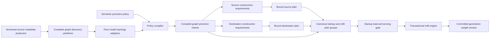

# Semantic Precision Policy and Transactional Refit

Status: Approved for implementation on 2026-09-04

Design choice: B — semantic policy, endpoint adapters, and transactional refit

Analysis baseline: NVIDIA-NeMo/RL `upstream/main` at
`4601ba2c646ec40e5928c780fc0051a842328eba` on 2026-09-03. Pull request heads
must be re-fetched before implementation or publication because they can drift
independently from this design snapshot.

## Decision

NeMo RL will describe quantization intent with a versioned semantic precision
policy and compile that policy into explicit source, wire, and destination
plans. The refit transport will not infer precision, ownership, or runtime
layout from parameter names, tensor dtype, or tensor shape.

Model-family adapters will describe logical model components. Endpoint
adapters will bind those components to the physical storage used by the
training and generation runtimes. A transactional refit protocol will validate
the complete plan before entering a collective and will make any detected
refit failure fatal to the training process.

This design replaces runtime monkey patches and duplicated training/generation
ignore lists. It preserves a fast direct-transfer path and confines vLLM
version-specific knowledge to small, tested adapters.

## Motivation

The production policy currently quantizes routed, non-shared MoE experts while
leaving shared experts and the first and last decoder layers in BF16. The same
selection must work for both:

- BF16 training to MXFP8 rollout; and
- MXFP8 training to MXFP8 rollout.

The scope may later include Q, K, V, O, dense FFNs, embeddings, latent
projections, recurrent mixers, or other model components. A design based on
negative parameter-name patterns does not scale to those cases.

Several current model families also separate logical checkpoint tensors from
runtime storage:

- Qwen3.5 and Qwen3.8 may store grouped routed experts in BF16 checkpoints and
  split experts plus scales in quantized checkpoints.
- FlashInfer TRTLLM stores an unquantized BF16 expert in a padded and permuted
  block-major layout.
- ModelOpt MXFP8 stores FP8 values and block scales and may create separate
  execution-only tensors.
- Kimi K3 fuses KDA and MLA projections, wraps its routed experts in latent
  projections, and transforms inner expert weights into MegaMoE storage.
- GLM-5.2 combines routed and shared experts with MLA, a dynamic sparse
  attention indexer, dense prefix layers, and an auxiliary prediction layer.

Matching two physical tensors because their dtypes happen to be equal is not a
valid loading rule. Equal dtypes can represent different layouts, while
different checkpoint encodings can represent the same logical parameter.

## Goals

1. Express the production routed-expert policy without generated negative
   ignore lists.
2. Permit any model component to become a future quantization scope without
   changing the policy or transport core.
3. Keep shared experts and unselected components in BF16 by default at each
   endpoint in which their graph participates; do not synthesize an endpoint
   for a training-only or checkpoint-served graph.
4. Handle split, fused, grouped, padded, permuted, and derived runtime storage
   explicitly.
5. Support BF16-to-MXFP8 and native-MXFP8-to-MXFP8 refit without ambiguous
   conversion.
6. Make a detected refit failure terminate the training launcher with a
   non-zero status and bound silent-peer failures with mandatory deadlines.
7. Meet an explicit no-regression performance gate: initially, p50 and p95
   refit latency may be no more than 5 percent slower than the fastest correct
   existing path for the same semantics.
8. Support vLLM 0.25.1 and 0.28.0 through versioned adapters and fail closed on
   an unsupported runtime.
9. Allow semantic topology coverage—and, after all runtime gates, production
   model support—to grow through adapters and conformance fixtures rather than
   central model-name branches.

## Non-goals

- Automatically trusting an unseen future architecture without an adapter or
  a successful capability negotiation.
- Implementing quantization mathematics inside the transport layer.
- Providing rollback from partially overwritten GPU runtime storage. A failed
  in-place update poisons and terminates the generation worker instead.
- Treating a safetensors index as a description of vLLM runtime storage.
- Supporting partial precision changes within a fused physical owner unless
  the endpoint explicitly supports split and repack.

## Architecture



The architecture separates six concerns:

| Concern | Owner |
|---|---|
| User intent | Semantic precision policy |
| Source dialect, normalization, and graph-completeness proof | Versioned source metadata producer |
| Logical model structure | Model topology adapter |
| Graph lifecycle and rollout participation | Typed internal graph declarations |
| Training storage and export | Source endpoint adapter |
| Wire encoding and transport | Refit planner and transport engine |
| Generation runtime layout | Destination endpoint adapter |

Checkpoint headers, Megatron Bridge, NeMo Automodel, and native Transformer
Engine MXFP8 storage each have a source metadata producer. A producer
normalizes its own native objects into one graph-scoped, immutable discovery
partition before a model topology adapter runs. Topology adapters remain pure:
they receive only standard-library records and semantic contracts and never
import those frameworks. The policy compiler operates only on the resulting
logical semantic records. It never sees a vLLM parameter path or a Megatron
parameter path.

The compiled graph intents are model-construction inputs, not refit-only
metadata. They configure the requested training realization and each
participating generation owner as BF16, MXFP8, or another advertised format
before storage is allocated. After model construction, source and destination
adapters bind their realized storage, capability fingerprints, layouts,
ownership, and transforms. Only graphs whose internal lifecycle requires
source-to-rollout refit enter the canonical bound refit plan. Training-only
graphs have no destination binding, while checkpoint-served graphs use their
pinned checkpoint load path. There is no global "MXFP8 model" flag followed by
hidden BF16 exceptions.

## User-facing precision policy

The common recipe interface is a short positive allow-list. At each endpoint a
graph participates in, unselected parameters inherit BF16. A missing endpoint
does not become a BF16 realization request.

```yaml
precision_policy:
  schema_version: 1
  default: bf16
  scopes:
    - id: routed-experts-middle
      role: moe.routed_expert
      layers:
        exclude_first: 2
        exclude_last: 1
      rollout: mxfp8
```

The values `2` and `1` illustrate recipe-supplied `N` and `M`; both fields are
non-negative integers rather than model-specific constants in the compiler.

BF16 training inherits `default: bf16`. MXFP8 training adds only
`training: mxfp8` to the scope. The version-1 `moe.routed_expert` role expands
to `graph_kind=main`, `semantic_graph_path=text.decoder`, `model_part=main`,
`module_kind=moe.expert_ffn`,
`expert_kind=routed`, `projection in {gate, up, down}`, and
`parameter_role=kernel`. It does not include shared experts, routers, latent
input/output projections, biases, draft/MTP models, or unrelated layers, so
those remain BF16 without an ignore pattern.

Scalar precision names are versioned format profiles. In schema version 1,
`mxfp8` means the E4M3-values/E8M0-block-32 descriptor. A specialized experiment
may declare a named detailed format profile, but the production recipe does not
repeat component or scale geometry.

`PrecisionPolicyConfig` and every YAML-loaded nested policy schema are typed
`BaseModel(extra="allow")` classes, following the repository convention.
In schema version 1, `default` is the non-configurable safety type
`Literal["bf16"]` with field default `"bf16"`; it applies independently to each
participating training or rollout endpoint and is not an endpoint selector.
`schema_version=1`, strict `require_match=True`, and the policy-level
`atomic_conflict="error"` are Python field defaults declared once on those
models; consumers do not invent fallbacks. A scope-level `atomic_conflict`
omitted or set to null remains `None` and inherits the policy value during
compilation; an explicit scope value overrides it. An omitted or null `layers`
value means no layer selector, while explicit `{}` is a real selector with
zero exclusions. Those distinctions survive serialization and reparsing.
Schema versions and layer exclusions reject coercive booleans, strings, or
floats, and semantic floating-point predicate values must be finite. A model
validator inspects `model_extra`: documented legacy fields enter the
compatibility translator and any other unknown field under the new policy
namespace raises a configuration error, so `extra="allow"` does not silently
accept selector typos. Open-ended semantic attributes use a typed
scalar-or-list predicate model, not `dict[str, Any]`. Internal manifests,
plans, and transaction records are typed dataclasses and are never YAML-loaded.

Common future scopes remain equally short. For example,
`role: attention.qkvo` selects Q, K, V, and O projection kernels, while
`role: embedding.ngram` selects a shared semantic embedding role. The
version-1 `attention.qkvo` predicate is `graph_kind=main`,
`semantic_graph_path=text.decoder` token-attention,
`module_kind=attention.projection`, `projection in {q, k, v, o}`, and
`parameter_role=kernel`. It includes ordinary full, GQA, and QSA token-attention
projections, but excludes gated-delta/KDA input projections, QSA or DSA indexer
projections, MLA projections, vision attention, output gates, biases, and
draft/MTP graphs. Genuinely architecture-specific behavior may use a
namespaced role such as `qwen.ple_ngram_embedding`.

The version-1 `embedding.ngram` predicate is `graph_kind=main`,
`semantic_graph_path=text.embedding`,
`model_part=main`, `module_kind=embedding.ngram`, and
`parameter_role=kernel`; it excludes token embeddings, vision embeddings, and
draft/MTP graphs. Every public or namespaced role is a schema-versioned
`RoleDefinition` in the canonical `SemanticManifestBundle.role_definitions`
registry. Its unique key is `(schema_version, role_name)`. Built-in predicates
are centrally fixed, and every built-in definition is installed in every
bundle. An adapter attaches its independently derived `RoleExpectedDomain`,
which is empty when that known role is absent from the model topology. This
distinguishes a valid built-in with zero matches from an unknown role name; a
required scope over the former fails as a zero-match selection. A namespaced
adapter role supplies its complete versioned predicate and non-empty expected
domain through a typed
`RoleDefinitionContribution`. Repeated contributions from separate graph
instances may share a key only when predicates are canonical-equal and expected
domains are disjoint; the builder deterministically unions their sorted entry
IDs into one final definition. Duplicate/overlapping claims, predicate
conflicts, or a changed built-in predicate fail. Every definition version must
equal the bundle version, and the
compiler rejects a policy/bundle schema-version mismatch before any matching,
including for a default-only policy. A role stores no bundle back-reference.

Before layer filtering, predicate matching over the complete bundle must equal
the independently derived expected domain exactly; a family that would be only
partly matched is split into complete homogeneous entries. An unadvertised,
orphaned, overbroad, or incomplete role fails compilation. The compiler accepts
the bundle as its only semantic input, never a separate role mapping or bare
inventory, so graph kind, lifecycle, semantic path, and model facets remain
available.

Role aliases are versioned by `schema_version`, never change meaning in place,
and expand into the structured semantic predicates used internally. The
compiler stores the complete compact expected/matched domains and logical
cardinalities, selected layer ranges, semantic owner families, and requested
formats before model construction. Physical owners, layouts, transforms, and
final plan IDs exist only after Task 7 binds realized endpoints. The compiler
does not store every rendered family member.

### Advanced selector escape hatch

Adapter authors and specialized experiments may replace `role` with an
`advanced_match` containing separate typed `graph_instance_id` and
`semantic_graph_path` predicates plus module kind, typed attributes, parameter
role, model part, and layer-coordinate predicates. `graph` is not an alias for
either identity and is rejected. A one-off component uses `addresses`, a list of
typed records containing `graph_instance_id`, `semantic_graph_path`, and
`semantic_id`:

```yaml
addresses:
  - graph_instance_id: draft.external
    semantic_graph_path: draft.decoder
    semantic_id: draft.decoder.layer.1.attention.q.kernel
```

`semantic_id` is one canonical rendered ID whose prefix includes its semantic
graph path, for example `text.decoder.layer.1.moe.routed.0.gate` or
`draft.decoder.layer.1.attention.q.kernel`. The canonical parameter identity is
the pair `(graph_instance_id, semantic_id)`; the explicit
`semantic_graph_path` field must equal the path encoded by `semantic_id`.
These advanced forms still never expose a checkpoint key or runtime parameter
name. Each required canonical identity must appear exactly once in every
logical binding map required by that graph's endpoint participation and owner
cadence. That unique logical binding may be a composite `BindingSet` containing
several physical owners, slices, values, scales, or other encoding components.
Adding a new ordinary quantization target should normally add a documented
versioned role alias instead of copying the advanced matcher into recipes.

The selector schema is a discriminated union: exactly one of `role`,
`advanced_match`, or `addresses` is present in a scope. The short production
role recipe is unchanged.

Scopes have the following semantics:

- Scope order is not an override mechanism. Two matching scopes that request
  different precision are a configuration error.
- `require_match` defaults to true. A routed-expert scope
  applied to a dense model fails during compilation instead of silently doing
  nothing.
- A role match also validates complete topology-derived coverage. An adapter
  advertising `moe.routed_expert` must bind every eligible routed gate/up/down
  kernel, and an adapter advertising `attention.qkvo` must bind every eligible
  Q/K/V/O kernel. Matching one component or one layer is not enough, and a role
  member cannot be hidden as generically out of scope.
- A scope must change at least one participating endpoint away from BF16.
  Omitting `training` or `rollout` inherits BF16 only when that graph
  participates in the endpoint; omitting both is an error.
- The policy-level `atomic_conflict` defaults to `error`. An omitted or null
  scope value inherits that default, while an explicit scope value overrides
  it. `expand` is allowed only when explicitly requested at either level.
  Expansion computes a transitive fixed point across
  semantic precision atomic groups at each endpoint the selected graph
  participates in, then reruns precision conflict and layer-boundary checks and
  reports every added semantic ID. An expansion that crosses an explicit BF16
  first/last boundary is rejected. Task 7 separately validates physical load
  atomicity after endpoint realization.
- Raw checkpoint or runtime parameter regexes are not part of the stable policy
  interface. A temporary migration field may exist for legacy recipes, but it
  is translated once and cannot be combined with semantic scopes.

The implementation adds a dry-run `explain-precision` command to the existing
configuration tool. Without constructing a model it emits the canonical
compiled intent group and exits non-zero on zero matches, conflicts,
unsupported topology or format profiles, incomplete checkpoint inventory, or
invalid immutable-auxiliary evidence. Physical layouts, transform/kernel
selection, realized capability fingerprints, and final `plan_id` values are
explicitly reported as unavailable until binding. The model-construction
preflight emits that realized information and rejects a binding gap only for an
endpoint and owner cadence the graph is required to realize, before any refit
communicator is created.

### Layer coordinates

Every adapter normalizes layers to a zero-based canonical coordinate. Simple
scopes default to `global_decoder` within the main `text.decoder`; the range
excludes vision, draft, and auxiliary prediction graphs. `exclude_first` and
`exclude_last` count physical decoder layers, even if some are dense.

`LayerMember.global_decoder_layer` is graph-local: it is the PP-global decoder
index within that graph instance, not a bundle-global coordinate. Main, MTP,
and external draft graphs each begin at layer 0. Only the semantic-graph-path /
model-part pairs `text.decoder`/`main`, `auxiliary.mtp`/`mtp`, and
`draft.decoder`/`draft` are valid for layered decoder members; cross-pairs fail
before family construction.

Both exclusions must be non-negative and cannot consume the whole selected
decoder range. `require_match` is evaluated after layer filtering, so an
otherwise valid role that becomes empty at the boundary fails before model
construction.

A `layers` selector is valid only for a role whose semantic domain has the
chosen canonical layer coordinate. Supplying it for an unlayered role such as
`embedding.ngram` is a configuration error.

`moe_ordinal` is also supported for policies that mean the first or last N
MoE-bearing layers rather than physical decoder layers. Selecting this
non-default index space must be explicit. Vendor-specific one-based layer lists
are normalized by the model adapter and never exposed to policy code.

## Semantic model manifest

The model topology adapter emits a complete logical manifest. Two identifiers
must not be conflated. `graph_instance_id` identifies a runtime/model instance:
the sole main instance is exactly `main`, while auxiliaries use stable `mtp.*`
or `draft.*` IDs. `semantic_graph_path` is an address facet such as
`text.decoder`, `text.embedding`, `auxiliary.mtp`, or `draft.decoder`. One main
instance can contain both text-decoder and text-embedding addresses. Bundle
membership and lifecycle validation use `graph_instance_id`; role matching and
layer domains use `semantic_graph_path`. Built-in main roles additionally
require `GraphKind.MAIN`, so a draft cannot match by copying a main semantic
path.

A manifest carries `graph_instance_id` and references authoritative compact
inventory entries. Each explicit member or lazily addressed family member
carries `semantic_graph_path` and a canonical rendered `semantic_id` beginning
with that path. `(graph_instance_id, semantic_id)` is the canonical identity;
the inventory `entry_id` remains only an accounting handle. The separate path
field is validated against the rendered ID and supports typed matching without
reparsing the ID. A semantic address contains structured facets rather than a
parameter-name string:

```text
semantic graph path
layer coordinate
module kind
module attributes
parameter role
logical axes
logical shape
logical dtype
model part
```

Representative module kinds and attributes include:

- `moe.expert_ffn`, `expert_kind=routed|shared`,
  `projection=gate|up|down`;
- `moe.latent_projection`, `direction=input|output`;
- `moe.router`;
- `attention.projection`, `projection=q|k|v|o`;
- `attention.mla`, `projection=q_a|q_b|kv_a|kv_b|output|output_gate`;
- `sequence_mixer.gated_delta` with projection, convolution, state, and bias
  facets;
- `attention.sparse_indexer`;
- `ffn.dense`;
- `embedding.token|ngram`;
- `residual.hyperconnection`;
- `vision.encoder`; and
- `auxiliary.mtp` or `draft.decoder`.

The vocabulary is versioned and namespaced, but not closed. Adapters advertise
the semantic kinds and attributes they implement. Common role aliases such as
`moe.routed_expert` expand into structured predicates. Their meanings are
pinned by the policy schema version and are independent from physical formats.

Family dispatch is exact capability matching over the effective plain model
configuration. An "exact architecture tuple" is a one-element tuple or list
whose only value is the literal architecture string for the matrix row. A
missing `architectures` field, scalar string, empty or multi-element
collection, extra architecture, or wrong outer/text-model combination fails
closed. The pinned resolved revision is evidence and topology identity, never a
revision allowlist or dispatch key. A revision whose configuration or header
capabilities contradict the pinned contract fails before semantic
classification.

### Complete accounting

The bundle carries an authoritative `ExpectedGraphDeclaration` set. It is built
from the actual training graph instances and explicit rollout graph
declarations before semantic adaptation, and contains graph instance ID, graph
kind, graph provenance, rollout participation, model identity, and any immutable
evidence attachment. There is a bijection between expected declarations and
manifests: adapters cannot add, drop, or rename an instance. Task 4 accepts
typed `AuxiliaryGraphDeclaration` values to construct this set; these records
are topology-independent and contain no PP-rank guesses. Exact source and
destination PP ownership is derived later from both realized runtime
topologies and bindings.

Task 4 classification starts from producer-normalized, metadata-only graph
discovery partitions, not from an already semantic or runtime-bound parameter
inventory. `SourceSchemaId` is a strict namespaced and versioned identifier;
the initial exact values are `hf.safetensors.header.v1`,
`megatron.bridge.state-dict.v1`, `nemo-automodel.state-dict.v1`, and
`transformer-engine.quantized-storage.v1`. A `SourceProducerFingerprint`
contains the schema ID, immutable producer implementation identity and
revision, normalization-contract digest, and typed evidence. Producer revision
and implementation identity participate in evidence and every discovery and
topology digest, but never select a model-family adapter.

The resolver's runtime/checkpoint integration, not the metadata producer,
supplies a trusted `ExpectedContributorSet` containing the canonical opaque
contributor IDs and typed authority evidence. Its derived
`ExpectedContributorAuthority` contains only the canonical set digest, count,
and a structurally ID-free evidence commitment. That commitment is an
`EvidenceSource` with kind `CONTENT_ADDRESS`, exact locator
`precision-policy.expected-contributor-authority.v1`, and a canonical lowercase
SHA-256 digest over the complete typed original authority-evidence payload. A
derived authority with any other kind, locator, or digest grammar is invalid;
no substring scan is used. The original typed evidence remains only in the
resolver-retained `ExpectedContributorSet`, while graph inputs, partitions, and
adapters see the opaque commitment. The graph input binds that authority before
the producer runs. The resolver retains the trusted set through the final
pre-classification validation boundary; it is not recoverable from or replaced
by producer output. Partition assembly independently recomputes the observed
contributor digest/count from `DiscoveryContribution` values, requires exact
set equality with the trusted input and authority, and only then strips the
opaque IDs. This prevents a producer-supplied count or digest from defining its
own completeness criterion.

One immutable `GraphDiscoveryPartition` binds exactly one graph instance to
one producer fingerprint, the independently derived expected-contributor
authority, its canonical `SourceDiscoveryRecord` tuple, and one
`DiscoveryCompletenessReceipt`. The fingerprint and expected authority are
stored once on the partition, not repeated on every record. The receipt
includes the observed opaque canonical contributor-set digest/count, canonical
source-set digest/count, canonical record digest, and the graph
input/configuration, resolved revision,
and artifact-identity digest against which discovery ran. Contributor IDs are
producer-private opaque atoms. Pipeline, tensor, and expert parallel
coordinates may help a producer prove a complete union, but never enter a
semantic address or topology-family domain.

Partition construction rejects a missing or duplicate contributor, a mixed
producer fingerprint, an incomplete PP/rank union, duplicate or missing native
source, configuration/revision/artifact mismatch, and any mutation of a record
after the receipt is constructed. Immediately before classification,
`validate_discovery_inventory()` revalidates each internal/factory-created
partition against its graph input and the resolver-retained
`ExpectedContributorSet` for that graph. It recomputes the trusted authority
from the canonical opaque-ID set, compares it with both stored authorities,
requires the receipt's independently assembled observed contributor
digest/count to equal it, and recomputes the source set/count and canonical
record/input digests from the partition. A missing or undeclared trusted-set
mapping entry, duplicate IDs within a trusted set, an incomplete contribution
union, a coordinated replacement of the graph-input/partition authority, or a
forged, replaced, or stale receipt
fails before adapter selection. The inventory is the canonical ordered tuple
of these verified partitions. It accepts exactly one partition and one trusted
contributor set for each expected graph and no undeclared value. Each
`GraphTopologyInput` pairs one expected declaration with that graph's own model
configuration,
resolved revision, source identity, artifact identity, expected-contributor
authority, and the same producer fingerprint as its partition, so an external
drafter can select a different-family adapter independently of main. A
discovery name/owner may be absent only for `SourceMutability.ABSENT`.
Contributor-ID collections and raw shapes snapshot supported non-scalar
`Sequence` inputs such as tuples, lists, and tuple-like shape objects. Bare
strings, bytes, byte arrays, memory views, and generators are rejected before
tuple conversion; a scalar tensor shape remains the explicit empty tuple.

Pure topology adapters receive the verified partition and graph input only.
They may see the expected contributor digest/count but never contributor IDs,
the trusted-set mapping, contribution objects, rank/PP membership, or
producer-private topology.

The producer integration boundary is a separate implementation tranche before
the shared materializer may call
`nemo_rl.precision_policy.topology_resolver.resolve_topology()`. Task 4B owns
that module, its focused resolver tests, and its commit/gates; Task 5 only
imports it. The checkpoint producer validates indexes and streams safetensors
headers; the Megatron producer normalizes public Bridge conversion-task and
MCore metadata; the Automodel
producer walks native state-dict metadata before a full gather or conversion;
and the Transformer Engine producer describes validated native quantized
storage components. Framework imports remain in their producer modules and are
never triggered by `import nemo_rl.precision_policy`. Fixtures or durable
evidence pin the exact inspected Bridge, Automodel, MCore, and Transformer
Engine implementation identities. When an identity or physical-format fact is
not present in pinned local evidence, an explicit evidence-capture gate runs
before its producer or format classifier is implemented; neither code nor a
fixture may guess it.

Typed `DiscoveryClassificationEdge` records provide bidirectional accounting.
A consuming canonical-value edge maps a compact `SourceRegion` to one exact
semantic output-member subdomain, canonical owner family, component role, and
typed source-to-family/layer/resolved-component axis mappings. Whole,
contiguous, strided, fused, and grouped selections are represented as compact
spans and ordinal maps, never element lists. Canonical edges partition every
present non-alias raw record with no source gap/overlap and, separately, exactly
partition every required `(inventory entry, format component role)` output
domain with no target gap/overlap. Fixed target coordinates and mapped
coordinates are disjoint and total. Canonical native-owner authority is also
global: consuming records with one native-owner identity must resolve to one
qualified canonical owner and agree on provenance and mutability evidence.
Another graph may refer to it only through a validated alias relation.

A non-empty set of tied-storage alias edges may split one fused tied record into
fixed-role semantic entries. Their compact coverage-only source regions and
output domains must partition the tied logical view without gaps, overlaps, or
duplicate targets, and every direct target must resolve compatibly to the same
underlying canonical native owner. They do not consume that canonical storage.
This relation is reserved for actual identical storage.

A synchronized-replica alias edge represents a distinct native source owner
whose value is guaranteed equal to a canonical record only at a declared
`SOURCE_VERSION_READY` boundary. It names the canonical source record
explicitly, since native-owner equality is intentionally false. The initial
contract requires equal raw dtype/shape and exact corresponding compact
regions; the semantic component/subdomain and projection must resolve to the
same direct canonical value. Replica mutability matches the canonical owner.
Immutable topology evidence names the replica group and required boundary, but
does not stand in for a live synchronization fence. Task 7/10 must observe a
matching group/topology/source-version/rank completion fence after replica
synchronization that itself occurs after the optimizer/TE update, before
exporting the canonical value. The mandatory order is update → synchronize →
fence → export. If that proof is unavailable, the copy is an independent owner. In particular,
MCore pipeline MTP embeddings are synchronized replicas rather than tied
storage, while an Eagle head initialized once with `.copy_()` remains an
independent owner.

An `ABSENT` disposition is the sole zero-output edge and cannot justify a
source-served owner. Thus claimed but dropped and invented semantic
entries/owners both fail. Edge variants must agree with raw provenance:
tied-storage and absent records cannot also claim canonical source regions.
Fragments also emit
the schema-bound role definitions described above. The final semantic
inventory, manifests, role registry, and normalized strongly typed
`IdenticalStorageSourceAliasContract |
SynchronizedReplicaSourceAliasContract` set are built and validated atomically
before any partial bundle is exposed; these topology-classification records
contain no destination/runtime physical layout. Each persisted contract carries
the alias/direct semantic IDs, canonical owner, component role, exact projected
domains, and relation evidence; replica contracts also carry group and
boundary. The canonical topology and intent digests include every field, so
discarding or changing synchronization evidence cannot preserve plan identity.
Bundle validation itself, not only the builder, proves an exact per-component
compact cover for every `CANONICAL_ALIAS`: claims are in-domain, pairwise
disjoint, and gap-free, and each resolves to the binding's exact direct
non-alias target, owner, compatible projected target subdomain, and total axis
mapping. Orphan/direct-value contracts, duplicates, gaps, overlaps, and
target/owner/component/projection/relation conflicts fail closed. Distinct
physical relation variants may cover disjoint components or subdomains when
each is independently evidenced. The compiler revalidates the complete bundle
once before producing any identity.

Every trainable or reload-relevant endpoint tensor must be represented by an
authoritative compact `ParameterInventoryEntry`. Its `member` is exactly one
explicit `SemanticTensor` or one complete `SemanticTensorFamily`; its unique
`entry_id` is only an accounting/reference handle and never replaces canonical
tensor identity. Each member is classified as one of:

1. a logical model parameter;
2. an encoding component of a logical parameter;
3. a derived runtime tensor;
4. a canonical logical alias; or
5. explicitly out of scope for policy refit with a typed reason.

`GraphProvenance` identifies who instantiated a graph
(`training_runtime`, `model_checkpoint`, or `external_checkpoint`). Separately,
`ValueProvenance` identifies whether an inventory value is a logical training
parameter, checkpoint encoding component, backend-derived value, or canonical
logical alias.
Every inventory member has typed `SemanticOwnership` backed by a qualified,
structured `OwnerFamilyReference` and exact finite `FamilyIndexDomain`. A scalar
owner is a zero-axis singleton family. Every `OwnerFamilyBinding` points
directly to one canonical `SourceOwnerInventoryEntry`; it cannot point to
another semantic alias. `ValueProvenance.CANONICAL_ALIAS` marks logical alias membership,
while every other provenance marks a direct member. A binding also names one
canonical non-alias value entry: a direct member names itself, while an alias
names its exact direct target. The target and canonical source owner must be
present, share compatible projected domains, shape, axes, dtype, and format,
and have total member-to-value and member-to-owner index mappings. This remains
unambiguous when one physical owner fuses several direct values. Alias chains
and cycles are structurally unrepresentable. `OutOfScopeTensor`
contains only `inventory_entry_id` plus typed `OutOfScopeReason`, thereby
claiming the entire authoritative explicit member or complete family. Graph,
domain, and ownership are derived from the referenced entry rather than copied
into fields that could disagree.

An out-of-scope member remains visible for complete accounting but contributes
neither an endpoint precision assignment nor a source realization request for
itself. Its canonical value may still appear as the exact source descriptor for
an in-scope served alias in another graph; the exclusion is local to the
member's destination participation, not destruction of canonical source
authority. A frozen training value that rollout itself still needs at startup
must remain in scope and inherit default BF16. Consequently, a
`served_from_source` graph must reach at least one in-scope training authority,
and every source request must trace to at least one in-scope destination
member. When one physical owner fuses in-scope and excluded direct entries, the
semantic request names only the in-scope entries; Task 7 must prove a partial
realization capability or fail before communication.

Unknown or partially inventoried tensors are never silently omitted. At each
endpoint a graph participates in, unselected representable tensors retain BF16
intent. A missing binding fails only when the graph's endpoint participation
and derived owner cadence require that binding. The compiler reports selected
and unselected counts by graph instance, semantic graph path, layer, module
kind, and precision.

Source mutability is recorded compactly for each qualified source owner family
and exact finite domain in the authoritative inventory, not as one independently
supplied graph flag or one record per logical tensor. All semantic values and
aliases sharing an owner inherit the same `SourceMutability`; conflicting or
overlapping claims fail validation. An out-of-scope reason is allowed only for a
source-proven frozen owner, an immutable auxiliary model, or backend-owned
derived state. A mutable main-model owner cannot be marked out of scope: even
when unselected for quantization, it must follow the default BF16 refit path. A
mutable training-only auxiliary is still represented and fully accounted for;
its rollout participation, rather than per-tensor exclusions, explains why it
has no refit destination. Source metadata and topology accounting are
reconciled so adapters cannot hide KDA state, router bias, AttnRes weights,
norms, or another changing parameter behind a generic exclusion.

`SourceMutability.ABSENT` is a raw discovery state, not a value provenance;
there is deliberately no absent `ValueProvenance`. Once classified, a
training-parameter authority required by a `served_from_source` member must be
present and cannot retain the absent state.

After logical/lazy family-domain and alias resolution, every
`served_from_source` graph must have a non-empty semantic domain and reach at
least one present training-runtime canonical value authority. A required owner
marked `absent`, an empty graph, or an alias whose target is missing is invalid;
`all([])` can never derive `initial_only`, while a non-empty all-frozen set
validly derives a one-shot startup requirement. An
alias-only graph is valid only when every alias binds directly to an existing
canonical source owner and exact compatible direct semantic value entry.
Cross-graph aliases retain the alias graph's semantic membership while reusing
the target owner's transfer and cadence; they create no local owner or
transfer.

`ImmutableAuxiliaryEvidence` is attached to its
`ExpectedGraphDeclaration` and contains graph instance/model identity, a pinned
checkpoint revision, checkpoint-content digest, model-configuration digest,
semantic-domain digest, and typed `EvidenceSource(kind, locator, digest)`.
Owner freeze claims use the same typed evidence-source record. All fields
participate in the declaration or owner-inventory digest. A safetensors index
name, mutable branch/tag, or model ID without content evidence is insufficient.

### MTP and speculative-draft coherence

MTP and speculative decoding are separate semantic graphs, never implicit
members of a main-model role. The built-in `moe.routed_expert` and
`attention.qkvo` roles therefore do not select `auxiliary.mtp` or
`draft.decoder` tensors. That exclusion controls precision selection only. It
does not decide whether an auxiliary is trained, served, or refitted.

Pinned artifact evidence, not an MTP-count config field alone, determines
whether an MTP graph exists. Qwen3.5-35B, Qwen3.8 A95B, Qwen3.8 Flash-Next,
Nemotron Lightning/Super/Ultra, and GLM-5.2 each contribute one graph-local MTP
layer only when their pinned artifact supplies every required record. Qwen3-30B
and Nemotron Nano contribute none. A config-declared case whose artifact lacks
a complete MTP source set records the discrepancy and fails graph creation;
the adapter never synthesizes missing members. Lightning/Super/Ultra physical
`.0` attention and `.1` MoE/final-norm sub-blocks form the single MTP-local
layer 0. GLM physical main-prefix layer 78 belongs only to MTP-local layer 0.
Missing any required sub-block or assigning either form to `text.decoder`
fails.

In particular, the pinned Qwen3.8-27B config contains
`mtp_num_hidden_layers=1`, while the current durable evidence records no
complete MTP source-set proof. Its fixture remains main-only and records that
discrepancy; declaring an MTP graph for it must fail until full metadata
evidence proves every required MTP record.

The different-family drafter conformance fixture is Qwen3.5-35B main plus a
synthetic Nemotron 3 Nano external draft. The draft owns a separate config,
resolved revision, producer fingerprint, complete partition, qualified scopes,
and `draft.decoder` addresses. The fixture proves independent adapter
selection only. It labels its record set synthetic and never claims that the
official Nano checkpoint is trained or published as a drafter.

Auxiliary lifecycle is an internal frozen composite record, not another
user-facing precision-policy rule. It keeps declared graph facts separate from
inventory-derived cadence:

| Axis | Representative values | Meaning |
|---|---|---|
| Graph kind | `main`, `mtp`, `speculative_drafter` | Declared semantic function of the graph instance |
| Graph provenance | `training_runtime`, `model_checkpoint`, `external_checkpoint` | Declared authority that instantiated the graph |
| Rollout participation | `not_served`, `served_from_source`, `served_from_checkpoint` | Declared way rollout obtains the graph's directly owned body; canonical-alias members retain canonical value authority |
| Owner source mutability | `mutable`, `frozen`, `absent` | Inventory evidence for each qualified source owner |
| Refit requirement | `none`, `initial_only`, `every_version` | Derived graph summary, never an independent input |
| Owner cadence | `startup_only`, `every_version`, `none` | Derived execution cadence for each physical owner |
| Rank-local endpoint ownership | owned storage, canonical alias, or absent at each source/destination rank | Task 7 result from realized endpoints and their parallel topologies |

The frozen `GraphLifecycle` stores graph kind, graph provenance, and rollout
participation plus immutable-evidence attachment where applicable. Validation
first resolves every participating member to its direct canonical value
authority, then joins that authority with the complete owner inventory to
derive `RefitRequirement` and per-owner cadence. Mutable training parameters
transfer every version; proven-frozen training parameters transfer once during
startup and their content digests remain transaction preconditions. A
checkpoint encoding component never creates a trainer send and instead owes a
checkpoint load receipt; a backend-derived value owes its declared dependency
proof. `not_served` derives `none` for every member. This authority-first rule
also applies to canonical aliases regardless of their member graph's serving
mode. A checkpoint-served graph's directly owned body must be
checkpoint/backend-owned; a direct training parameter is an inconsistent
lifecycle and fails closed. The graph summary is the maximum of the served
member-owner obligations. Callers cannot store a conflicting refit
requirement.

A mutable MTP or drafter declared `not_served` is a legitimate training-only
graph: it remains in the semantic bundle and receives a training precision
intent, but it has no rollout binding, wire plan, finalizer, or transaction
acknowledgement. A source-proven frozen owner served from source requires a
startup realization/load request and owning-rank binding/finalization before
generation can serve. It is excluded from every-version payloads after that
startup precondition succeeds. Freezing cannot be inferred merely because
`loss_scaling_factor=0`, `detach_heads` is set, or the current gradient is
absent. Those controls affect loss or gradient flow, not value provenance or
future mutability.

A graph declared `served_from_checkpoint` has a static, directly owned body for
checkpoint realization. Cross-graph canonical aliases remain governed by their canonical value
authority. Before model construction, its evidence attachment must provide the graph/model
identity, immutable resolved revision, checkpoint-content digest,
model-configuration digest, semantic-domain digest, and evidence source. It is
validated as serving context but contributes no source startup/per-version
payload for its directly owned body. Its destination startup load/finalizer and
artifact attestation are still mandatory. A mutable directly owned checkpoint
value or incomplete evidence fails closed.

The declaration is not sufficient proof that the destination loaded those
bytes. After its native checkpoint load, every destination adapter returns
`RealizedCheckpointEvidence` with the same graph/model identity, resolved
revision, content/configuration/semantic-domain digests, and typed evidence
source. The serving gate compares every field with
`ImmutableAuxiliaryEvidence`. A mutable tag, stale local cache entry, changed
path/locator, or any revision/content/configuration/domain/evidence-source
mismatch is fatal. A directly owned training parameter is likewise fatal; it
must instead be represented as a canonical alias to its training authority.
This generic attestation applies to vLLM, SGLang, and any
static external drafter backend; backend-specific "load succeeded" booleans do
not satisfy it.

Every auxiliary actually instantiated by the training runtime appears in the
semantic manifest bundle, including mutable training-only MTP/draft heads.
Task 4 does not predict PP ownership. Task 7 derives rank-local ownership from
both realized endpoint bindings and the source/destination runtime parallel
topologies rather than a process-global `has_drafter` boolean. Missing realized
drafter/MTP storage on a rank derived to own a startup-only or every-version
owner is fatal during preflight. Absence is valid on derived non-owning
pipeline-parallel ranks and for `not_served` graphs.

An external drafter may use a different model family or endpoint adapter, but
all graph instances in one policy/generation group are governed by the same
versioned `precision_policy`. Per-graph exceptions use qualified
`advanced_match` or `addresses` scopes; there is no separate drafter policy. A
mutable served-from-source drafter joins the parent transaction through an
ordered member record and target version. MTP weights tied to main-model storage
are represented as qualified canonical aliases backed by an exact physical
relation contract; alias-only graph members reference
the canonical source owner and never duplicate source export or wire transfer.
That does not prove destination identity: vLLM may realize separate main-model
and drafter allocations for the same source values. Task 7 therefore fans out
to every distinct physical destination owner and requires its load, finalizer,
and rank acknowledgement. Those destination operations are de-duplicated only
when the endpoint adapter proves identical storage-owner and finalizer identity.
No adapter may discard either tied or independent storage through a name-based
`mtp` ignore rule.

### Compressed tensor families

Large models can contain hundreds of thousands of homogeneous expert
components. The compact manifest uses only structured finite domains:

```text
LayerMember(global_decoder_layer, moe_ordinal | None)
LayerDomain(members)
AxisDomain(name, members)
FamilyIndexDomain(layer_domain, independent_axes)
LiteralPathSegment(value) | IndexPathSegment(axis_name)
SemanticAddressPattern(fixed semantic facets, typed path segments)
OwnerFamilyReference(graph_instance_id, owner_family_id)
OwnerFamilyBinding(owner family, structured axis projection, exact index domain)
ParameterInventoryEntry(entry_id, graph_instance_id, member, value_provenance)
```

`LayerMember` keeps correlated decoder and MoE coordinates together; they are
never modeled as two Cartesian axes. `AxisDomain` is reserved for genuinely
independent axes such as expert ordinal. `SemanticAddressPattern` contains fixed
facets and a tuple of `LiteralPathSegment | IndexPathSegment`, not a free-form
string template, regex, glob, or wildcard. The canonical renderer lazily
produces each path-prefixed `semantic_id`. `OwnerFamilyBinding` uses qualified
owner-family references and typed axis projections rather than formatted
owner-name strings. Scalars use a zero-axis singleton domain.

A `SemanticTensorFamily` fixes semantic facets, format descriptor, logical
dtype, shape, axes, and ownership binding across its exact domain. A value that
changes any of those facts or role meaning belongs to a separate complete
family. Routed gate, up, and down are three families; Q, K, V, and O are four
families. Projection is not a generic family axis and no explicit
attribute-to-axis binding mechanism is needed. A dependent or ragged domain,
such as layer groups with different expert counts, is represented by multiple
complete non-overlapping families. It is never approximated by a correlated
Cartesian product.

Validation computes exact finite-domain intersections among explicit tensors
and all families, rejects every duplicate canonical identity or physical-owner
claim, and proves the compact-entry union exactly accounts for the authoritative
inventory. `OutOfScopeTensor` can claim only a whole referenced compact entry;
partial family coverage or an unaccounted inventory suffix is invalid. These
checks use domain algebra or lazy generators; expanded instances are never
stored in the inventory/manifest or exchanged on every refit. Each rank later
materializes only its locally owned execution records. Plan digests use the
canonical structured family representation and entry IDs only as accounting
references.

### Plan identity and determinism

Identity is deliberately staged so policy materialization does not depend on a
backend that has not been constructed yet. Each graph first gets an `intent_id`
that hashes the semantic schema version, resolved model revision and topology
digest, persisted source-alias relation/evidence, policy digest, logical
precision assignments, and requested formats. A
`CompiledPrecisionIntentGroup` contains the ordered intent for every declared
graph, including training-only mutable auxiliaries, plus validated immutable
checkpoint evidence and the canonical typed `source_alias_contracts` tuple.
The latter is an explicit handoff because a topology digest cannot be inverted
to recover relation-specific de-duplication and synchronization requirements.
Endpoint realization requests are present only where that graph participates
in the corresponding endpoint.

After every required endpoint is realized, canonical `startup_plan_id` and
`plan_id` values additionally hash the actual source and destination capability
fingerprints, format descriptors, both runtime parallel topologies, ownership
map, canonical bindings, transform/kernel selection, owner cadence, and buffer
schedule. The startup group contains source-proven frozen training authorities
reached by any in-scope served member, including a checkpoint-served
cross-graph alias and frozen owners inside a graph that also has mutable
owners. It must complete once before serving.

Static startup/refit plan-group digests hash the ordered graph-member records,
their unique source-owner `plan_id` values, realized destination
owner/finalizer composition plans, alias-to-owner mappings, exact replica-fence
requirements, and the required frozen-owner cache/startup-precondition
identity. The startup digest also includes every checkpoint load/attestation
plan, expected immutable evidence, and exact bound component/domain,
load-operation, finalizer-group, rank, and completion-fence receipt set. They
are built once rather than per update. The one-shot runtime
startup transaction digest additionally hashes its static startup-plan-group
ID, exact live `SourceVersionFence` set, initial source weight version, and
explicit initial target generation version; it cannot hash the successful
startup receipt it has not produced yet. An every-version transaction-group
digest hashes the static refit-plan-group ID, exact live fence set, source
weight version, target generation version, and successful startup/cache
precondition digest.
Static checkpoint evidence is immutable serving context, not a source
transaction member. All identities are independent of dictionary order and
process-local object identity.

Every participating rank receives the same relevant canonical startup/refit
plan identity. Local execution-plan digests are keyed by rank and placement and
are validated against the canonical ownership map; they are not incorrectly
required to be equal across ranks that own different shards. A graph binding
may be absent exactly where the realized topologies say the rank is a non-owner.
Replicated owners additionally prove that their local bindings agree. The Ray
control plane performs this comparison before data communicators are created.

## Storage and wire contracts

Logical semantics do not imply a quantization format. Task 2's versioned
`FormatDescriptor` describes only logical encoding and ordered canonical
components. It contains no physical shape, layout, padding, permutation,
placement, or backend runtime-storage fact.
For one component, `component_axes=None` means identity over the logical
tensor's ordered axes/extents; an explicit empty tuple is a true rank-zero
scalar with extent product one. Logical component-axis specs use either exact
division, which rejects any remainder, or integer ceiling division. Literal
component axes are component-only fixed positive extents, and explicit axis
order is preserved. A raw classification region must have cardinality equal to
its output member-domain cardinality times the product of these resolved
component extents; scalar metadata is `()`, not a synthetic `(1,)`.

Before any family classifier is implemented, one independently reviewed
catalog freezes the source-storage semantics below. Stable `format_id` is a
canonical `FormatDescriptor` identity, not a display label: two descriptors
with one ID must be structurally equal in family, ordered roles, scalar dtypes,
encodings, component axes, divisors, and rounding. Task 2's `BF16_FORMAT` and
`MXFP8_FORMAT` remain the sole constructors for their IDs, but the checked-in
Task 2 baseline is not yet canonical: BF16 and MXFP8 values use
`encoding=None`, MXFP8 scales use the legacy `mxfp8_scale` spelling, and the
output axis relies on default `/1 EXACT` values. A mandatory pre-Task-4B
compatibility migration updates `nemo_rl/precision_policy/semantic.py` and
the exact contract tests in `tests/unit/precision_policy/test_semantic.py` and
`tests/unit/precision_policy/test_compiler.py` to the explicit
`plain_bfloat16`, `mxfp8_e4m3_values`, and `mxfp8_e8m0_scale` encodings and the
exact MXFP8 axes below. The stable IDs remain because the physical contracts
do not change; only their previously underspecified canonical serialization is
made explicit. Legacy same-ID descriptors are rejected, and any persisted
pre-migration wire payload or digest must be regenerated rather than accepted
as an alias.

Task 4B source-catalog/object-identity tests may run only after that migration's
RED/GREEN semantic tests, full semantic/compiler regression gates, signed
three-file commit, and independent review pass. The source catalog then imports
those same objects by identity and constructs only the additional formats; a
typed alias cannot redefine a stable ID. `identity` means
`component_axes=None`; `output_features` and `input_features` are the literal
logical-axis names; and every divisor names its exact rounding rule.

| Storage use | Stable `format_id` / family | Ordered component contract |
|---|---|---|
| BF16 | `bf16.logical.v1` / `bf16` | `logical_values:bfloat16:plain_bfloat16`, identity |
| Native MXFP8 | `mxfp8.e4m3-e8m0-block32-input-features.v1` / `mxfp8` | `values:e4m3:mxfp8_e4m3_values`, identity; `block_scales:e8m0:mxfp8_e8m0_scale`, `(output_features / 1 EXACT, input_features / 32 CEIL)` |
| K2 and, subject to the evidence gate below, A95B block FP8 | `block-fp8.e4m3-f32-scale-inv-block128x128.v1` / `block_fp8` | `values:e4m3:float8_e4m3_values`, identity; `inverse_scales:float32:inverse_scale_float32`, `(output_features / 128 EXACT, input_features / 128 EXACT)` |
| K2.5 checkpoint INT4 | `packed-int4.i32-bf16-group32-shape-i32.v1` / `packed_int4` | `packed_values:int32:int4_offset_binary_pack8`, `(output_features / 1 EXACT, input_features / 8 EXACT)`; `group_scales:bfloat16:symmetric_group_scale`, `(output_features / 1 EXACT, input_features / 32 EXACT)`; `logical_shape:int32:logical_shape_vector`, literal extent 2 |
| K2.5 Automodel INT4 | `packed-int4.i32-f16-group32-shape-i64.v1` / `packed_int4` | `packed_values:int32:int4_offset_binary_pack8`, `(output_features / 1 EXACT, input_features / 8 EXACT)`; `group_scales:float16:symmetric_group_scale`, `(output_features / 1 EXACT, input_features / 32 EXACT)`; `logical_shape:int64:logical_shape_vector`, literal extent 2 |
| K3 MXFP4 | `mxfp4.u8-u8-block32-input-features.v1` / `mxfp4` | `packed_values:uint8:mxfp4_pack2`, `(output_features / 1 EXACT, input_features / 2 EXACT)`; `block_scales:uint8:mxfp4_block_scale`, `(output_features / 1 EXACT, input_features / 32 EXACT)` |
| Lightning NVFP4 | `nvfp4.u8-e4m3-f32-block16-input-features.v1` / `nvfp4` | `packed_values:uint8:nvfp4_pack2`, `(output_features / 1 EXACT, input_features / 2 EXACT)`; `block_scales:e4m3:nvfp4_block_scale`, `(output_features / 1 EXACT, input_features / 16 EXACT)`; `global_scale:float32:nvfp4_global_scale`, scalar `()` |
| A95B block FP8 | same literal block-FP8 ID only if evidence proves the same roles, dtypes, encodings, axes, divisors, and rounding | no model-name alias and no permissive union; a different contract requires a separately reviewed semantic-storage ID |

The current pinned metadata proves representative K2, K2.5-checkpoint, K3,
and Lightning component shapes, and the inspected Automodel producer proves
its I32/F16/I64 pack-8/group-32 contract. It does not yet durably prove every
rounding/encoding assertion or the A95B block geometry. A mandatory read-only
evidence extraction therefore records representative orientations, exact
component names/dtypes/shapes, logical axes, remainder behavior, producer
revision, and canonical digest before catalog tests are accepted. A mismatch
fails the catalog gate and requires a design amendment; it never widens a
descriptor or guesses an axis.

After realization, Task 7's `RealizedBindingFormat` carries ordered
`PhysicalComponentDescriptor` values at four explicit stages:
`SOURCE_STORAGE`, `WIRE`, `DESTINATION_LOAD_API`, and `DESTINATION_RUNTIME`.
Each `BindingSet` retains both its logical `FormatDescriptor` and this realized
physical record.
Each component separates a `PhysicalRepresentation` from its
`EndpointPlacement`. Each physical stage describes:

```text
ordered component roles and physical dtypes/shapes
physical axis order and logical-to-physical mappings
block or group geometry and padding fill semantics
permutation and storage encoding
rank/device/memory placement
adapter capability fingerprint
```

Component roles are extensible. Examples include `logical_values`, `values`,
`block_scales`, `global_scale`, `input_scale`, `packed_shape`, and `bias`.
MXFP8 value plus E8M0 scale is one logical encoding: its built-in descriptor
fixes E4M3 values, E8M0 scales, and block size 32. The built-in BF16 descriptor
fixes one logical BF16 `logical_values` component and no quantization scale.
Block-FP8, NVFP4, and MXFP4 use
distinct format IDs and component families even when they apply to the same
semantic parameter, and exist only when an adapter advertises their exact
encoding; the core does not invent unsupported generic profiles.

The planner selects one transform locus:

- `none` when source and destination encodings are compatible;
- `source` for trainer-side prequantization;
- `destination` for receiver-side quantization or runtime packing; or
- `destination_native_loader` when the destination owns checkpoint-to-runtime
  conversion.

For an owner cadence whose source and destination endpoints both participate,
the same transform is never applied at both endpoints.

Transforms are planned only between adjacent physical stages. DIRECT_COPY
requires equality of the complete ordered physical representation—roles,
dtypes, shapes, axis order/mappings, padding, permutation, and storage
encoding—plus an adapter capability proof bound to both representation and
placement digests, the exact stage pair, and transport capability fingerprint. Placement is
validated separately from representation equality, so the same representation
may transfer across ranks only when the NCCL/transport route proves those
source and destination placements compatible. Equal dtype or
equal logical `FormatDescriptor` is insufficient. In particular, a BF16
logical `[E,I,H]` wire/load representation may be accepted by a TRTLLM native
loader whose final runtime storage is padded/permuted
`[E,blocks,I_pad,block]`; the wire can never be copied directly into that
runtime allocation merely because both report BF16.

### Canonical load components and derived execution storage

A destination binding distinguishes canonical load components from derived
execution storage. `load_component` accepts only the logical or encoded
components named by the load plan. A finalizer then produces padded, permuted,
fused, flattened-scale, or backend-specific kernel storage exactly once per
dirty physical owner.

Current vLLM MXFP8 implementations illustrate why this distinction is
mandatory: logical scales may live in `*_scale_from_checkpoint`, padded values
may use `*_weight_for_apply`, and runtime scales may be flattened and shuffled.
For an aligned owner that reuses the `w13_weight` or `w2_weight` allocation as
execution storage, the public destination capability must provide a canonical
shadow/staging view or a native reload operation followed by one finalization.
The transport never writes logical data directly into an already shuffled
allocation because a name, dtype, or shape appears compatible.

Conformance tests reject bindings that target flattened runtime scales,
`*_weight_for_apply`, or already shuffled values as canonical inputs. The
Qwen3.5 grouped-main-expert path must bind through the new grouped semantic
loader; a legacy path that raises for grouped MXFP8 weights is not an allowed
fallback.

### Safetensors and checkpoint metadata

A safetensors index is evidence only of source-key-to-shard membership for one
resolved model revision. It does not describe tensor shape, dtype, logical
axes, TP or EP ownership, fused vLLM names, padded runtime storage, or derived
execution tensors. Production plans resolve model references to immutable
revisions and combine model configuration, safetensors headers, source adapter
metadata, and the realized destination manifest. For a static checkpoint-served
auxiliary, the index alone is insufficient: revision, checkpoint content,
configuration, and semantic-domain digests are all mandatory.

A canonical header-manifest digest attests metadata only. It is not a
checkpoint-content digest and cannot be reused as one for a checkpoint-served
MTP or external-draft graph. A bounded synthetic auxiliary fixture says that
its records are synthetic. A production immutable auxiliary supplies trusted
shard-content evidence or another trusted checkpoint-content digest before the
serving gate may open.

Static indexes are useful as pinned conformance fixtures, but they are never
the runtime loading contract. For example, Lightning NVFP4, Kimi K3 MXFP4, and
Qwen or GLM block-FP8 components are distinct format descriptors and cannot be
relabeled as MXFP8 merely because they contain low-precision values and scales.

### Mixed-precision destination paths

The destination plan dispatches by the realized owner's format and layout, not
by a model-global quantization mode and not by dtype equality.

| Policy result | Received representation | Realized destination | Required operation |
|---|---|---|---|
| MXFP8 owner | BF16 tensor | FP8 values plus MXFP8 scales | Quantize once at the selected transform locus, then load both components |
| MXFP8 owner | Compatible current MXFP8 components | FP8 values plus MXFP8 scales | Direct component transfer after descriptor and version checks |
| BF16 TRTLLM owner | BF16 tensor | Padded and permuted TRTLLM block storage | Destination-owned native layer load and batched pad/permute |
| Layout-compatible BF16 owner | BF16 tensor | Matching BF16 storage | Direct transfer only for an adjacent-stage equal physical representation plus route/capability proof |

For the Nano padding case, a logical expert tensor such as
`[128, 928, 2688]` may realize as `[128, 42, 1024, 64]`. Equal BF16 dtypes do
not make those tensors directly copy-compatible. Conversely, the middle
MXFP8 layers are loaded as values plus scales without passing through the BF16
TRTLLM layout path. This owner-level dispatch is what permits BF16 first/last
layers and MXFP8 middle layers in one engine.

### TRTLLM expert padding contract

For current FlashInfer TRTLLM adapters, let `E_l` be locally owned experts,
`I_l` the local expert intermediate dimension, `H_r` the routed hidden
dimension, and `g` one for non-gated or two for gated experts. The canonical
MXFP8 load shapes are:

```text
w13 values: [E_l, g * I_l, H_r]
w2 values:  [E_l, H_r, I_l]
w13 scales: [E_l, g * I_l, H_r / 32]
w2 scales:  [E_l, H_r, I_l / 32]
```

The current adapter advertises `H_p = round_up(H_r, 512)` and
`I_p = round_up(I_l, 128)`. The destination finalizer produces padded apply
values and flattened scales with:

```text
w13 apply values: [E_l, g * I_p, H_p]
w2 apply values:  [E_l, H_p, I_p]
w13 runtime scales: [E_l, g * I_p * H_p / 32]
w2 runtime scales:  [E_l, H_p * I_p / 32]
```

Value padding is zero, E8M0 scale padding uses the unit-scale byte `127`, and
the two gated halves are padded independently. Finalization performs the
required W13-to-W31 ordering and block-major shuffle. These values are adapter
capabilities and conformance fixtures, not constants in the transport core.

Logical dimensions must be divisible by 32 before this MXFP8 padding path.
Nano or Lightning TP4 (`I_l=464`), Super TP8 (`336`), Qwen3 TP16 (`48`),
Qwen3.5 TP32 (`16`), and Ultra TP64 (`80`) are preflight-negative fixtures
unless a later adapter explicitly advertises and numerically validates a
pad-before-quantize algorithm.

## Physical owners and atomic groups

One physical tensor may own several semantic parameters, and one semantic
parameter may be represented by several physical components. Each endpoint
binding therefore declares:

- physical owner ID;
- semantic slices with logical axis mappings;
- quantization atomic group;
- load atomic group;
- supported split/repack operations; and
- finalizer owner.

Examples include fused gate-up, fused QKV, Qwen grouped experts, Kimi fused KDA
input projections, and vLLM `w13` storage.

Before realization, a semantic precision atomic group is a compact pointwise
relation: it has a non-empty logical group domain and non-empty participants,
each naming a same-graph inventory entry with an exact participant domain and
total group-to-participant axis projection. Thus one record can express each
layer/expert gate-up-down group or each layer's Q-K-V-O group without eagerly
rendering all instances. It contains no physical owner, layout, load group, or
finalizer; Task 7 derives those from realized endpoint bindings.

If a policy selects only Q from an inseparable fused QKV owner, or gate from an
inseparable gate-up owner, compilation fails by default. It succeeds only when
the endpoint advertises a split/repack plan or the user explicitly permits
atomic expansion. This decision is made before any refit data-plane
communicator is created.

Cadence is closed over realized destination physical-owner/finalizer groups,
not merely over logical source owners. If a realized group contains frozen and
mutable contributors, frozen canonical components are transferred once into a
verified persistent destination startup cache and mutable components are
refreshed each version. Each update then composes the fresh mutable components
with the verified cached immutable components and finalizes the physical owner
exactly once. The adapter must advertise either native partial-update
preservation of immutable regions or a split/repack operation from canonical
components; an inseparable owner without either capability fails preflight.

The immutable-contributor cache key and digest cover canonical owner IDs,
content evidence, destination owner/finalizer identity, layout, storage
generation, topology, and the adapter capability fingerprint, and they enter
the canonical plan identity. Rebinding storage, changing any covered identity
or evidence, explicit runtime cache invalidation, or poisoning invalidates the
cache and closes serving. A normal A-to-B-to-C mutable update does not invalidate
it. Cached frozen components are never placed back on the wire, but their
verified digest is checked before composition and COMMIT.

## Endpoint adapter interfaces

Construction and runtime protocols isolate implementation-specific behavior:

```python
class SourceMetadataProducer(Protocol):
    producer_id: str
    schema_id: SourceSchemaId
    def fingerprint(self) -> SourceProducerFingerprint: ...
    def discover_contributions(
        self,
        graph_input: GraphTopologyInput,
        expected_contributors: ExpectedContributorSet,
    ) -> tuple[DiscoveryContribution, ...]: ...

class ModelTopologyAdapter(Protocol):
    adapter_id: str
    def supports(self, model_config: Mapping[str, object]) -> bool: ...
    def classify_graph(
        self,
        schema_version: int,
        graph_input: GraphTopologyInput,
        discovery_partition: GraphDiscoveryPartition,
    ) -> SemanticGraphBuildFragment: ...

class SourceEndpointFactory(Protocol):
    def capabilities(self) -> EndpointCapabilities: ...
    def compile_realization(
        self, intents: CompiledPrecisionIntentGroup
    ) -> SourceRealizationPlan: ...
    def bind_realized(self, plan: SourceRealizationPlan) -> SourceEndpointAdapter: ...

class SourceEndpointAdapter(Protocol):
    def capabilities(self) -> EndpointCapabilities: ...
    def bind_source(
        self, intents: CompiledPrecisionIntentGroup
    ) -> BoundSourcePlans: ...
    def fence_source_version(
        self,
        source_version: int,
        requirements: tuple[SourceVersionFenceRequirement, ...],
    ) -> tuple[SourceVersionFence, ...]: ...

class DestinationEndpointFactory(Protocol):
    def capabilities(self) -> EndpointCapabilities: ...
    def compile_realization(
        self, intents: CompiledPrecisionIntentGroup
    ) -> DestinationRealizationPlan: ...
    def bind_realized(
        self, plan: DestinationRealizationPlan
    ) -> DestinationEndpointAdapter: ...

class DestinationEndpointAdapter(Protocol):
    def capabilities(self) -> EndpointCapabilities: ...
    def describe_realized_storage(self) -> RealizedStorageManifest: ...
    def bind_destination(
        self, intents: CompiledPrecisionIntentGroup
    ) -> BoundDestinationPlans: ...
    def attest_checkpoint_realization(
        self, graph_instance_id: str
    ) -> CheckpointLoadReceipt: ...
    def prepare_startup_load(self, startup_id: str) -> None: ...
    def prepare_update(self, update: PreparedUpdate) -> None: ...
    def load_component(self, component: ReceivedComponent) -> DestinationLoadReceipt: ...
    def finalize_group(self, finalizer_group_id: str) -> FinalizerReceipt: ...
    def commit(self, update_id: str) -> None: ...
    def abort(self, update_id: str, cause: BaseException) -> None: ...
```

The exact Python API may be split across processes, but these responsibilities
remain separate. Endpoint adapters own names, fused regions, padding, runtime
layout conversion, stable CUDA-graph storage, cache invalidation, and
finalization. The transport owns byte movement and deadlines.

Destination load-owner identity and finalizer identity are independent
equivalence relations established only after model construction. A load receipt
is keyed by `(rank, load_operation_id)` and includes the exact covered physical
owner/member digest. A finalizer receipt is keyed by
`(rank, finalizer_group_id)` and includes the exact covered load-owner/member
digest plus a completion fence. Consequently shared storage may require two
derived-state finalizers, while two separate storages may share one model-wide
finalizer. An adapter may collapse operations only with a proof scoped to its
adapter/capability fingerprint, engine/model instance, allocation generation,
exact region/layout, and finalizer operation/configuration identity.

`CheckpointLoadReceipt` extends immutable artifact evidence with what the
native loader actually consumed: the complete semantic component/domain digest,
destination load bindings, finalizer-group receipts, and completion fence. It
is built from loader observations or normalized native loader reports, never by
copying the expected manifest. A non-empty subset, an ignored loader return, or
a matching checkpoint index without complete consumption is not success.

`abort` is idempotent and bounded. If cleanup cannot complete inside its local
budget, the only valid fallback is process termination; an abort error can
never be converted into permission to resume the engine.

Topology and endpoint adapters are registered by architecture/capability
fingerprint. This registration alone is not a production-support claim. The
core contains no Kimi, Qwen, GLM, or Nemotron parameter-name branches.

## vLLM compatibility

Both vLLM 0.25.1 and 0.28.0 expose a registered `WeightTransferEngine`
lifecycle. The interface evolved between the releases: 0.28.0 adds a stateful
trainer engine, `WeightSource` metadata, target selection, and a richer public
control plane. NeMo RL will use that public lifecycle rather than replacing
parameter `weight_loader` attributes or patching global conversion functions.

The NeMo-facing adapter API is stable. Runtime-specific modules implement it:

- `Vllm0251EndpointAdapter` for the 0.25.1 public lifecycle plus explicitly
  backported public reload capabilities;
- `Vllm0280EndpointAdapter` for the 0.28.0 stateful trainer/inference lifecycle;
  and
- later adapters selected by capability fingerprint rather than a scattered
  version comparison.

IPC, collective, NCCL reshard, and checkpoint-engine transports all enter the
same bound reload session and transaction supervisor. Checkpoint-engine batches
cannot call a parallel boolean `_load_weights` path or finalize only KV-cache
state. They carry the exact bound main/MTP/Eagle load operations, invoke the
advertised finalizer groups, return non-empty typed receipts, and participate in
the same poison/abort/COMMIT envelope. Filtering `None` before `all(...)` is a
protocol failure, not compatibility behavior.

If vLLM lacks a public operation needed for component loading, padding, or
batched TRTLLM conversion, the operation must be added upstream and backported
to the pinned wheel. NeMo RL will not compensate with a runtime monkey patch.

At startup, the adapter runs a semantic conformance check:

1. protocol and capability schema versions are supported;
2. all relevant endpoint tensors are accounted for;
3. every required policy selector matches;
4. source and destination bindings are unique and complete for each required
   startup-only or every-version owner cadence;
5. encoding, alignment, placement, and atomicity are compatible;
6. every participating rank has the same canonical `plan_id`, and each rank's
   local binding or declared absence matches its ownership entry;
7. every source-served startup-only/every-version owner has destination storage
   on each derived owning rank, while non-owning ranks and `not_served` graphs
   may omit it; and
8. every checkpoint-served graph's post-load realized evidence exactly matches
   its immutable declaration, including evidence source; and
9. the destination can prepare and abort a no-data dry run.

An unsupported version or semantic mismatch fails before refit-transport
communicator initialization or the first refit collective. The model runtime's
own TP/EP communicators may already exist. There is no direct-copy fallback
based on matching dtype or shape.

The compatibility guarantee is therefore bounded and testable: a vLLM bump
may require a new thin adapter, but it does not change policy, model semantics,
or transport. An unseen future vLLM version is not claimed to work until its
adapter passes conformance.

## Transactional fail-fast refit

Before generation can serve, a fail-fast startup-load transaction executes the
canonical startup plan exactly once for every source-proven frozen training
authority reached by an in-scope served member, including a cross-graph alias
inside a checkpoint-served graph. It uses the same PREPARE, TRANSFER, destination load,
exactly-once FINALIZE, abort, timeout, and poison contracts as refit, then
publishes an immutable startup-precondition digest. It does not advance a
generation weight version and is never replayed in an every-version refit. A
binding/load/finalize failure keeps the serving gate closed, terminates the
launcher non-zero, and preserves the original phase/rank/cause.

Every refit has a monotonic `update_id`, immutable plan-group identity, source
weight version, and expected destination version. Any served graph with an
in-scope member that resolves to at least one mutable training authority is an
every-version transaction member, including a checkpoint-served graph's
cross-graph canonical alias. Only mutable independent training owners appear in
repeated payloads. Frozen independent owners are fixed startup preconditions
and aliases remain de-duplicated. The trainer exposes an immutable snapshot for
that source version; optimizer writes cannot race the exported components.

```text
PREPARE -> READY consensus -> TRANSFER -> FINALIZE -> COMMIT consensus
    |            |              |            |
    +------------+--------------+------------+--> ABORT on first failure
```

### Prepare

- Quiesce generation and resolve current destination handles.
- Freeze or acquire the declared source weight snapshot.
- Validate every local source and destination component required by this
  transaction's owner cadence and verify its startup-precondition digest.
- Allocate or acquire bounded staging buffers.
- Arm an out-of-band abort controller and phase deadlines.
- Perform no data collective.

All source and destination ranks that own a transaction member or participate
in its transfer route must return READY with the same plan digest before
TRANSFER is released. An absent binding on an owning rank is an immediate
preflight failure; an absent graph on a declared non-owning pipeline rank is not
an acknowledgement failure.

### Transfer and finalize

The controller supervises training and generation futures as one set using a
first-completion loop. It does not wait for every trainer before observing a
generation failure. Workers return a typed `RefitWorkerResult`; any exception,
`ok=False`, malformed or missing result, actor death, or deadline triggers
ABORT. Temporary wrappers may normalize a legacy `False` to `ok=False`, but
`None` is never accepted as an implicit success.

Abort is a distributed control-plane protocol, separate from the data
collectives and Ray actor work queues. Every participating process has a local
abort supervisor with handles to its communicators and an independent phase
watchdog. A worker that detects an exception publishes a validated
`ABORT(update_id, plan_id, cause)` before unwinding; the job supervisor fans it
out to all ranks. Each local supervisor can abort communicators from a dedicated
thread. If a backend cannot safely abort in place, its advertised abort action
is immediate worker termination rather than best-effort continuation.

Controller loss, abort-fanout failure, or a missed phase deadline causes every
surviving rank to poison local state, abort its local communicators, and
terminate. The launcher observes controller or actor death, terminates the
remaining job actors within the teardown deadline, and exits non-zero. No rank
may commit or resume service after observing an abort for the current or a
newer update.

Destination adapters finalize only dirty modules. A worker may update runtime
storage in place while generation is quiesced. If that update fails, the
worker is marked POISONED and terminated; it never resumes serving a partial
weight version.

### Commit and propagation

The destination weight version changes only after every expected owning rank
acknowledges successful finalization for every realized destination
owner/finalizer group affected by a repeated mutable contributor, and the
frozen-contributor cache/startup precondition still matches. Alias-only graph
members reuse the canonical source transfer, but reuse a destination
acknowledgement only when an endpoint identity proof collapses them into the
same physical owner/finalizer group; otherwise each realized main/drafter
destination acknowledges independently. Training-only, independent source
startup-only, and static checkpoint graph bodies add no every-version
acknowledgement. `commit(update_id)` is an idempotent metadata or
pointer transition; generation remains globally quiesced until every expected
commit acknowledgement arrives. A partial commit acknowledgement poisons the
affected generation group; the launcher then terminates all job actors and
exits non-zero instead of serving ranks with different versions. Recovery and
worker-group rebuild are future modes and are not part of this fail-fast
contract. Prefix, encoder, multimodal, and quantization caches are invalidated
according to destination capabilities before generation resumes after a fully
successful commit.

All wrappers raise a structured `RefitTransactionError` containing update ID,
phase, rank, semantic address, component, source/destination shapes, plan
digests, and original cause. No layer converts a refit exception into a normal
`False` result. Algorithm-level cleanup re-raises the original fatal error, so
the launcher exits non-zero.

Detected failures propagate immediately. A process that freezes without
reporting is bounded by mandatory bootstrap, prepare, transfer, finalize,
commit, abort-fanout, and teardown deadlines. Every timeout is a typed
`BaseModel` field with one centralized default; detected exceptions do not wait
for the normal refit timeout before starting abort.

## Performance contract

Generality must not put model discovery or name matching in the hot path.

### Fast paths

- MXFP8 training to MXFP8 rollout transfers native values and scales directly
  only when the source adapter proves that the components encode the current
  frozen optimizer weight version and exactly match the negotiated descriptor.
  Stale Transformer Engine caches or merely dtype-compatible components cannot
  take this path. A valid direct path does not materialize BF16 or requantize.
- BF16 training to MXFP8 rollout selects source-side prequantization or
  destination-side quantization once during planning. Topology-specific
  benchmarks choose the production default.
- BF16 TRTLLM experts use a destination-owned layer-batched layout conversion,
  not a Python loop per expert.
- Matching physical encodings avoid requantization and repacking; the transport
  may still execute its precompiled TP/EP/PP reshard route.
- Derived runtime layouts are finalized once per dirty owner, not once per
  incoming component or across the whole model.

### Reuse and overlap

- Semantic discovery, route resolution, shape validation, and plan digestion
  happen at startup.
- The execution plan uses pre-resolved handles or stable endpoint tokens.
- Scratch, IPC, and receive buffers are persistent and bounded.
- Homogeneous components are batched by transform and layout.
- Transfer, quantization, and packing may overlap through bounded buckets and
  streams while preserving atomic-group ordering and commit semantics.
- Existing batched MXFP8 shuffle work remains available behind the destination
  adapter.
- PREPARE and COMMIT exchange one batched digest/version envelope per rank, not
  a Ray RPC per tensor. Static metadata is reused across updates.

When more than one transform locus or kernel is valid, the plan records a
deterministic choice from capability-specific benchmark data. An optional
startup microbenchmark may refresh that choice and cache it with the exact
topology and software fingerprints; no autotuning or name discovery occurs in
the repeated-refit hot path.

The production performance gate records explicit baseline and treatment SHAs.
Where possible, both paths run from one immutable validation SHA with only the
refit-engine selector changed; otherwise both SHAs and their diff are retained.
Model revision, container digest, topology, policy, warmup, measured iterations,
and CUDA synchronization points are identical. Cold initialization, JIT, and
autotuning are reported separately from steady state. Baseline and treatment
trials are paired and randomized or interleaved on the same allocation after
warmup reaches a predeclared stability condition.

The sample plan is fixed before the comparison and must be large enough to
bound the p95 ratio with a predeclared confidence interval. Twenty paired
steady-state refits are a floor, not automatically sufficient; an inconclusive
interval fails the gate. Allocation-heavy full-model correctness jobs may use
three measured updates but make no p95 claim. The gate records the collective
critical path from generation quiesce through every COMMIT acknowledgement
using the maximum rank completion time, plus total p50/p95, source
gather/quantization, wire time, destination repack/finalize, synchronization,
and peak allocated/reserved memory, with raw samples and variance.

The 95 percent upper confidence bounds for treatment/baseline p50 and p95 must
be no greater than 1.05 against the fastest correct existing path for the same
semantic policy. A shortcut that produces the wrong TRTLLM layout or cannot
support mixed precision is not a valid baseline. Peak memory must remain within
the predeclared persistent-buffer budget and fit the same production topology;
any increase is reported separately and blocks restacking until reviewed. BF16
boundary overhead must scale with the number of BF16 boundary layers, not with
the whole model. Mixed-cadence measurements record wire bytes by contributor
cadence and fail if a frozen contributor is retransferred after its verified
startup cache is established.

Padding and finalization can also change every rollout forward pass. The same
comparison therefore measures steady-state generation tokens per second and
request latency over a representative, pinned batch/sequence-length
distribution after refit, with special coverage for Nano or Lightning's
simultaneous `H_r: 2688 -> 3072` and `I_l: 928 -> 1024` padding. The upper
confidence bound for latency regression and lower bound for throughput ratio
must be no greater than 1.05 and no less than 0.95, respectively.

## Model-family conformance

Conformance reporting records only the highest tier actually executed for each
artifact. Task 4C completion requires the pinned `topology facts` and bounded
`grammar micro-fixture` gates, not full-header execution for all fifteen
artifacts. Per-artifact full-header runs are optional Task 4D promotion gates;
Task 5 may proceed while unavailable artifacts retain an exact lower-tier
label. Each artifact-case fixture records only its executed Task 4C lower tier;
an immutable Task 4D receipt is the sole promotion evidence and does not
rewrite the fixture's history. The exact tier meanings are:

- `topology facts`: pinned complete config proves graph/layer/dimension/domain
  relations without source-record classification.
- `grammar micro-fixture`: bounded literal raw records prove parser,
  dtype/shape/encoding, region, alias, and graph-boundary behavior. It does not
  prove complete artifact support.
- `full metadata conformance`: stream every tensor header from one pinned
  artifact, require exact index/header equality and complete source
  accounting, then record topology digest, `source_count`,
  `normalized_record_count`, `semantic_member_count`, `component_count`,
  `tensor_count`, `shard_count`, per-trial elapsed time, and per-trial
  incremental peak RSS.

The counts have non-interchangeable meanings. `source_count` is the canonical
source-set cardinality from the producer completeness receipt;
`normalized_record_count` is the classifier input size;
`semantic_member_count` is exact logical semantic cardinality computed through
compact domain algebra; `component_count` is the resolved semantic-component
cardinality; and tensor/shard counts are the raw pinned header/index values.
Every count is independently recomputed and asserted even when two values are
numerically equal.

Ordinary unit tests use only `topology facts` and `grammar micro-fixture`. Full
metadata conformance is a separate reproducible metadata-only test/benchmark
against staged local headers and never downloads or maps weight payloads. Kimi
K3 classifies exactly 497,220 normalized records in one untimed warmup followed
by five isolated classification trials on one Grace CPU process. Its p95
classification time is at most 60 seconds and incremental peak RSS is at most
4 GiB. A valid K3 receipt is the prerequisite resource baseline for promoting
any other artifact; each requested artifact runs in an isolated process and
must remain below the same absolute limits and K3's measured time and memory.
The classifier may scale with actual raw records and compact factors, but never
renders a Cartesian semantic family and never runs in the repeated-refit hot
path. Each successful run promotes only its own artifact. An optional
all-fifteen aggregate audit may require exact coverage, but its absence does
not block Task 4C. If a full artifact test was not executed, the artifact is
labeled only `topology facts` or `grammar micro-fixture`, never adapter or
model support.

Thirteen logical topology cases remain distinct from fifteen physical artifact
cases:

| `topology_case_id` | Required logical semantic coverage | `artifact_case_id` values |
|---|---|---|
| `qwen3_30ba3b` | 48 routed-MoE layers; gated routed experts; GQA Q/K/V/O; router, embeddings, norms, and head | `qwen3_30ba3b_bf16` |
| `qwen3_5_35ba3b` | nested 40-layer text config; grouped main and split MTP experts; shared expert; full-attention/GDN split; output-gated Q; one MTP layer | `qwen3_5_35ba3b_bf16` |
| `nemotron3_5_lightning_30ba3b` | 52-layer Mamba/MoE/attention pattern; non-gated routed/shared experts; one two-prefix MTP layer | `nemotron3_5_lightning_30ba3b_bf16`, `nemotron3_5_lightning_30ba3b_nvfp4` |
| `nemotron3_super_120ba12b` | 88-layer hybrid pattern; routed latent input/output owners; non-gated routed/shared experts; one MTP layer | `nemotron3_super_120ba12b_bf16` |
| `nemotron3_ultra_550ba55b` | list-derived 108-layer hybrid pattern; routed latent owners; non-gated routed/shared experts; one MTP layer | `nemotron3_ultra_550ba55b_bf16` |
| `nemotron3_nano_30ba3b` | exact 52-layer hybrid pattern; non-gated routed/shared experts; no MTP graph | `nemotron3_nano_30ba3b_bf16` |
| `kimi_k2` | dense layer 0 plus 60 MLA/MoE layers; gated routed/shared experts and router; no ordinary QKVO contribution | `kimi_k2_block_fp8` |
| `kimi_k2_5` | nested topology; dense layer 0 plus 60 MLA/MoE layers; checkpoint and Automodel INT4 dialects remain distinct; no MTP graph | `kimi_k2_5_checkpoint_int4` |
| `kimi_k3` | dense layer 0 plus 92 MoE layers partitioned into MLA/KDA; latent projections, combined shared FFN capacity, SiTU, and AttnRes | `kimi_k3_mxfp4` |
| `qwen3_8_2_4t_a95b` | 92 routed-MoE layers; grouped BF16 versus split block-FP8 owners; shared expert; full-attention/GDN split; one MTP layer | `qwen3_8_2_4t_a95b_bf16`, `qwen3_8_2_4t_a95b_fp8` |
| `qwen3_8_flash_next` | 48 routed-MoE layers; full-attention/GDN split; QSA indexer, PLE/ngram, shared expert, and one MTP layer | `qwen3_8_flash_next_bf16` |
| `qwen3_8_27b` | 64 dense hybrid layers, zero routed role, and no synthesized MTP graph from config alone | `qwen3_8_27b_bf16` |
| `glm_5_2` | 78 main layers with dense prefix then MLA/DSA/MoE; routed/shared experts, DSA indexer, and appended physical layer 78 as MTP-local layer 0 | `glm_5_2_bf16` |

Each artifact case owns its physical evidence rather than borrowing the sibling
topology's identity:

| `artifact_case_id` | Exact revision | Config / index / header-manifest SHA256 | Shards / tensors | Source schema | Expected physical format set |
|---|---|---|---:|---|---|
| `qwen3_30ba3b_bf16` | `ad44e777bcd18fa416d9da3bd8f70d33ebb85d39` | `2850ddb3bf7aecad20b611e2d44f3077fc8193f4827c93beddd4c02ad63c2297` / `df0d481ec595c55a0ba58426d517390c6214a566ec4ff1c8fc4bbce9f57b3c24` / `72d48dbc90e484781cffc7962ae19ceb477bd252981b4c9554d7f5792107d970` | 16 / 18,867 | `hf.safetensors.header.v1` | `{bf16.logical.v1}` |
| `qwen3_5_35ba3b_bf16` | `59d61f3ce65a6d9863b86d2e96597125219dc754` | `5e4d7f74fec2f360eb9cfbfcd6ec0c4c76e684d3a11caaed259d9fd9bfbc7944` / `d8d0b7ca4e61ae107e3e87a3ff21136b3ac7c789e64bb24267227ca804e04205` / `c1e6ad9ca856e1c19ae195363a5e8663752973fd1a607f3792f2f83df29b9e44` | 14 / 1,811 | `hf.safetensors.header.v1` | `{bf16.logical.v1}` |
| `nemotron3_5_lightning_30ba3b_bf16` | `a9904d24bcc1d289a1950fa9d2b978c47cf903b9` | `a3827a0f5e311547b40943dc081e3ff2f8a277466e8c1a3df2291e8db8a7617c` / `67f21da80ce245a3e24967f54eef3fa10e67a63eba16ef19a2d0569f06103f50` / `2520bb3dbc431f6b62cb0277ef64f401540b2364247da3529dd81215a14aab97` | 14 / 6,513 | `hf.safetensors.header.v1` | `{bf16.logical.v1}` |
| `nemotron3_5_lightning_30ba3b_nvfp4` | `cc84af2fe71647d87f4486c064f320e1e7535243` | `f1d98b530846087dc08b574a219713a94f945bf6583dc7230a19ebf1e8c50933` / `3c3bc7efa8d658c2e909a0b9020eb0f72064e6647de348856af4dee9895bead9` / `b70b7d010a9aea3783f6bca9081a59afa41a80a97ff51d8e0ced2f41fb5f6714` | 52 / 18,487 | `hf.safetensors.header.v1` | `{bf16.logical.v1, nvfp4.u8-e4m3-f32-block16-input-features.v1}` |
| `nemotron3_super_120ba12b_bf16` | `2dc98e2afe4face0e4ce40972a915c45368bd34a` | `699f34f0fc645d29ebffa5767fb59e6ae6ec98e3a4605485eb9913256d0df7e6` / `42ddaa271a5e40d3614760750f8bcd4d982b34361d6f3c519d3e840e17d038b0` / `d58ed8f907ad59be3441b03df7cfed5caddb261497418a33db9c351b841b2068` | 50 / 42,683 | `hf.safetensors.header.v1` | `{bf16.logical.v1}` |
| `nemotron3_ultra_550ba55b_bf16` | `77df655d5e9f8362164ed14dd8b48f8bce657498` | `8f92735a43afae0d94b73fb9e658910ed548818a188eb2fc51513e88c9e689cd` / `8edd9a7e2b78e51612d41d3e4851fb9159d8d466a6f2207e1236b0a78ab76eb0` / `408f9c537794c69e2c9a80d99d2270dca1eb2668e6cb1b3284e5be329d045aaa` | 225 / 51,023 | `hf.safetensors.header.v1` | `{bf16.logical.v1}` |
| `nemotron3_nano_30ba3b_bf16` | `e0ac9ee3dfd02be21b5479edfc2f671ed269d0a2` | `c78db134b3aecd82042b9a573bd0d71acabfee3f1b4d082fe78d1c1d317cebfb` / `813083edde00aac0be40aa34d605532e86ce426d896bd2402202a76187f1da6d` / `f5939d16711a28e5683209775f7823967276e4953c6d4d4bc46563692790d345` | 13 / 6,243 | `hf.safetensors.header.v1` | `{bf16.logical.v1}` |
| `kimi_k2_block_fp8` | `ce72df012259dcc55d945e890f815fe7ef69159c` | `8c13ae1049df55f29b3bdcae69a562433f243ff70dac251d819ecad8dbdf7439` / `c1f1d16c853f20467ae81361d2a92223650d39efa005f9c872a7cc14425ddcbc` / `ff7de9c047659d7cbc0cbee8734e60dade5384d48bda8a3600e33eb84a69fe41` | 61 / 139,644 | `hf.safetensors.header.v1` | `{bf16.logical.v1, block-fp8.e4m3-f32-scale-inv-block128x128.v1}` |
| `kimi_k2_5_checkpoint_int4` | `4d01dfe0332d63057c186e0b262165819efb6611` | `acd5bb01a16f64b309599cd6ed196be056f613c99d6bc9300692b82cd10882f6` / `bdba19b127c4d1dc57dc3b6f3366c10739c7e7f13baf3f5424b556469a4dbc1b` / `1f869fba2e6a9c4de7376fb6b277f545a78f6e0276075748589c438e35374012` | 64 / 208,550 | `hf.safetensors.header.v1` | `{bf16.logical.v1, packed-int4.i32-bf16-group32-shape-i32.v1}` |
| `kimi_k3_mxfp4` | `f831ab66814297da540d832a5235f8e904f29d06` | `9710e121a58d03ac92c8d6da287a19541994319afbbe6d6202af001ffd379213` / `a1c5210650ce71d2d3ae9ec5a101ac4afd3cf4b10091be589853437eb967febd` / `35fc99eb32a3bce794e86f9ac7c1f4cdf55df197e60444b0c8c47dc25b95594b` | 96 / 497,220 | `hf.safetensors.header.v1` | `{bf16.logical.v1, mxfp4.u8-u8-block32-input-features.v1}` |
| `qwen3_8_2_4t_a95b_bf16` | `207bd685a7e3696cfaff12ded7c6a7ea0f88c996` | `4e3819548967e319ab435d044a3a331dbe3b078590ce822e9d74b79430533987` / `e36c40d4e99b2714fff821218a0433bda2dec46afdb1ebee8ce96ced997928ee` / `012533b2c7f69e8be8be57b581328dbd59b294565137d648a44ed4ee5b051850` | 213 / 1,609 | `hf.safetensors.header.v1` | `{bf16.logical.v1}` |
| `qwen3_8_2_4t_a95b_fp8` | `d2dc35658bcf77e66643428cb52e774cc3b5bd29` | `b7396b749964c6afb5387c58e6425db8628e85f8ae66739d284eb1c8f42c4d4e` / `67f75ab10833869c951b5c8e02ddcf4fa11974a8dcb950c51193680c90a4f77c` / `cc5b309051da3d5fc508b8609247ce0f49aa0592839786cad9d7ddddfd8344c3` | 213 / 287,119 | `hf.safetensors.header.v1` | `{bf16.logical.v1, block-fp8.e4m3-f32-scale-inv-block128x128.v1}`, contingent on the mandatory geometry evidence gate |
| `qwen3_8_flash_next_bf16` | `de4b8e4d43b917e7706784d8bb445c9af86a3540` | `889658f2508e8c61d409b02e70e0d78d8d4452ec65aaafbe129805d213d2e74b` / `99e815241ef03325536b0aaa4441deea45174c17fae31e10f0bb456410c590de` / `8ba299eea2b45e0fdcf515f4c29581c225c2b64e95075b0857a15feee058f776` | 131 / 1,658 | `hf.safetensors.header.v1` | `{bf16.logical.v1}` |
| `qwen3_8_27b_bf16` | `1d4bf0f2ff6012fd82039f2fa52739d0dd7c60c0` | `191e0af232104ed8b65258cf3fb2b842e288008baca7633c11b82a1ac7203aab` / `77042094076611b69791a610065f28b7013b8c621795fa86ddccc8bac7d1b9df` / `780d0aa871edc8123111f35565ad73e7a63d3644dfcbdc552c1655dab8a440bb` | 18 / 1,199 | `hf.safetensors.header.v1` | `{bf16.logical.v1}` |
| `glm_5_2_bf16` | `cf457fa734ab149ffef225f80893eb38c6ff5cdc` | `185f93ee6d12548e16a847e279dc0c3c90b1524c970b0866b42fb545747d859a` / `5fd47a926aefce0f2c917f42523e5e0f3c87e23e389e767c3681536a62f5cf5e` / `28c1f7692ff2fbff50c06b5cd30d982a66a31e048cf18908392d5bc1aa982091` | 282 / 59,585 | `hf.safetensors.header.v1` | `{bf16.logical.v1}` |

Sibling encodings share logical graph/domain facts but retain distinct physical
format/component identities and exact artifact evidence. Topology identity
preserves both the common `topology_case_id` and the selected
`artifact_case_id`. Crossing BF16 config/revision evidence with quantized
sibling records fails before compilation.

The production policy remains intentionally small, but known-family accounting
is complete. Every record under a known namespace is assigned exact graph-local
layer domains, semantic module kind, fixed attributes, logical axes, canonical
owner relation, format component, and role cardinality. The vocabulary keeps
routed and shared expert projections, routers, routed latent input/output
projections, dense-prefix FFNs, ordinary Q/K/V/O projections, GDN, MLA, KDA,
QSA/DSA indexers, PLE/ngram, SiTU, AttnRes, embeddings, norms, and output/shared
heads distinct wherever present. GDN, MLA, KDA, indexers, PLE, SiTU, and
AttnRes explicitly contribute zero members to `attention.qkvo`; they retain
their own semantic module kinds so a future positive scope can select them.

Known-prefix unknowns, ambiguous owners, fused records without an exact
partition, and unsupported quantized siblings fail closed. Generic BF16
accounting is reserved for truly extension-owned namespaces and remains
addressable through qualified semantic selectors; it cannot hide a known
family namespace or substitute for full metadata accounting.

At the compiler boundary, literal `exclude_first=2` and `exclude_last=1`
acceptance fixtures prove the current routed-only production scope without
claiming end-to-end runtime support:

| Topology case | Selected global decoder layers | BF16 routed boundary owners | Total / selected routed cardinality |
|---|---|---|---:|
| `qwen3_30ba3b` | `2..46` | layers 0 and 47 | 18,432 / 17,280 |
| `qwen3_5_35ba3b` | `2..38` | layers 0 and 39 | 30,720 / 28,416 |
| `nemotron3_5_lightning_30ba3b` | `3,6,8,10,13,15,17,20,22,24,27,29,31,34,36,38,40,43,45,47,49` | dense layer 0 is outside the role; first routed layer 1 and last routed layer 51 remain BF16 | 5,888 / 5,376 |
| `nemotron3_super_120ba12b` | `3,5,8,10,12,14,17,19,21,23,26,28,30,32,34,37,39,41,43,45,48,50,52,54,56,59,61,63,65,67,70,72,74,76,79,81,83,85` | dense layer 0 is outside the role; first routed layer 1 and last routed layer 87 remain BF16 | 40,960 / 38,912 |
| `nemotron3_ultra_550ba55b` | `3,5,8,10,12,15,17,19,21,24,26,28,30,33,35,37,40,42,44,46,49,51,53,55,58,60,62,65,67,69,71,74,76,78,80,83,85,87,90,92,94,96,99,101,103,105` | dense layer 0 is outside the role; first routed layer 1 and last routed layer 107 remain BF16 | 49,152 / 47,104 |

These compile-time cases prove selector and cardinality semantics only.
Production support is claimed only after the matching source producer,
Transformer Engine training realization, versioned destination binding, mixed
BF16/MXFP8 refit, fail-fast transaction, repeated-update numeric comparison,
and performance gates all pass.

Kimi K3 normalizes its vendor layer lists to canonical zero-based decoder
indices. Its inner routed experts, latent input/output projections, router, and
shared experts remain distinct semantic owners. Qwen3.8 grouped and split
checkpoint encodings bind to the same logical expert projections. GLM-5.2's
MLA and sparse indexer are not mislabeled as ordinary QKVO.

Nested models obtain decoder counts and graph boundaries from the topology
adapter, never an assumed top-level `config.num_hidden_layers`. This is a
required contract fixture for Qwen3.5, Kimi K2.5, and multimodal Qwen3.8. The
Qwen3.5 test uses a pinned real `Qwen3_5MoeConfig` whose top level lacks
`num_hidden_layers`, asserts 40 canonical decoder layers, and verifies boundary
mapping for layers 0, 1, and 39.

Kimi K2 and K2.5 use separate pinned manifests. K2 covers its top-level
61-layer topology and block-FP8 `weight` plus `weight_scale_inv` components;
K2.5 covers its nested topology and routed-expert `weight_packed`,
`weight_scale`, and `weight_shape` components. The `moe.routed_expert` domain
asserts `60 * 384 * 3` semantic IDs for K2.5 and `92 * 896 * 3` for K3, with
zero shared-expert, router, latent-projection, KDA, or MLA matches. Kimi's dense
layer 0 also proves that `global_decoder.exclude_first=1` excludes no routed
expert; excluding the first routed layer requires `exclude_first=2` or the
explicit `moe_ordinal` index space.

## Validation

### Unit and contract tests

- Positive selector compilation, conflict detection, required zero-match, and
  global-decoder versus MoE-ordinal layer ranges.
- Training/rollout precision combinations for BF16 and MXFP8.
- Extensible semantic roles and exact semantic-ID selection.
- Fused gate-up, fused QKV, grouped experts, tied parameters, and derived
  runtime tensors.
- Canonical load versus execution-only storage, including aligned-buffer reuse,
  logical checkpoint scales, padded apply values, and flattened runtime scales.
- Split/repack capability success and default atomic-conflict rejection.
- Component ordering, format negotiation, padding, placement, and plan digest.
- Complete tensor accounting and unknown/missing/duplicate binding failures.
- Structured family-domain intersection, exact inventory accounting, ragged
  multi-family partitioning, and rank-local materialization without persistent
  expansion.
- vLLM 0.25.1 and 0.28.0 adapter conformance in separate dependency
  environments.
- Model/version capability negotiation. A model such as Kimi K3 that is absent
  from an older runtime fails preflight as unsupported instead of entering a
  partial adapter path.

### Numeric GPU tests

- BF16 to BF16, BF16 to MXFP8, and native MXFP8 to MXFP8.
- Production routed-only scope with first and last BF16 decoder layers.
- Separate grouped-source and fused-source FlashInfer TRTLLM runs, each
  containing MXFP8 middle-layer owners and padded/permuted BF16 first/last
  owners in one refit. Both runs inverse-map each destination path to logical
  values, compare MXFP8 scales, verify that BF16 owners update to current source
  values without quantization, and compare fresh-load logits after repeated
  updates.
- QKVO scope on a model where the destination advertises safe split/repack.
- Repeated A-to-B-to-C refits with packed component comparison and fresh-model
  logits or log-probability comparison after each update.
- TP, EP, PP, fused-owner, padding, gated and non-gated expert coverage.
- Orthogonal auxiliary graph kind, provenance, source mutability, rollout
  participation, refit requirement, and rank-local ownership declarations.
- Mutable training-only MTP/draft acceptance with complete manifest accounting
  and no destination/refit plan; `loss_scaling_factor=0` and `detach_heads` do
  not prove that a source is frozen.
- Static checkpoint MTP/drafter validation with revision, content,
  configuration, semantic-domain, and evidence-source attestation after native
  load but no source transfer; stale cache/path and every field mismatch fail.
- Mutable `served_from_source` MTP/drafter refit, tied and independent storage,
  alias-owner de-duplication, and atomic main/MTP/draft version commit.
- Mixed-cadence fused-owner A-to-B-to-C refits stage immutable contributors
  once, transfer only mutable contributors, compose/finalize once per update,
  and fail preflight without native preservation or split/repack capability.
- Fatal missing drafter storage on owning ranks and valid absence on non-owning
  pipeline ranks or graphs not served by rollout.
- Kimi K3 destructive finalization: per-expert w1/w3/w2 semantic tensors bind
  to fused w13/w2 value-scale owners and transformed MegaMoE storage. A-to-B-to-C
  refits preserve canonical reload state, invalidate transformed caches,
  finalize exactly once, and forbid partial commit.

The later production-support validation target is explicitly Qwen3-30B-A3B,
Qwen3.5-35B-A3B, NVIDIA Nemotron 3.5 Lightning 30B-A3B, Nemotron3 Super, and
Nemotron3 Ultra. Each runs both BF16-training-to-MXFP8-rollout and
MXFP8-training-to-MXFP8-rollout policies with BF16 boundaries. Task 4C's
semantic/source-classifier tier does not imply this support. Full-model runs are
added only where the required producer, checkpoint, Transformer Engine path,
destination adapter, transaction, runtime kernel, and allocation exist.

For every production run, inverse-mapped BF16 boundary weights must equal the
current source weights at each committed version, and dequantized MXFP8 owners
must satisfy the predeclared numeric tolerance. A deterministic generation or
log-probability evaluation compares the treatment with a fresh-load reference.
The accuracy-preserving production task metric and allowed tolerance are fixed
per model before the run; performance results are not accepted when either
numeric or task-level correctness fails.

Required padding fixtures include Nano or Lightning TP2 (`I_l: 928 -> 1024`,
`H_r: 2688 -> 3072`), Super TP4 (`672 -> 768`), Ultra TP16
(`320 -> 384`), Qwen3 TP4 (`192 -> 256`), and Qwen3.5 TP8 (`64 -> 128`). They
assert the canonical and padded formulas above, zero-value and unit-scale
padding, separate gated halves, W13-to-W31 ordering, and final runtime layout.

Pure TP expects `E_l=E` and `I_l=I/TP`; `EP=TP` expects `E_l=E/EP` and
`I_l=I`. Exact EP fixtures are Nano or Lightning EP4 `(32, 1856)`, Super EP8
`(64, 2688)`, Ultra EP16 `(32, 5120)`, Qwen3 EP16 `(8, 768)`, and Qwen3.5 EP16
`(16, 512)` for `(E_l, I_l)`. Training PP2 maps Lightning to `26/26`, Super to
`44/44`, Ultra to `54/54`, Qwen3 to `24/24`, and Qwen3.5 to `20/20` decoder
layers; generation remains PP1. A generation PP topology that the selected
transport adapter does not support, including the current NCCL-reshard PP2
case, fails during preflight.

For the Nemotron Nano/Lightning topology fixtures, `exclude_first=2` and
`exclude_last=1` must leave routed layer 1 and the final layer in BF16. The
negative boundary fixture shows that `exclude_first=1` covers only dense layer
0 and therefore leaves no first routed expert in BF16.

### Failure injection

Inject failures on a non-controller rank during destination binding, the first
and later components, quantization, layout conversion, wire transfer,
finalization, and commit. Cover initial and subsequent refits in both
synchronous and asynchronous algorithms. Also inject a silent frozen peer.

Every test asserts:

- no data collective begins after a preflight failure;
- every affected communicator is aborted, or its owning process is terminated,
  according to the advertised abort capability;
- no partial version is committed or served;
- the original cause and rank are preserved;
- sync and async launchers exit non-zero; and
- a detected exception exits within the abort-propagation plus teardown budget,
  without waiting for the normal refit timeout; a silent peer exits within its
  phase deadline plus the bounded teardown budget.

At least one receiver-load or finalizer failure runs for every production
model/TP/PP row. Exhaustive protocol-phase injection may use a smaller
representative model. The sync and async launcher checks execute
`examples/run_grpo.py` as a subprocess and assert its operating-system exit
status, so an algorithm-level catch-and-return cannot turn a refit failure into
exit code zero.

### Cluster matrix

Lyris and Ptyche run immutable validation commits. Separate pinned containers
cover the vLLM 0.25.1 and 0.28.0 dependency stacks. Every run records NeMo RL,
Megatron-Bridge, Megatron-Core, vLLM, FlashInfer, model revision, policy digest,
plan digest, container digest, topology, configuration, auxiliary lifecycle
records, and expected rank-local ownership. Static checkpoint auxiliaries also
record their four immutable evidence digests.

## Migration

1. Add semantic policy and manifest generation without changing the active
   refit path.
2. Compile existing routed-expert recipes and compare their selected logical
   sets with the current recipes.
3. Add endpoint plans and transaction preflight in shadow mode.
4. Switch supported model/version combinations to transactional execution.
5. Deprecate duplicated training and generation first/last knobs and negative
   ignore patterns.
6. Remove the compatibility translator after the documented deprecation
   window.

If legacy and semantic scope fields are both supplied, configuration fails.
Generated backend configuration is an artifact of the compiled plan, not a
second user-maintained source of truth.

## Pull request decomposition

1. **Fail-fast foundation:** fatal error envelope, combined future supervisor,
   distributed abort fanout with process-local communicator abort, deadlines,
   poison semantics, and non-zero launcher propagation.
2. **Policy and manifest:** replace the narrow refit component contract with
   semantic addresses, format descriptors, atomic groups, and plan digests.
3. **Training adapters:** compile the policy into Megatron/Transformer Engine
   recipes and Megatron-Bridge source bindings.
4. **vLLM public capabilities:** upstream and backport the module-owned padding,
   component loading, dirty finalization, and batched TRTLLM conversion APIs.
5. **Generation adapters:** registered vLLM 0.25.1 and 0.28.0 endpoint adapters,
   incorporating realized-module detection and destination-owned conversion.
6. **Performance PRs:** source prequantization, persistent buffer pools, compact
   route caching, and other independently measured optimizations.
7. **Recipes and validation:** production recipes, five-model end-to-end matrix,
   future-family conformance fixtures, and cluster performance reports.

The reviewed pull requests are inputs to this decomposition, not branches to
merge wholesale:

| Pull request | Retained scope | Planned disposition |
|---|---|---|
| [#3477](https://github.com/NVIDIA-NeMo/RL/pull/3477) | Merged BF16-to-MXFP8 receiver baseline | Keep the numeric conversion as a reference implementation behind the destination adapter; add mixed-owner and transaction coverage |
| [#3630](https://github.com/NVIDIA-NeMo/RL/pull/3630) | FlashInfer TRTLLM MoE alignment and padding requirements | Retain the shape contract; replace ModelOpt/vLLM monkey patches with a module-owned public padding capability |
| [#3659](https://github.com/NVIDIA-NeMo/RL/pull/3659) | Realized-module ownership and the need for a separate BF16 TRTLLM load path | Restack on policy and transaction foundations; replace dtype/name dispatch and ensure generation failure cannot be observed late or swallowed |
| [#3669](https://github.com/NVIDIA-NeMo/RL/pull/3669) | Layer-batched TRTLLM conversion performance | Preserve the batched algorithm in a public destination capability; remove global converter replacement |
| [#3907](https://github.com/NVIDIA-NeMo/RL/pull/3907) | Initial component-aware transfer contract | Supersede the fixed `weight`/`weight_scale` FFN schema with semantic addresses and extensible format components |
| [#3908](https://github.com/NVIDIA-NeMo/RL/pull/3908) | Training-side first/last selection and MXFP8 export | Restack the source adapter on the shared policy compiler; remove duplicated scope logic and cover nested text configs |
| [#3909](https://github.com/NVIDIA-NeMo/RL/pull/3909) | Generation-side component receiving | Restack on the exact #3908/schema revision and public vLLM capability adapter; remove private loader patches and pin drift |
| [#3294](https://github.com/NVIDIA-NeMo/RL/pull/3294) | Synchronous refit prequantization, buffer, cache, and offload optimizations | Split into independently measurable performance changes after transaction correctness; revalidate the synchronous lifecycle for each split |

No listed open PR head changes during implementation. Each retained idea first
lands on a new immutable validation revision and must pass local correctness,
fault-injection, Lyris/Ptyche numeric, and performance gates. Only then is the
minimal validated commit range restacked onto its intended PR branch. Runtime
monkey-patch implementations of MXFP8 padding and TRTLLM conversion are
replaced by the public capability work above.

## Reproducible development workflow

Development uses an isolated worktree based on an exact upstream commit.
Existing PR heads are not updated during local development. After local unit,
contract, and fault-injection gates pass, an immutable validation branch is
pushed to the developer fork, for example `validation/semantic-refit-r1`.
Lyris and Ptyche can fetch that normal remote branch, use `git pull --ff-only`
when refreshing a branch checkout, and must detach the submitted job at the
recorded exact commit. The job verifies `git rev-parse HEAD` before launch.
Corrections use a new `r2` branch and SHA rather than force-pushing a commit
used by an experiment.

Nightly containers may be staged when required, but the validation record uses
the immutable image digest and lockfile rather than a mutable nightly tag. A
cluster submission preview names the branch and SHA, image digest, command,
cluster, account, GPU and node topology, time limit, and log directory before
the job is launched.

Only commits that pass correctness, fail-fast, and performance gates on both
clusters are restacked onto the affected PR branches.

## Acceptance criteria

The design is complete when:

- one semantic policy produces consistent precision assignments for canonical
  identities shared by required source and destination endpoints while
  preserving endpoint-specific graph participation;
- routed-only plus BF16 boundary policies require no manual ignore list;
- the short role-based recipe expands to a complete, reviewable semantic plan;
- every declared graph has exactly one immutable, complete discovery partition
  whose producer fingerprint and independently trusted expected-contributor
  authority agree with its graph input; observed/expected contributor and
  recomputed source/record counts and digests reject incomplete unions, forged
  or replaced receipts, mixed producers, and post-receipt mutation before
  classification;
- the eight source-storage uses pass literal format-catalog tests, with no
  Task 4B catalog/object-identity gate running before the explicit Task 4A.1
  built-in-format migration is committed and reviewed, no family classifier
  landing before the independently reviewed catalog and its evidence gate, and
  a stable format ID never having two descriptor meanings;
- all thirteen topology cases and fifteen artifact cases retain their distinct
  logical and physical identities, and sibling evidence cannot be cross-spliced;
- Task 4C completes and reports its exact executed `topology facts` or `grammar
  micro-fixture` tier without requiring all fifteen full-artifact runs; each
  optional Task 4D receipt promotes only the artifact actually executed and
  persists independently asserted source, normalized-record, semantic-member,
  component, tensor, and shard counts;
- arbitrary advertised component roles can be selected without core changes;
- incompatible fused subsets fail before communication;
- canonical load components cannot bind to derived execution-only storage;
- every instantiated training auxiliary is accounted for without forcing a
  training-only mutable graph into rollout refit;
- every in-scope served member resolving to a training authority requires the
  corresponding source-to-destination binding, including cross-graph aliases
  inside checkpoint-served graphs; frozen owners complete startup-only load
  before serving, and graphs resolving to a mutable training authority enter
  every-version atomic transactions;
- startup-load failure is fatal, successful frozen owners are not retransferred,
  and their digest remains an every-version precondition;
- mixed-cadence realized owners use verified persistent immutable inputs and
  exactly-once composition/finalization without retransferring frozen bytes;
- static checkpoint auxiliaries prove the realized post-load revision,
  content, configuration, semantic domain, and evidence source before serving,
  while canonical aliases never duplicate their canonical source export;
  distinct destination storage owners still require separate load/finalize/ACK
  unless the endpoint proves identical storage-owner and finalizer identity;
- compact families use structured exact domains, account for the full
  inventory, and never rely on regexes, string templates, wildcards, or an
  incorrect correlated Cartesian product;
- vLLM 0.25.1 and 0.28.0 pass the same endpoint conformance suite;
- detected refit failures terminate the launcher non-zero without waiting for
  the normal refit timeout;
- silent peers are bounded by a configured deadline;
- repeated numeric refits match fresh-load references; and
- refit latency, peak memory, and post-refit generation performance satisfy the
  production performance gate.

## Evidence references

The architecture links below are discovery references for this design review.
Implementation fixtures resolve and record immutable revisions even when a
project's public documentation link uses `main`.

- vLLM weight-transfer interfaces:
  [v0.25.1 base](https://github.com/vllm-project/vllm/blob/v0.25.1/vllm/distributed/weight_transfer/base.py),
  [v0.28.0 base](https://github.com/vllm-project/vllm/blob/v0.28.0/vllm/distributed/weight_transfer/base.py),
  [v0.28.0 factory](https://github.com/vllm-project/vllm/blob/v0.28.0/vllm/distributed/weight_transfer/factory.py),
  [training weight-transfer documentation](https://docs.vllm.ai/en/latest/training/weight_transfer/),
  and [v0.28.0 release](https://github.com/vllm-project/vllm/releases/tag/v0.28.0).
- Qwen topology fixtures:
  [Qwen3.5-35B-A3B config at `59d61f3`](https://huggingface.co/Qwen/Qwen3.5-35B-A3B/resolve/59d61f3ce65a6d9863b86d2e96597125219dc754/config.json),
  [Qwen3.8 releases](https://github.com/QwenLM/Qwen3.8),
  [Qwen3.8-2.4T config](https://huggingface.co/Qwen/Qwen3.8-2.4T-A95B/raw/main/config.json),
  [Qwen3.8-2.4T FP8 config](https://huggingface.co/Qwen/Qwen3.8-2.4T-A95B-FP8/raw/main/config.json),
  [Qwen3.8-Flash-Next architecture](https://github.com/QwenLM/Qwen3.8-Flash-Next),
  and [Qwen3.8-27B dense config](https://huggingface.co/Qwen/Qwen3.8-27B/raw/main/config.json).
- Kimi topology fixtures:
  [Kimi K2 config at `ce72df0`](https://huggingface.co/moonshotai/Kimi-K2-Base/resolve/ce72df012259dcc55d945e890f815fe7ef69159c/config.json),
  [Kimi K2.5 config at `4d01dfe`](https://huggingface.co/moonshotai/Kimi-K2.5/resolve/4d01dfe0332d63057c186e0b262165819efb6611/config.json),
  [Kimi K3 architecture](https://github.com/MoonshotAI/Kimi-K3),
  [Kimi K3 config at `f831ab6`](https://huggingface.co/moonshotai/Kimi-K3/resolve/f831ab66814297da540d832a5235f8e904f29d06/config.json),
  and [vLLM 0.28.0 Kimi K3 loader](https://github.com/vllm-project/vllm/blob/v0.28.0/vllm/models/kimi_k3/nvidia/model.py).
- GLM topology fixture:
  [GLM-5.2 config](https://huggingface.co/zai-org/GLM-5.2/blob/main/config.json).
- Checkpoint-index boundary fixture:
  [Nemotron 3.5 Lightning NVFP4 safetensors index at `cc84af2`](https://huggingface.co/nvidia/NVIDIA-Nemotron-3.5-Lightning-30B-A3B-NVFP4/resolve/cc84af2fe71647d87f4486c064f320e1e7535243/model.safetensors.index.json).
