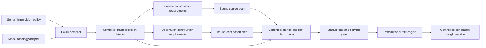

# Semantic Precision Policy and Transactional Refit

Status: Approved for implementation on 2026-09-04

Design choice: B — semantic policy, endpoint adapters, and transactional refit

Analysis baseline: NVIDIA-NeMo/RL `upstream/main` at
`4601ba2c646ec40e5928c780fc0051a842328eba` on 2026-09-03. Pull request heads
must be re-fetched before implementation or publication because they can drift
independently from this design snapshot.

## Decision

NeMo RL will describe quantization intent with a versioned semantic precision
policy and compile that policy into explicit source, wire, and destination
plans. The refit transport will not infer precision, ownership, or runtime
layout from parameter names, tensor dtype, or tensor shape.

Model-family adapters will describe logical model components. Endpoint
adapters will bind those components to the physical storage used by the
training and generation runtimes. A transactional refit protocol will validate
the complete plan before entering a collective and will make any detected
refit failure fatal to the training process.

This design replaces runtime monkey patches and duplicated training/generation
ignore lists. It preserves a fast direct-transfer path and confines vLLM
version-specific knowledge to small, tested adapters.

## Motivation

The production policy currently quantizes routed, non-shared MoE experts while
leaving shared experts and the first and last decoder layers in BF16. The same
selection must work for both:

- BF16 training to MXFP8 rollout; and
- MXFP8 training to MXFP8 rollout.

The scope may later include Q, K, V, O, dense FFNs, embeddings, latent
projections, recurrent mixers, or other model components. A design based on
negative parameter-name patterns does not scale to those cases.

Several current model families also separate logical checkpoint tensors from
runtime storage:

- Qwen3.5 and Qwen3.8 may store grouped routed experts in BF16 checkpoints and
  split experts plus scales in quantized checkpoints.
- FlashInfer TRTLLM stores an unquantized BF16 expert in a padded and permuted
  block-major layout.
- ModelOpt MXFP8 stores FP8 values and block scales and may create separate
  execution-only tensors.
- Kimi K3 fuses KDA and MLA projections, wraps its routed experts in latent
  projections, and transforms inner expert weights into MegaMoE storage.
- GLM-5.2 combines routed and shared experts with MLA, a dynamic sparse
  attention indexer, dense prefix layers, and an auxiliary prediction layer.

Matching two physical tensors because their dtypes happen to be equal is not a
valid loading rule. Equal dtypes can represent different layouts, while
different checkpoint encodings can represent the same logical parameter.

## Goals

1. Express the production routed-expert policy without generated negative
   ignore lists.
2. Permit any model component to become a future quantization scope without
   changing the policy or transport core.
3. Keep shared experts and unselected components in BF16 by default at each
   endpoint in which their graph participates; do not synthesize an endpoint
   for a training-only or checkpoint-served graph.
4. Handle split, fused, grouped, padded, permuted, and derived runtime storage
   explicitly.
5. Support BF16-to-MXFP8 and native-MXFP8-to-MXFP8 refit without ambiguous
   conversion.
6. Make a detected refit failure terminate the training launcher with a
   non-zero status and bound silent-peer failures with mandatory deadlines.
7. Meet an explicit no-regression performance gate: initially, p50 and p95
   refit latency may be no more than 5 percent slower than the fastest correct
   existing path for the same semantics.
8. Support vLLM 0.25.1 and 0.28.0 through versioned adapters and fail closed on
   an unsupported runtime.
9. Allow model support to grow through adapters and conformance fixtures rather
   than central model-name branches.

## Non-goals

- Automatically trusting an unseen future architecture without an adapter or
  a successful capability negotiation.
- Implementing quantization mathematics inside the transport layer.
- Providing rollback from partially overwritten GPU runtime storage. A failed
  in-place update poisons and terminates the generation worker instead.
- Treating a safetensors index as a description of vLLM runtime storage.
- Supporting partial precision changes within a fused physical owner unless
  the endpoint explicitly supports split and repack.

## Architecture



The architecture separates six concerns:

| Concern | Owner |
|---|---|
| User intent | Semantic precision policy |
| Logical model structure | Model topology adapter |
| Graph lifecycle and rollout participation | Typed internal graph declarations |
| Training storage and export | Source endpoint adapter |
| Wire encoding and transport | Refit planner and transport engine |
| Generation runtime layout | Destination endpoint adapter |

The policy compiler operates only on logical semantic records. It never sees a
vLLM parameter path or a Megatron parameter path.

The compiled graph intents are model-construction inputs, not refit-only
metadata. They configure the requested training realization and each
participating generation owner as BF16, MXFP8, or another advertised format
before storage is allocated. After model construction, source and destination
adapters bind their realized storage, capability fingerprints, layouts,
ownership, and transforms. Only graphs whose internal lifecycle requires
source-to-rollout refit enter the canonical bound refit plan. Training-only
graphs have no destination binding, while checkpoint-served graphs use their
pinned checkpoint load path. There is no global "MXFP8 model" flag followed by
hidden BF16 exceptions.

## User-facing precision policy

The common recipe interface is a short positive allow-list. At each endpoint a
graph participates in, unselected parameters inherit BF16. A missing endpoint
does not become a BF16 realization request.

```yaml
precision_policy:
  schema_version: 1
  default: bf16
  scopes:
    - id: routed-experts-middle
      role: moe.routed_expert
      layers:
        exclude_first: 2
        exclude_last: 1
      rollout: mxfp8
```

The values `2` and `1` illustrate recipe-supplied `N` and `M`; both fields are
non-negative integers rather than model-specific constants in the compiler.

BF16 training inherits `default: bf16`. MXFP8 training adds only
`training: mxfp8` to the scope. The version-1 `moe.routed_expert` role expands
to `graph_kind=main`, `semantic_graph_path=text.decoder`, `model_part=main`,
`module_kind=moe.expert_ffn`,
`expert_kind=routed`, `projection in {gate, up, down}`, and
`parameter_role=kernel`. It does not include shared experts, routers, latent
input/output projections, biases, draft/MTP models, or unrelated layers, so
those remain BF16 without an ignore pattern.

Scalar precision names are versioned format profiles. In schema version 1,
`mxfp8` means the E4M3-values/E8M0-block-32 descriptor. A specialized experiment
may declare a named detailed format profile, but the production recipe does not
repeat component or scale geometry.

`PrecisionPolicyConfig` and every YAML-loaded nested policy schema are typed
`BaseModel(extra="allow")` classes, following the repository convention.
In schema version 1, `default` is the non-configurable safety type
`Literal["bf16"]` with field default `"bf16"`; it applies independently to each
participating training or rollout endpoint and is not an endpoint selector.
`schema_version=1`,
`require_match=True`, and `atomic_conflict="error"` are Python field defaults
declared once on those models; consumers do not invent fallbacks. A model
validator inspects `model_extra`: documented legacy fields enter the
compatibility translator and any other unknown field under the new policy
namespace raises a configuration error, so `extra="allow"` does not silently
accept selector typos. Open-ended semantic attributes use a typed
scalar-or-list predicate model, not `dict[str, Any]`. Internal manifests,
plans, and transaction records are typed dataclasses and are never YAML-loaded.

Common future scopes remain equally short. For example,
`role: attention.qkvo` selects Q, K, V, and O projection kernels, while
`role: embedding.ngram` selects a shared semantic embedding role. The
version-1 `attention.qkvo` predicate is `graph_kind=main`,
`semantic_graph_path=text.decoder` token-attention,
`module_kind=attention.projection`, `projection in {q, k, v, o}`, and
`parameter_role=kernel`. It includes ordinary full, GQA, and QSA token-attention
projections, but excludes gated-delta/KDA input projections, QSA or DSA indexer
projections, MLA projections, vision attention, output gates, biases, and
draft/MTP graphs. Genuinely architecture-specific behavior may use a
namespaced role such as `qwen.ple_ngram_embedding`.

The version-1 `embedding.ngram` predicate is `graph_kind=main`,
`semantic_graph_path=text.embedding`,
`model_part=main`, `module_kind=embedding.ngram`, and
`parameter_role=kernel`; it excludes token embeddings, vision embeddings, and
draft/MTP graphs. Every public or namespaced role must be advertised by the
selected topology adapter as a schema-versioned `RoleDefinition` containing
its exact graph kind, semantic graph path, model part,
module-kind/attribute, parameter-role predicate, and expected
topology-derived domain. An unadvertised role fails compilation.

Role aliases are versioned by `schema_version`, never change meaning in place,
and expand into the structured semantic predicates used internally. The
compiler prints and stores the full expansion, matched counts, selected layer
ranges, physical owners, formats, and transforms before model construction.

### Advanced selector escape hatch

Adapter authors and specialized experiments may replace `role` with an
`advanced_match` containing separate typed `graph_instance_id` and
`semantic_graph_path` predicates plus module kind, typed attributes, parameter
role, model part, and layer-coordinate predicates. `graph` is not an alias for
either identity and is rejected. A one-off component uses `addresses`, a list of
typed records containing `graph_instance_id`, `semantic_graph_path`, and
`semantic_id`:

```yaml
addresses:
  - graph_instance_id: draft.external
    semantic_graph_path: draft.decoder
    semantic_id: draft.decoder.layer.1.attention.q.kernel
```

`semantic_id` is one canonical rendered ID whose prefix includes its semantic
graph path, for example `text.decoder.layer.1.moe.routed.0.gate` or
`draft.decoder.layer.1.attention.q.kernel`. The canonical parameter identity is
the pair `(graph_instance_id, semantic_id)`; the explicit
`semantic_graph_path` field must equal the path encoded by `semantic_id`.
These advanced forms still never expose a checkpoint key or runtime parameter
name. Each required canonical identity must appear exactly once in every
logical binding map required by that graph's endpoint participation and owner
cadence. That unique logical binding may be a composite `BindingSet` containing
several physical owners, slices, values, scales, or other encoding components.
Adding a new ordinary quantization target should normally add a documented
versioned role alias instead of copying the advanced matcher into recipes.

The selector schema is a discriminated union: exactly one of `role`,
`advanced_match`, or `addresses` is present in a scope. The short production
role recipe is unchanged.

Scopes have the following semantics:

- Scope order is not an override mechanism. Two matching scopes that request
  different precision are a configuration error.
- `require_match` defaults to true. A routed-expert scope
  applied to a dense model fails during compilation instead of silently doing
  nothing.
- A role match also validates complete topology-derived coverage. An adapter
  advertising `moe.routed_expert` must bind every eligible routed gate/up/down
  kernel, and an adapter advertising `attention.qkvo` must bind every eligible
  Q/K/V/O kernel. Matching one component or one layer is not enough, and a role
  member cannot be hidden as generically out of scope.
- A scope must change at least one participating endpoint away from BF16.
  Omitting `training` or `rollout` inherits BF16 only when that graph
  participates in the endpoint; omitting both is an error.
- `atomic_conflict` defaults to `error`. `expand` is allowed only when
  explicitly requested. Expansion computes a transitive fixed point across
  quantization and load atomic groups at each endpoint the selected graph
  participates in, then reruns precision conflict and layer-boundary checks and
  reports every added semantic ID. An expansion that crosses an explicit BF16
  first/last boundary is rejected.
- Raw checkpoint or runtime parameter regexes are not part of the stable policy
  interface. A temporary migration field may exist for legacy recipes, but it
  is translated once and cannot be combined with semantic scopes.

The implementation adds a dry-run `explain-precision` command to the existing
configuration tool. Without constructing a model it emits the canonical
compiled intent group and exits non-zero on zero matches, conflicts,
unsupported topology or format profiles, incomplete checkpoint inventory, or
invalid immutable-auxiliary evidence. Physical layouts, transform/kernel
selection, realized capability fingerprints, and final `plan_id` values are
explicitly reported as unavailable until binding. The model-construction
preflight emits that realized information and rejects a binding gap only for an
endpoint and owner cadence the graph is required to realize, before any refit
communicator is created.

### Layer coordinates

Every adapter normalizes layers to a zero-based canonical coordinate. Simple
scopes default to `global_decoder` within the main `text.decoder`; the range
excludes vision, draft, and auxiliary prediction graphs. `exclude_first` and
`exclude_last` count physical decoder layers, even if some are dense.

Both exclusions must be non-negative and cannot consume the whole selected
decoder range. `require_match` is evaluated after layer filtering, so an
otherwise valid role that becomes empty at the boundary fails before model
construction.

A `layers` selector is valid only for a role whose semantic domain has the
chosen canonical layer coordinate. Supplying it for an unlayered role such as
`embedding.ngram` is a configuration error.

`moe_ordinal` is also supported for policies that mean the first or last N
MoE-bearing layers rather than physical decoder layers. Selecting this
non-default index space must be explicit. Vendor-specific one-based layer lists
are normalized by the model adapter and never exposed to policy code.

## Semantic model manifest

The model topology adapter emits a complete logical manifest. Two identifiers
must not be conflated. `graph_instance_id` identifies a runtime/model instance:
the sole main instance is exactly `main`, while auxiliaries use stable `mtp.*`
or `draft.*` IDs. `semantic_graph_path` is an address facet such as
`text.decoder`, `text.embedding`, `auxiliary.mtp`, or `draft.decoder`. One main
instance can contain both text-decoder and text-embedding addresses. Bundle
membership and lifecycle validation use `graph_instance_id`; role matching and
layer domains use `semantic_graph_path`. Built-in main roles additionally
require `GraphKind.MAIN`, so a draft cannot match by copying a main semantic
path.

A manifest carries `graph_instance_id`; each address inside it carries
`semantic_graph_path` and a canonical rendered `semantic_id` beginning with
that path. `(graph_instance_id, semantic_id)` is the canonical identity; the
separate path field is validated against the rendered ID and supports typed
matching without reparsing the ID. A semantic address contains structured
facets rather than a parameter-name string:

```text
semantic graph path
layer coordinate
module kind
module attributes
parameter role
logical axes
logical shape
logical dtype
model part
```

Representative module kinds and attributes include:

- `moe.expert_ffn`, `expert_kind=routed|shared`,
  `projection=gate|up|down`;
- `moe.latent_projection`, `direction=input|output`;
- `moe.router`;
- `attention.projection`, `projection=q|k|v|o`;
- `attention.mla`, `projection=q_a|q_b|kv_a|kv_b|output|output_gate`;
- `sequence_mixer.gated_delta` with projection, convolution, state, and bias
  facets;
- `attention.sparse_indexer`;
- `ffn.dense`;
- `embedding.token|ngram`;
- `residual.hyperconnection`;
- `vision.encoder`; and
- `auxiliary.mtp` or `draft.decoder`.

The vocabulary is versioned and namespaced, but not closed. Adapters advertise
the semantic kinds and attributes they implement. Common role aliases such as
`moe.routed_expert` expand into structured predicates. Their meanings are
pinned by the policy schema version and are independent from physical formats.

### Complete accounting

The bundle carries an authoritative `ExpectedGraphDeclaration` set. It is built
from the actual training graph instances and explicit rollout graph
declarations before semantic adaptation, and contains graph instance ID, graph
kind, graph provenance, rollout participation, model identity, and any immutable
evidence attachment. There is a bijection between expected declarations and
manifests: adapters cannot add, drop, or rename an instance. Task 4 accepts
typed `AuxiliaryGraphDeclaration` values to construct this set; these records
are topology-independent and contain no PP-rank guesses. Exact source and
destination PP ownership is derived later from both realized runtime
topologies and bindings.

Every trainable or reload-relevant endpoint tensor must be represented in a
typed `ParameterInventory` and classified as one of:

1. a logical model parameter;
2. an encoding component of a logical parameter;
3. a derived runtime tensor;
4. a tied alias; or
5. explicitly out of scope for policy refit with a typed reason.

`GraphProvenance` identifies who instantiated a graph
(`training_runtime`, `model_checkpoint`, or `external_checkpoint`). Separately,
`ValueProvenance` identifies whether an inventory value is a logical training
parameter, checkpoint encoding component, backend-derived value, or tied alias.
Every inventory entry has typed `SemanticOwnership` and a qualified
`OwnerReference(graph_instance_id, owner_id)`. A tied alias points to another
qualified owner reference; an unqualified owner ID or cross-graph alias cycle is
invalid. `OutOfScopeTensor` pairs a canonical identity with a typed
`OutOfScopeReason`; a reason enum alone cannot hide an unaccounted tensor.

Unknown or partially inventoried tensors are never silently omitted. At each
endpoint a graph participates in, unselected representable tensors retain BF16
intent. A missing binding fails only when the graph's endpoint participation
and derived owner cadence require that binding. The compiler reports selected
and unselected counts by graph instance, semantic graph path, layer, module
kind, and precision.

Source mutability is recorded per qualified physical owner in the authoritative
inventory, not as one independently supplied graph flag. All semantic values
and aliases sharing an owner inherit the same `SourceMutability`; conflicting
claims fail validation. An out-of-scope reason is allowed only for a
source-proven frozen owner, an immutable auxiliary model, or backend-owned
derived state. A mutable main-model owner cannot be marked out of scope: even
when unselected for quantization, it must follow the default BF16 refit path. A
mutable training-only auxiliary is still represented and fully accounted for;
its rollout participation, rather than per-tensor exclusions, explains why it
has no refit destination. Source metadata and topology accounting are
reconciled so adapters cannot hide KDA state, router bias, AttnRes weights,
norms, or another changing parameter behind a generic exclusion.

`ImmutableAuxiliaryEvidence` is attached to its
`ExpectedGraphDeclaration` and contains graph instance/model identity, a pinned
checkpoint revision, checkpoint-content digest, model-configuration digest,
semantic-domain digest, and typed `EvidenceSource(kind, locator, digest)`.
Owner freeze claims use the same typed evidence-source record. All fields
participate in the declaration or owner-inventory digest. A safetensors index
name, mutable branch/tag, or model ID without content evidence is insufficient.

### MTP and speculative-draft coherence

MTP and speculative decoding are separate semantic graphs, never implicit
members of a main-model role. The built-in `moe.routed_expert` and
`attention.qkvo` roles therefore do not select `auxiliary.mtp` or
`draft.decoder` tensors. That exclusion controls precision selection only. It
does not decide whether an auxiliary is trained, served, or refitted.

Auxiliary lifecycle is an internal frozen composite record, not another
user-facing precision-policy rule. It keeps declared graph facts separate from
inventory-derived cadence:

| Axis | Representative values | Meaning |
|---|---|---|
| Graph kind | `main`, `mtp`, `speculative_drafter` | Declared semantic function of the graph instance |
| Graph provenance | `training_runtime`, `model_checkpoint`, `external_checkpoint` | Declared authority that instantiated the graph |
| Rollout participation | `not_served`, `served_from_source`, `served_from_checkpoint` | Declared way rollout obtains the graph |
| Owner source mutability | `mutable`, `frozen`, `absent` | Inventory evidence for each qualified source owner |
| Refit requirement | `none`, `initial_only`, `every_version` | Derived graph summary, never an independent input |
| Owner cadence | `startup_only`, `every_version`, `none` | Derived execution cadence for each physical owner |
| Rank-local endpoint ownership | owned storage, tied alias, or absent at each source/destination rank | Task 7 result from realized endpoints and their parallel topologies |

The frozen `GraphLifecycle` stores graph kind, graph provenance, and rollout
participation plus immutable-evidence attachment where applicable. Validation
joins it with the complete owner inventory to derive `RefitRequirement` and
per-owner cadence. For `served_from_source`, any mutable owner makes the graph
`every_version`; mutable owners transfer each version, while independent frozen
owners load once during startup and their content digests remain transaction
preconditions. If every source owner is proven frozen, the graph is
`initial_only`. `not_served` and `served_from_checkpoint` derive `none` for
source refit. Callers cannot store a conflicting refit requirement.

A mutable MTP or drafter declared `not_served` is a legitimate training-only
graph: it remains in the semantic bundle and receives a training precision
intent, but it has no rollout binding, wire plan, finalizer, or transaction
acknowledgement. A source-proven frozen owner served from source requires a
startup realization/load request and owning-rank binding/finalization before
generation can serve. It is excluded from every-version payloads after that
startup precondition succeeds. Freezing cannot be inferred merely because
`loss_scaling_factor=0`, `detach_heads` is set, or the current gradient is
absent. Those controls affect loss or gradient flow, not value provenance or
future mutability.

A graph declared `served_from_checkpoint` is static for source refit. Before
model construction, its evidence attachment must provide the graph/model
identity, immutable resolved revision, checkpoint-content digest,
model-configuration digest, semantic-domain digest, and evidence source. It is
validated as serving context but contributes no source startup/per-version
payload or FINALIZE acknowledgement. A mutable checkpoint declaration or
incomplete evidence fails closed.

Every auxiliary actually instantiated by the training runtime appears in the
semantic manifest bundle, including mutable training-only MTP/draft heads.
Task 4 does not predict PP ownership. Task 7 derives rank-local ownership from
both realized endpoint bindings and the source/destination runtime parallel
topologies rather than a process-global `has_drafter` boolean. Missing realized
drafter/MTP storage on a rank derived to own a startup-only or every-version
owner is fatal during preflight. Absence is valid on derived non-owning
pipeline-parallel ranks and for `not_served` graphs.

An external drafter may use a different model family or endpoint adapter, but
all graph instances in one policy/generation group are governed by the same
versioned `precision_policy`. Per-graph exceptions use qualified
`advanced_match` or `addresses` scopes; there is no separate drafter policy. A
mutable served-from-source drafter joins the parent transaction through an
ordered member record and target version. MTP weights tied to main-model storage
are represented as qualified tied aliases; alias-only graph members reference
the canonical physical owner and never duplicate transfer, dirty-owner
finalization, or rank acknowledgement. No adapter may discard either tied or
independent storage through a name-based `mtp` ignore rule.

### Compressed tensor families

Large models can contain hundreds of thousands of homogeneous expert
components. The compact manifest uses only structured finite domains:

```text
LayerMember(global_decoder_layer, moe_ordinal | None)
LayerDomain(members)
AxisDomain(name, members)
FamilyIndexDomain(layer_domain, independent_axes)
SemanticAddressPattern(fixed semantic facets, structured index slots)
OwnerFamilyReference(graph_instance_id, owner_family_id, structured indices)
OwnerFamilyBinding(owner reference, semantic pattern, exact index domain)
```

`LayerMember` keeps correlated decoder and MoE coordinates together; they are
never modeled as two Cartesian axes. `AxisDomain` is reserved for genuinely
independent axes such as expert ordinal. `SemanticAddressPattern` contains typed
facets and index slots, not a free-form string template, regex, glob, or
wildcard. The canonical renderer produces each path-prefixed `semantic_id`.
`OwnerFamilyBinding` and `OwnerFamilyReference` likewise use qualified,
structured indices rather than formatted owner-name strings.

A value that changes role meaning is a fixed attribute of a separate complete
family. Routed gate, up, and down are three families; Q, K, V, and O are four
families. Projection is not a generic family axis and no explicit
attribute-to-axis binding mechanism is needed. A dependent or ragged domain,
such as layer groups with different expert counts, is represented by multiple
complete non-overlapping families. It is never approximated by a correlated
Cartesian product.

Validation computes exact finite-domain intersections among explicit tensors
and all families, rejects every duplicate canonical identity or physical-owner
claim, and proves the union exactly accounts for the authoritative inventory.
Partial family coverage or an unaccounted inventory suffix is invalid. These
checks operate over compact domains or lazy iterators; expanded instances are
not persisted in the manifest or exchanged on every refit. Each rank later
materializes only the locally owned execution entries. Plan digests use the
canonical structured family representation.

### Plan identity and determinism

Identity is deliberately staged so policy materialization does not depend on a
backend that has not been constructed yet. Each graph first gets an `intent_id`
that hashes the semantic schema version, resolved model revision and topology
digest, policy digest, logical precision assignments, and requested formats. A
`CompiledPrecisionIntentGroup` contains the ordered intent for every declared
graph, including training-only mutable auxiliaries, plus validated immutable
checkpoint evidence. Endpoint realization requests are present only where that
graph participates in the corresponding endpoint.

After every required endpoint is realized, canonical `startup_plan_id` and
`plan_id` values additionally hash the actual source and destination capability
fingerprints, format descriptors, both runtime parallel topologies, ownership
map, canonical bindings, transform/kernel selection, owner cadence, and buffer
schedule. The startup group contains source-proven frozen
`served_from_source` owners, including frozen owners inside a graph that also
has mutable owners. It must complete once before serving.

An every-version transaction-group digest hashes the ordered graph-member
records, their unique mutable-owner `plan_id` values, alias-to-owner mappings,
the successful frozen-owner startup-precondition digest, and the target
generation version. Static checkpoint evidence is immutable serving context,
not a source transaction member. All identities are independent of dictionary
order and process-local object identity.

Every participating rank receives the same relevant canonical startup/refit
plan identity. Local execution-plan digests are keyed by rank and placement and
are validated against the canonical ownership map; they are not incorrectly
required to be equal across ranks that own different shards. A graph binding
may be absent exactly where the realized topologies say the rank is a non-owner.
Replicated owners additionally prove that their local bindings agree. The Ray
control plane performs this comparison before data communicators are created.

## Storage and wire contracts

Logical semantics do not imply a quantization format. Each endpoint and wire
binding carries a versioned format descriptor:

```text
format family and recipe
value dtype
ordered component descriptors
logical and physical shapes
logical axes and physical axis mapping
block or group geometry
padding semantics
placement and ownership
layout identifier
```

Component roles are extensible. Examples include `values`, `block_scales`,
`global_scale`, `input_scale`, `packed_shape`, and `bias`. MXFP8 value plus
E8M0 scale is one encoding; block-128 FP8, NVFP4, and MXFP4 are different
encodings even when they apply to the same semantic parameter.

The planner selects one transform locus:

- `none` when source and destination encodings are compatible;
- `source` for trainer-side prequantization;
- `destination` for receiver-side quantization or runtime packing; or
- `destination_native_loader` when the destination owns checkpoint-to-runtime
  conversion.

For an owner cadence whose source and destination endpoints both participate,
the same transform is never applied at both endpoints.

### Canonical load components and derived execution storage

A destination binding distinguishes canonical load components from derived
execution storage. `load_component` accepts only the logical or encoded
components named by the load plan. A finalizer then produces padded, permuted,
fused, flattened-scale, or backend-specific kernel storage exactly once per
dirty physical owner.

Current vLLM MXFP8 implementations illustrate why this distinction is
mandatory: logical scales may live in `*_scale_from_checkpoint`, padded values
may use `*_weight_for_apply`, and runtime scales may be flattened and shuffled.
For an aligned owner that reuses the `w13_weight` or `w2_weight` allocation as
execution storage, the public destination capability must provide a canonical
shadow/staging view or a native reload operation followed by one finalization.
The transport never writes logical data directly into an already shuffled
allocation because a name, dtype, or shape appears compatible.

Conformance tests reject bindings that target flattened runtime scales,
`*_weight_for_apply`, or already shuffled values as canonical inputs. The
Qwen3.5 grouped-main-expert path must bind through the new grouped semantic
loader; a legacy path that raises for grouped MXFP8 weights is not an allowed
fallback.

### Safetensors and checkpoint metadata

A safetensors index is evidence only of source-key-to-shard membership for one
resolved model revision. It does not describe tensor shape, dtype, logical
axes, TP or EP ownership, fused vLLM names, padded runtime storage, or derived
execution tensors. Production plans resolve model references to immutable
revisions and combine model configuration, safetensors headers, source adapter
metadata, and the realized destination manifest. For a static checkpoint-served
auxiliary, the index alone is insufficient: revision, checkpoint content,
configuration, and semantic-domain digests are all mandatory.

Static indexes are useful as pinned conformance fixtures, but they are never
the runtime loading contract. For example, Lightning NVFP4, Kimi K3 MXFP4, and
Qwen or GLM block-FP8 components are distinct format descriptors and cannot be
relabeled as MXFP8 merely because they contain low-precision values and scales.

### Mixed-precision destination paths

The destination plan dispatches by the realized owner's format and layout, not
by a model-global quantization mode and not by dtype equality.

| Policy result | Received representation | Realized destination | Required operation |
|---|---|---|---|
| MXFP8 owner | BF16 tensor | FP8 values plus MXFP8 scales | Quantize once at the selected transform locus, then load both components |
| MXFP8 owner | Compatible current MXFP8 components | FP8 values plus MXFP8 scales | Direct component transfer after descriptor and version checks |
| BF16 TRTLLM owner | BF16 tensor | Padded and permuted TRTLLM block storage | Destination-owned native layer load and batched pad/permute |
| Layout-compatible BF16 owner | BF16 tensor | Matching BF16 storage | Direct transfer only after full layout-descriptor equality |

For the Nano padding case, a logical expert tensor such as
`[128, 928, 2688]` may realize as `[128, 42, 1024, 64]`. Equal BF16 dtypes do
not make those tensors directly copy-compatible. Conversely, the middle
MXFP8 layers are loaded as values plus scales without passing through the BF16
TRTLLM layout path. This owner-level dispatch is what permits BF16 first/last
layers and MXFP8 middle layers in one engine.

### TRTLLM expert padding contract

For current FlashInfer TRTLLM adapters, let `E_l` be locally owned experts,
`I_l` the local expert intermediate dimension, `H_r` the routed hidden
dimension, and `g` one for non-gated or two for gated experts. The canonical
MXFP8 load shapes are:

```text
w13 values: [E_l, g * I_l, H_r]
w2 values:  [E_l, H_r, I_l]
w13 scales: [E_l, g * I_l, H_r / 32]
w2 scales:  [E_l, H_r, I_l / 32]
```

The current adapter advertises `H_p = round_up(H_r, 512)` and
`I_p = round_up(I_l, 128)`. The destination finalizer produces padded apply
values and flattened scales with:

```text
w13 apply values: [E_l, g * I_p, H_p]
w2 apply values:  [E_l, H_p, I_p]
w13 runtime scales: [E_l, g * I_p * H_p / 32]
w2 runtime scales:  [E_l, H_p * I_p / 32]
```

Value padding is zero, E8M0 scale padding uses the unit-scale byte `127`, and
the two gated halves are padded independently. Finalization performs the
required W13-to-W31 ordering and block-major shuffle. These values are adapter
capabilities and conformance fixtures, not constants in the transport core.

Logical dimensions must be divisible by 32 before this MXFP8 padding path.
Nano or Lightning TP4 (`I_l=464`), Super TP8 (`336`), Qwen3 TP16 (`48`),
Qwen3.5 TP32 (`16`), and Ultra TP64 (`80`) are preflight-negative fixtures
unless a later adapter explicitly advertises and numerically validates a
pad-before-quantize algorithm.

## Physical owners and atomic groups

One physical tensor may own several semantic parameters, and one semantic
parameter may be represented by several physical components. Each endpoint
binding therefore declares:

- physical owner ID;
- semantic slices with logical axis mappings;
- quantization atomic group;
- load atomic group;
- supported split/repack operations; and
- finalizer owner.

Examples include fused gate-up, fused QKV, Qwen grouped experts, Kimi fused KDA
input projections, and vLLM `w13` storage.

If a policy selects only Q from an inseparable fused QKV owner, or gate from an
inseparable gate-up owner, compilation fails by default. It succeeds only when
the endpoint advertises a split/repack plan or the user explicitly permits
atomic expansion. This decision is made before any refit data-plane
communicator is created.

## Endpoint adapter interfaces

Construction and runtime protocols isolate implementation-specific behavior:

```python
class ModelTopologyAdapter(Protocol):
    def describe_semantic_model(self) -> SemanticModelManifest: ...

class SourceEndpointFactory(Protocol):
    def capabilities(self) -> EndpointCapabilities: ...
    def compile_realization(
        self, manifest: SemanticModelManifest, policy: EndpointPrecisionPlan
    ) -> SourceRealizationPlan: ...
    def bind_realized(self, plan: SourceRealizationPlan) -> SourceEndpointAdapter: ...

class SourceEndpointAdapter(Protocol):
    def capabilities(self) -> EndpointCapabilities: ...
    def bind_source(self, manifest: SemanticModelManifest) -> BoundSourcePlans: ...

class DestinationEndpointFactory(Protocol):
    def capabilities(self) -> EndpointCapabilities: ...
    def compile_realization(
        self, manifest: SemanticModelManifest, policy: EndpointPrecisionPlan
    ) -> DestinationRealizationPlan: ...
    def bind_realized(
        self, plan: DestinationRealizationPlan
    ) -> DestinationEndpointAdapter: ...

class DestinationEndpointAdapter(Protocol):
    def capabilities(self) -> EndpointCapabilities: ...
    def describe_realized_storage(self) -> RealizedStorageManifest: ...
    def bind_destination(self, manifest: SemanticModelManifest) -> BoundDestinationPlans: ...
    def prepare_startup_load(self, startup_id: str) -> None: ...
    def prepare_update(self, update: PreparedUpdate) -> None: ...
    def load_component(self, component: ReceivedComponent) -> None: ...
    def finalize_dirty_modules(self) -> None: ...
    def commit(self, update_id: str) -> None: ...
    def abort(self, update_id: str, cause: BaseException) -> None: ...
```

The exact Python API may be split across processes, but these responsibilities
remain separate. Endpoint adapters own names, fused regions, padding, runtime
layout conversion, stable CUDA-graph storage, cache invalidation, and
finalization. The transport owns byte movement and deadlines.

`abort` is idempotent and bounded. If cleanup cannot complete inside its local
budget, the only valid fallback is process termination; an abort error can
never be converted into permission to resume the engine.

Model support is registered by architecture and capability fingerprint. The
core contains no Kimi, Qwen, GLM, or Nemotron parameter-name branches.

## vLLM compatibility

Both vLLM 0.25.1 and 0.28.0 expose a registered `WeightTransferEngine`
lifecycle. The interface evolved between the releases: 0.28.0 adds a stateful
trainer engine, `WeightSource` metadata, target selection, and a richer public
control plane. NeMo RL will use that public lifecycle rather than replacing
parameter `weight_loader` attributes or patching global conversion functions.

The NeMo-facing adapter API is stable. Runtime-specific modules implement it:

- `Vllm0251EndpointAdapter` for the 0.25.1 public lifecycle plus explicitly
  backported public reload capabilities;
- `Vllm0280EndpointAdapter` for the 0.28.0 stateful trainer/inference lifecycle;
  and
- later adapters selected by capability fingerprint rather than a scattered
  version comparison.

If vLLM lacks a public operation needed for component loading, padding, or
batched TRTLLM conversion, the operation must be added upstream and backported
to the pinned wheel. NeMo RL will not compensate with a runtime monkey patch.

At startup, the adapter runs a semantic conformance check:

1. protocol and capability schema versions are supported;
2. all relevant endpoint tensors are accounted for;
3. every required policy selector matches;
4. source and destination bindings are unique and complete for each required
   startup-only or every-version owner cadence;
5. encoding, alignment, placement, and atomicity are compatible;
6. every participating rank has the same canonical `plan_id`, and each rank's
   local binding or declared absence matches its ownership entry;
7. every source-served startup-only/every-version owner has destination storage
   on each derived owning rank, while non-owning ranks and `not_served` graphs
   may omit it; and
8. the destination can prepare and abort a no-data dry run.

An unsupported version or semantic mismatch fails before refit-transport
communicator initialization or the first refit collective. The model runtime's
own TP/EP communicators may already exist. There is no direct-copy fallback
based on matching dtype or shape.

The compatibility guarantee is therefore bounded and testable: a vLLM bump
may require a new thin adapter, but it does not change policy, model semantics,
or transport. An unseen future vLLM version is not claimed to work until its
adapter passes conformance.

## Transactional fail-fast refit

Before generation can serve, a fail-fast startup-load transaction executes the
canonical startup plan exactly once for every source-proven frozen
`served_from_source` owner. It uses the same PREPARE, TRANSFER, destination load,
exactly-once FINALIZE, abort, timeout, and poison contracts as refit, then
publishes an immutable startup-precondition digest. It does not advance a
generation weight version and is never replayed in an every-version refit. A
binding/load/finalize failure keeps the serving gate closed, terminates the
launcher non-zero, and preserves the original phase/rank/cause.

Every refit has a monotonic `update_id`, immutable plan-group identity, source
weight version, and expected destination version. A source-served graph with at
least one mutable owner is an every-version transaction member, but only its
mutable independent owners appear in repeated payloads. Its frozen independent
owners are fixed startup preconditions and aliases remain de-duplicated. The
trainer exposes an immutable snapshot for that source version; optimizer writes
cannot race the exported components.

```text
PREPARE -> READY consensus -> TRANSFER -> FINALIZE -> COMMIT consensus
    |            |              |            |
    +------------+--------------+------------+--> ABORT on first failure
```

### Prepare

- Quiesce generation and resolve current destination handles.
- Freeze or acquire the declared source weight snapshot.
- Validate every local source and destination component required by this
  transaction's owner cadence and verify its startup-precondition digest.
- Allocate or acquire bounded staging buffers.
- Arm an out-of-band abort controller and phase deadlines.
- Perform no data collective.

All source and destination ranks that own a transaction member or participate
in its transfer route must return READY with the same plan digest before
TRANSFER is released. An absent binding on an owning rank is an immediate
preflight failure; an absent graph on a declared non-owning pipeline rank is not
an acknowledgement failure.

### Transfer and finalize

The controller supervises training and generation futures as one set using a
first-completion loop. It does not wait for every trainer before observing a
generation failure. Workers return a typed `RefitWorkerResult`; any exception,
`ok=False`, malformed or missing result, actor death, or deadline triggers
ABORT. Temporary wrappers may normalize a legacy `False` to `ok=False`, but
`None` is never accepted as an implicit success.

Abort is a distributed control-plane protocol, separate from the data
collectives and Ray actor work queues. Every participating process has a local
abort supervisor with handles to its communicators and an independent phase
watchdog. A worker that detects an exception publishes a validated
`ABORT(update_id, plan_id, cause)` before unwinding; the job supervisor fans it
out to all ranks. Each local supervisor can abort communicators from a dedicated
thread. If a backend cannot safely abort in place, its advertised abort action
is immediate worker termination rather than best-effort continuation.

Controller loss, abort-fanout failure, or a missed phase deadline causes every
surviving rank to poison local state, abort its local communicators, and
terminate. The launcher observes controller or actor death, terminates the
remaining job actors within the teardown deadline, and exits non-zero. No rank
may commit or resume service after observing an abort for the current or a
newer update.

Destination adapters finalize only dirty modules. A worker may update runtime
storage in place while generation is quiesced. If that update fails, the
worker is marked POISONED and terminated; it never resumes serving a partial
weight version.

### Commit and propagation

The destination weight version changes only after every expected owning rank
acknowledges successful finalization for every repeated mutable owner in each
source-served transaction member and the frozen-owner startup precondition still
matches. Alias-only graph members reuse the canonical owner's acknowledgement;
training-only, source startup-only, and static checkpoint graphs add no
every-version acknowledgement. `commit(update_id)` is an idempotent metadata or
pointer transition; generation remains globally quiesced until every expected
commit acknowledgement arrives. A partial commit acknowledgement poisons the
affected generation group; the launcher then terminates all job actors and
exits non-zero instead of serving ranks with different versions. Recovery and
worker-group rebuild are future modes and are not part of this fail-fast
contract. Prefix, encoder, multimodal, and quantization caches are invalidated
according to destination capabilities before generation resumes after a fully
successful commit.

All wrappers raise a structured `RefitTransactionError` containing update ID,
phase, rank, semantic address, component, source/destination shapes, plan
digests, and original cause. No layer converts a refit exception into a normal
`False` result. Algorithm-level cleanup re-raises the original fatal error, so
the launcher exits non-zero.

Detected failures propagate immediately. A process that freezes without
reporting is bounded by mandatory bootstrap, prepare, transfer, finalize,
commit, abort-fanout, and teardown deadlines. Every timeout is a typed
`BaseModel` field with one centralized default; detected exceptions do not wait
for the normal refit timeout before starting abort.

## Performance contract

Generality must not put model discovery or name matching in the hot path.

### Fast paths

- MXFP8 training to MXFP8 rollout transfers native values and scales directly
  only when the source adapter proves that the components encode the current
  frozen optimizer weight version and exactly match the negotiated descriptor.
  Stale Transformer Engine caches or merely dtype-compatible components cannot
  take this path. A valid direct path does not materialize BF16 or requantize.
- BF16 training to MXFP8 rollout selects source-side prequantization or
  destination-side quantization once during planning. Topology-specific
  benchmarks choose the production default.
- BF16 TRTLLM experts use a destination-owned layer-batched layout conversion,
  not a Python loop per expert.
- Matching physical encodings avoid requantization and repacking; the transport
  may still execute its precompiled TP/EP/PP reshard route.
- Derived runtime layouts are finalized once per dirty owner, not once per
  incoming component or across the whole model.

### Reuse and overlap

- Semantic discovery, route resolution, shape validation, and plan digestion
  happen at startup.
- The execution plan uses pre-resolved handles or stable endpoint tokens.
- Scratch, IPC, and receive buffers are persistent and bounded.
- Homogeneous components are batched by transform and layout.
- Transfer, quantization, and packing may overlap through bounded buckets and
  streams while preserving atomic-group ordering and commit semantics.
- Existing batched MXFP8 shuffle work remains available behind the destination
  adapter.
- PREPARE and COMMIT exchange one batched digest/version envelope per rank, not
  a Ray RPC per tensor. Static metadata is reused across updates.

When more than one transform locus or kernel is valid, the plan records a
deterministic choice from capability-specific benchmark data. An optional
startup microbenchmark may refresh that choice and cache it with the exact
topology and software fingerprints; no autotuning or name discovery occurs in
the repeated-refit hot path.

The production performance gate records explicit baseline and treatment SHAs.
Where possible, both paths run from one immutable validation SHA with only the
refit-engine selector changed; otherwise both SHAs and their diff are retained.
Model revision, container digest, topology, policy, warmup, measured iterations,
and CUDA synchronization points are identical. Cold initialization, JIT, and
autotuning are reported separately from steady state. Baseline and treatment
trials are paired and randomized or interleaved on the same allocation after
warmup reaches a predeclared stability condition.

The sample plan is fixed before the comparison and must be large enough to
bound the p95 ratio with a predeclared confidence interval. Twenty paired
steady-state refits are a floor, not automatically sufficient; an inconclusive
interval fails the gate. Allocation-heavy full-model correctness jobs may use
three measured updates but make no p95 claim. The gate records the collective
critical path from generation quiesce through every COMMIT acknowledgement
using the maximum rank completion time, plus total p50/p95, source
gather/quantization, wire time, destination repack/finalize, synchronization,
and peak allocated/reserved memory, with raw samples and variance.

The 95 percent upper confidence bounds for treatment/baseline p50 and p95 must
be no greater than 1.05 against the fastest correct existing path for the same
semantic policy. A shortcut that produces the wrong TRTLLM layout or cannot
support mixed precision is not a valid baseline. Peak memory must remain within
the predeclared persistent-buffer budget and fit the same production topology;
any increase is reported separately and blocks restacking until reviewed. BF16
boundary overhead must scale with the number of BF16 boundary layers, not with
the whole model.

Padding and finalization can also change every rollout forward pass. The same
comparison therefore measures steady-state generation tokens per second and
request latency over a representative, pinned batch/sequence-length
distribution after refit, with special coverage for Nano or Lightning's
simultaneous `H_r: 2688 -> 3072` and `I_l: 928 -> 1024` padding. The upper
confidence bound for latency regression and lower bound for throughput ratio
must be no greater than 1.05 and no less than 0.95, respectively.

## Model-family conformance

The following models are architecture fixtures, not blanket claims that every
published quantization format is an MXFP8 kernel input.

| Family | Validation tier | Required semantic coverage |
|---|---|---|
| Qwen3-30B-A3B | Production end-to-end | Per-expert gated FFN, GQA projections, no shared expert |
| Qwen3.5-35B-A3B | Production end-to-end | Nested text config, grouped experts, shared expert, hybrid attention, MTP |
| NVIDIA Nemotron 3.5 Lightning 30B-A3B | Production end-to-end | Hybrid decoder, non-gated routed experts, shared experts, padding, static MTP |
| Nemotron3 Super | Production end-to-end | Latent routed hidden dimension, shared full-hidden FFN, padding |
| Nemotron3 Ultra | Production end-to-end | Large latent routed MoE, shared experts, hybrid layers, MTP |
| Nemotron 3 Nano 30B-A3B | Realized-module GPU | Alternating MoE, non-gated routed experts, shared experts, padding |
| Kimi K2 | Compile-time manifest plus realized-module GPU | Top-level 61-layer topology, MLA, block-FP8 value/scale-inverse components, routed and shared experts |
| Kimi K2.5 | Compile-time manifest plus realized-module GPU | Nested text config, MLA, packed expert value/scale/shape components |
| Kimi K3 | Compile-time manifest plus realized-module GPU | KDA, MLA, LatentMoE, two shared experts, SiTU, AttnRes, fused MegaMoE layout |
| Qwen3.8-2.4T-A95B | Compile-time manifest plus realized-module GPU | Grouped BF16 experts versus split block-FP8 experts, shared expert, MTP |
| Qwen3.8-Flash-Next | Compile-time manifest plus realized-module GPU | Experimental Qwen4 graph, QSA indexer, n-gram embedding, multiple quantized scopes |
| Qwen3.8-27B | Compile-time negative fixture | Dense zero-match case for a required routed-expert rule |
| GLM-5.2 | Compile-time manifest plus realized-module GPU | Dense prefix, routed/shared MoE, MLA, DSA indexer, MTP |

Kimi K3 normalizes its vendor layer lists to canonical zero-based decoder
indices. Its inner routed experts, latent input/output projections, router, and
shared experts remain distinct semantic owners. Qwen3.8 grouped and split
checkpoint encodings bind to the same logical expert projections. GLM-5.2's
MLA and sparse indexer are not mislabeled as ordinary QKVO.

Nested models obtain decoder counts and graph boundaries from the topology
adapter, never an assumed top-level `config.num_hidden_layers`. This is a
required contract fixture for Qwen3.5, Kimi K2.5, and multimodal Qwen3.8. The
Qwen3.5 test uses a pinned real `Qwen3_5MoeConfig` whose top level lacks
`num_hidden_layers`, asserts 40 canonical decoder layers, and verifies boundary
mapping for layers 0, 1, and 39.

Kimi K2 and K2.5 use separate pinned manifests. K2 covers its top-level
61-layer topology and block-FP8 `weight` plus `weight_scale_inv` components;
K2.5 covers its nested topology and routed-expert `weight_packed`,
`weight_scale`, and `weight_shape` components. The `moe.routed_expert` domain
asserts `60 * 384 * 3` semantic IDs for K2.5 and `92 * 896 * 3` for K3, with
zero shared-expert, router, latent-projection, KDA, or MLA matches. Kimi's dense
layer 0 also proves that `global_decoder.exclude_first=1` excludes no routed
expert; excluding the first routed layer requires `exclude_first=2` or the
explicit `moe_ordinal` index space.

## Validation

### Unit and contract tests

- Positive selector compilation, conflict detection, required zero-match, and
  global-decoder versus MoE-ordinal layer ranges.
- Training/rollout precision combinations for BF16 and MXFP8.
- Extensible semantic roles and exact semantic-ID selection.
- Fused gate-up, fused QKV, grouped experts, tied parameters, and derived
  runtime tensors.
- Canonical load versus execution-only storage, including aligned-buffer reuse,
  logical checkpoint scales, padded apply values, and flattened runtime scales.
- Split/repack capability success and default atomic-conflict rejection.
- Component ordering, format negotiation, padding, placement, and plan digest.
- Complete tensor accounting and unknown/missing/duplicate binding failures.
- Structured family-domain intersection, exact inventory accounting, ragged
  multi-family partitioning, and rank-local materialization without persistent
  expansion.
- vLLM 0.25.1 and 0.28.0 adapter conformance in separate dependency
  environments.
- Model/version capability negotiation. A model such as Kimi K3 that is absent
  from an older runtime fails preflight as unsupported instead of entering a
  partial adapter path.

### Numeric GPU tests

- BF16 to BF16, BF16 to MXFP8, and native MXFP8 to MXFP8.
- Production routed-only scope with first and last BF16 decoder layers.
- Separate grouped-source and fused-source FlashInfer TRTLLM runs, each
  containing MXFP8 middle-layer owners and padded/permuted BF16 first/last
  owners in one refit. Both runs inverse-map each destination path to logical
  values, compare MXFP8 scales, verify that BF16 owners update to current source
  values without quantization, and compare fresh-load logits after repeated
  updates.
- QKVO scope on a model where the destination advertises safe split/repack.
- Repeated A-to-B-to-C refits with packed component comparison and fresh-model
  logits or log-probability comparison after each update.
- TP, EP, PP, fused-owner, padding, gated and non-gated expert coverage.
- Orthogonal auxiliary graph kind, provenance, source mutability, rollout
  participation, refit requirement, and rank-local ownership declarations.
- Mutable training-only MTP/draft acceptance with complete manifest accounting
  and no destination/refit plan; `loss_scaling_factor=0` and `detach_heads` do
  not prove that a source is frozen.
- Static checkpoint MTP/drafter validation with revision, content,
  configuration, and semantic-domain evidence but no per-version transfer.
- Mutable `served_from_source` MTP/drafter refit, tied and independent storage,
  alias-owner de-duplication, and atomic main/MTP/draft version commit.
- Fatal missing drafter storage on owning ranks and valid absence on non-owning
  pipeline ranks or graphs not served by rollout.
- Kimi K3 destructive finalization: per-expert w1/w3/w2 semantic tensors bind
  to fused w13/w2 value-scale owners and transformed MegaMoE storage. A-to-B-to-C
  refits preserve canonical reload state, invalidate transformed caches,
  finalize exactly once, and forbid partial commit.

The production end-to-end set is explicitly Qwen3-30B-A3B,
Qwen3.5-35B-A3B, NVIDIA Nemotron 3.5 Lightning 30B-A3B, Nemotron3 Super, and
Nemotron3 Ultra. Each runs both BF16-training-to-MXFP8-rollout and
MXFP8-training-to-MXFP8-rollout policies with BF16 boundaries. The remaining
tiers are explicit in the table rather than being implied as full-model support;
full-model runs are added only where the required checkpoint, runtime kernel,
and allocation exist.

For every production run, inverse-mapped BF16 boundary weights must equal the
current source weights at each committed version, and dequantized MXFP8 owners
must satisfy the predeclared numeric tolerance. A deterministic generation or
log-probability evaluation compares the treatment with a fresh-load reference.
The accuracy-preserving production task metric and allowed tolerance are fixed
per model before the run; performance results are not accepted when either
numeric or task-level correctness fails.

Required padding fixtures include Nano or Lightning TP2 (`I_l: 928 -> 1024`,
`H_r: 2688 -> 3072`), Super TP4 (`672 -> 768`), Ultra TP16
(`320 -> 384`), Qwen3 TP4 (`192 -> 256`), and Qwen3.5 TP8 (`64 -> 128`). They
assert the canonical and padded formulas above, zero-value and unit-scale
padding, separate gated halves, W13-to-W31 ordering, and final runtime layout.

Pure TP expects `E_l=E` and `I_l=I/TP`; `EP=TP` expects `E_l=E/EP` and
`I_l=I`. Exact EP fixtures are Nano or Lightning EP4 `(32, 1856)`, Super EP8
`(64, 2688)`, Ultra EP16 `(32, 5120)`, Qwen3 EP16 `(8, 768)`, and Qwen3.5 EP16
`(16, 512)` for `(E_l, I_l)`. Training PP2 maps Lightning to `26/26`, Super to
`44/44`, Ultra to `54/54`, Qwen3 to `24/24`, and Qwen3.5 to `20/20` decoder
layers; generation remains PP1. A generation PP topology that the selected
transport adapter does not support, including the current NCCL-reshard PP2
case, fails during preflight.

For the Nemotron Nano/Lightning topology fixtures, `exclude_first=2` and
`exclude_last=1` must leave routed layer 1 and the final layer in BF16. The
negative boundary fixture shows that `exclude_first=1` covers only dense layer
0 and therefore leaves no first routed expert in BF16.

### Failure injection

Inject failures on a non-controller rank during destination binding, the first
and later components, quantization, layout conversion, wire transfer,
finalization, and commit. Cover initial and subsequent refits in both
synchronous and asynchronous algorithms. Also inject a silent frozen peer.

Every test asserts:

- no data collective begins after a preflight failure;
- every affected communicator is aborted, or its owning process is terminated,
  according to the advertised abort capability;
- no partial version is committed or served;
- the original cause and rank are preserved;
- sync and async launchers exit non-zero; and
- a detected exception exits within the abort-propagation plus teardown budget,
  without waiting for the normal refit timeout; a silent peer exits within its
  phase deadline plus the bounded teardown budget.

At least one receiver-load or finalizer failure runs for every production
model/TP/PP row. Exhaustive protocol-phase injection may use a smaller
representative model. The sync and async launcher checks execute
`examples/run_grpo.py` as a subprocess and assert its operating-system exit
status, so an algorithm-level catch-and-return cannot turn a refit failure into
exit code zero.

### Cluster matrix

Lyris and Ptyche run immutable validation commits. Separate pinned containers
cover the vLLM 0.25.1 and 0.28.0 dependency stacks. Every run records NeMo RL,
Megatron-Bridge, Megatron-Core, vLLM, FlashInfer, model revision, policy digest,
plan digest, container digest, topology, configuration, auxiliary lifecycle
records, and expected rank-local ownership. Static checkpoint auxiliaries also
record their four immutable evidence digests.

## Migration

1. Add semantic policy and manifest generation without changing the active
   refit path.
2. Compile existing routed-expert recipes and compare their selected logical
   sets with the current recipes.
3. Add endpoint plans and transaction preflight in shadow mode.
4. Switch supported model/version combinations to transactional execution.
5. Deprecate duplicated training and generation first/last knobs and negative
   ignore patterns.
6. Remove the compatibility translator after the documented deprecation
   window.

If legacy and semantic scope fields are both supplied, configuration fails.
Generated backend configuration is an artifact of the compiled plan, not a
second user-maintained source of truth.

## Pull request decomposition

1. **Fail-fast foundation:** fatal error envelope, combined future supervisor,
   distributed abort fanout with process-local communicator abort, deadlines,
   poison semantics, and non-zero launcher propagation.
2. **Policy and manifest:** replace the narrow refit component contract with
   semantic addresses, format descriptors, atomic groups, and plan digests.
3. **Training adapters:** compile the policy into Megatron/Transformer Engine
   recipes and Megatron-Bridge source bindings.
4. **vLLM public capabilities:** upstream and backport the module-owned padding,
   component loading, dirty finalization, and batched TRTLLM conversion APIs.
5. **Generation adapters:** registered vLLM 0.25.1 and 0.28.0 endpoint adapters,
   incorporating realized-module detection and destination-owned conversion.
6. **Performance PRs:** source prequantization, persistent buffer pools, compact
   route caching, and other independently measured optimizations.
7. **Recipes and validation:** production recipes, five-model end-to-end matrix,
   future-family conformance fixtures, and cluster performance reports.

The reviewed pull requests are inputs to this decomposition, not branches to
merge wholesale:

| Pull request | Retained scope | Planned disposition |
|---|---|---|
| [#3477](https://github.com/NVIDIA-NeMo/RL/pull/3477) | Merged BF16-to-MXFP8 receiver baseline | Keep the numeric conversion as a reference implementation behind the destination adapter; add mixed-owner and transaction coverage |
| [#3630](https://github.com/NVIDIA-NeMo/RL/pull/3630) | FlashInfer TRTLLM MoE alignment and padding requirements | Retain the shape contract; replace ModelOpt/vLLM monkey patches with a module-owned public padding capability |
| [#3659](https://github.com/NVIDIA-NeMo/RL/pull/3659) | Realized-module ownership and the need for a separate BF16 TRTLLM load path | Restack on policy and transaction foundations; replace dtype/name dispatch and ensure generation failure cannot be observed late or swallowed |
| [#3669](https://github.com/NVIDIA-NeMo/RL/pull/3669) | Layer-batched TRTLLM conversion performance | Preserve the batched algorithm in a public destination capability; remove global converter replacement |
| [#3907](https://github.com/NVIDIA-NeMo/RL/pull/3907) | Initial component-aware transfer contract | Supersede the fixed `weight`/`weight_scale` FFN schema with semantic addresses and extensible format components |
| [#3908](https://github.com/NVIDIA-NeMo/RL/pull/3908) | Training-side first/last selection and MXFP8 export | Restack the source adapter on the shared policy compiler; remove duplicated scope logic and cover nested text configs |
| [#3909](https://github.com/NVIDIA-NeMo/RL/pull/3909) | Generation-side component receiving | Restack on the exact #3908/schema revision and public vLLM capability adapter; remove private loader patches and pin drift |
| [#3294](https://github.com/NVIDIA-NeMo/RL/pull/3294) | Synchronous refit prequantization, buffer, cache, and offload optimizations | Split into independently measurable performance changes after transaction correctness; revalidate the synchronous lifecycle for each split |

No listed open PR head changes during implementation. Each retained idea first
lands on a new immutable validation revision and must pass local correctness,
fault-injection, Lyris/Ptyche numeric, and performance gates. Only then is the
minimal validated commit range restacked onto its intended PR branch. Runtime
monkey-patch implementations of MXFP8 padding and TRTLLM conversion are
replaced by the public capability work above.

## Reproducible development workflow

Development uses an isolated worktree based on an exact upstream commit.
Existing PR heads are not updated during local development. After local unit,
contract, and fault-injection gates pass, an immutable validation branch is
pushed to the developer fork, for example `validation/semantic-refit-r1`.
Lyris and Ptyche can fetch that normal remote branch, use `git pull --ff-only`
when refreshing a branch checkout, and must detach the submitted job at the
recorded exact commit. The job verifies `git rev-parse HEAD` before launch.
Corrections use a new `r2` branch and SHA rather than force-pushing a commit
used by an experiment.

Nightly containers may be staged when required, but the validation record uses
the immutable image digest and lockfile rather than a mutable nightly tag. A
cluster submission preview names the branch and SHA, image digest, command,
cluster, account, GPU and node topology, time limit, and log directory before
the job is launched.

Only commits that pass correctness, fail-fast, and performance gates on both
clusters are restacked onto the affected PR branches.

## Acceptance criteria

The design is complete when:

- one semantic policy produces consistent precision assignments for canonical
  identities shared by required source and destination endpoints while
  preserving endpoint-specific graph participation;
- routed-only plus BF16 boundary policies require no manual ignore list;
- the short role-based recipe expands to a complete, reviewable semantic plan;
- arbitrary advertised component roles can be selected without core changes;
- incompatible fused subsets fail before communication;
- canonical load components cannot bind to derived execution-only storage;
- every instantiated training auxiliary is accounted for without forcing a
  training-only mutable graph into rollout refit;
- only `served_from_source` owners require source-to-destination bindings;
  frozen owners complete startup-only load before serving, and only graphs with
  at least one mutable owner enter every-version atomic transactions;
- startup-load failure is fatal, successful frozen owners are not retransferred,
  and their digest remains an every-version precondition;
- static checkpoint auxiliaries have complete immutable evidence, and tied
  aliases do not duplicate transfer or finalization;
- compact families use structured exact domains, account for the full
  inventory, and never rely on regexes, string templates, wildcards, or an
  incorrect correlated Cartesian product;
- vLLM 0.25.1 and 0.28.0 pass the same endpoint conformance suite;
- detected refit failures terminate the launcher non-zero without waiting for
  the normal refit timeout;
- silent peers are bounded by a configured deadline;
- repeated numeric refits match fresh-load references; and
- refit latency, peak memory, and post-refit generation performance satisfy the
  production performance gate.

## Evidence references

The architecture links below are discovery references for this design review.
Implementation fixtures resolve and record immutable revisions even when a
project's public documentation link uses `main`.

- vLLM weight-transfer interfaces:
  [v0.25.1 base](https://github.com/vllm-project/vllm/blob/v0.25.1/vllm/distributed/weight_transfer/base.py),
  [v0.28.0 base](https://github.com/vllm-project/vllm/blob/v0.28.0/vllm/distributed/weight_transfer/base.py),
  [v0.28.0 factory](https://github.com/vllm-project/vllm/blob/v0.28.0/vllm/distributed/weight_transfer/factory.py),
  [training weight-transfer documentation](https://docs.vllm.ai/en/latest/training/weight_transfer/),
  and [v0.28.0 release](https://github.com/vllm-project/vllm/releases/tag/v0.28.0).
- Qwen topology fixtures:
  [Qwen3.5-35B-A3B config at `59d61f3`](https://huggingface.co/Qwen/Qwen3.5-35B-A3B/resolve/59d61f3ce65a6d9863b86d2e96597125219dc754/config.json),
  [Qwen3.8 releases](https://github.com/QwenLM/Qwen3.8),
  [Qwen3.8-2.4T config](https://huggingface.co/Qwen/Qwen3.8-2.4T-A95B/raw/main/config.json),
  [Qwen3.8-2.4T FP8 config](https://huggingface.co/Qwen/Qwen3.8-2.4T-A95B-FP8/raw/main/config.json),
  [Qwen3.8-Flash-Next architecture](https://github.com/QwenLM/Qwen3.8-Flash-Next),
  and [Qwen3.8-27B dense config](https://huggingface.co/Qwen/Qwen3.8-27B/raw/main/config.json).
- Kimi topology fixtures:
  [Kimi K2 config at `ce72df0`](https://huggingface.co/moonshotai/Kimi-K2-Base/resolve/ce72df012259dcc55d945e890f815fe7ef69159c/config.json),
  [Kimi K2.5 config at `4d01dfe`](https://huggingface.co/moonshotai/Kimi-K2.5/resolve/4d01dfe0332d63057c186e0b262165819efb6611/config.json),
  [Kimi K3 architecture](https://github.com/MoonshotAI/Kimi-K3),
  [Kimi K3 config at `f831ab6`](https://huggingface.co/moonshotai/Kimi-K3/resolve/f831ab66814297da540d832a5235f8e904f29d06/config.json),
  and [vLLM 0.28.0 Kimi K3 loader](https://github.com/vllm-project/vllm/blob/v0.28.0/vllm/models/kimi_k3/nvidia/model.py).
- GLM topology fixture:
  [GLM-5.2 config](https://huggingface.co/zai-org/GLM-5.2/blob/main/config.json).
- Checkpoint-index boundary fixture:
  [Nemotron 3.5 Lightning NVFP4 safetensors index at `cc84af2`](https://huggingface.co/nvidia/NVIDIA-Nemotron-3.5-Lightning-30B-A3B-NVFP4/resolve/cc84af2fe71647d87f4486c064f320e1e7535243/model.safetensors.index.json).
