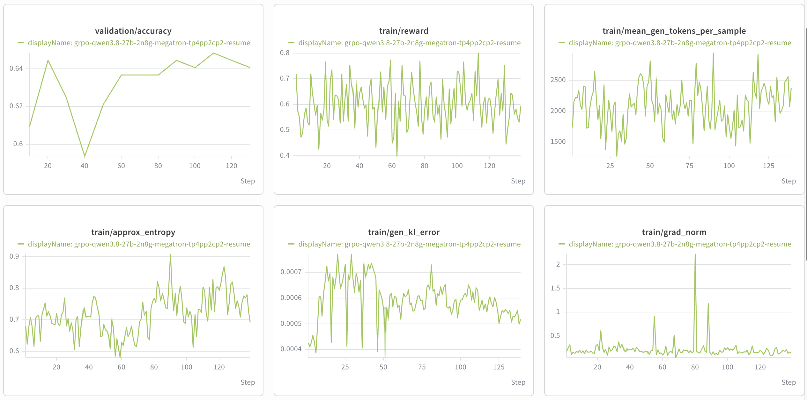

# Qwen3.8

This page describes the initial NeMo RL support for the dense
`Qwen/Qwen3.8-27B` model.

## Support Status

`Qwen/Qwen3.8-27B` is **Functionally Ready** for text-only GRPO on the Megatron
(MBridge) training backend, with vLLM inference. The shipped recipe is a short
functional smoke test. It validates model loading, rollout generation, weight
refit, log-probability computation, and an optimizer step; it is not a long-run
convergence recipe.

## What's Supported

| Model | Modality | Training backend | Parallelism | Inference |
| --- | --- | --- | --- | --- |
| `Qwen/Qwen3.8-27B` | LLM (dense) | Megatron | TP + PP + CP | vLLM |

The model follows the same dense hybrid-attention integration path as the
supported Qwen3.5 dense models. Context parallelism requires sequence packing,
which is enabled in the example recipe below.

> [!NOTE]
> AutoModel dependencies now include the Qwen3.5-family dense adapter via
> [NeMo RL PR #3498](https://github.com/NVIDIA-NeMo/RL/pull/3498).
> Qwen3.8 AutoModel validation and an example recipe remain tracked in
> [issue #3675](https://github.com/NVIDIA-NeMo/RL/issues/3675).

## Example Recipes

The recipe below is an example starting point. Recipe YAML files under
`examples/configs/recipes/` are the source of truth; check the YAML file for the
authoritative settings.

| Model | Modality | Algorithm | Backend | Scale | Recipe |
|---|---|---|---|---|---|
| Qwen3.8-27B | LLM | GRPO | Megatron | 2n8g | [`grpo-qwen3.8-27b-2n8g-megatron-tp4pp2cp2.yaml`](../../../../examples/configs/recipes/llm/grpo-qwen3.8-27b-2n8g-megatron-tp4pp2cp2.yaml) |

## Choose a Recipe

### 27B GRPO (Megatron)

Use the Megatron recipe to validate the setup, launch mechanics, logging, and
checkpointing.

```sh
uv run examples/run_grpo.py \
  --config examples/configs/recipes/llm/grpo-qwen3.8-27b-2n8g-megatron-tp4pp2cp2.yaml
```

This is a functional validation recipe rather than a long-run convergence
recipe; validate longer training separately for the target workload.

#### 100-Step Functional Validation Results

The reference curves below were produced by running the example recipe for more
than 100 steps.

The recipe's OpenMathInstruct-2 dataset is relatively easy for Qwen3.8-27B, and
the maximum sequence length is limited to 4,096 tokens. Consequently, the
reward curve does not show a pronounced upward trend. These curves are provided
only as a functional validation reference for training beyond 100 steps, not as
evidence of long-run convergence.


