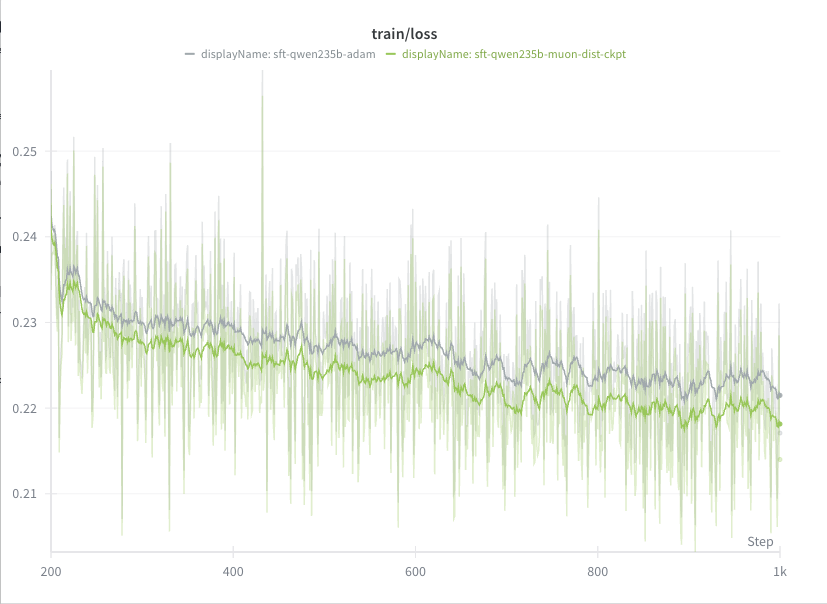
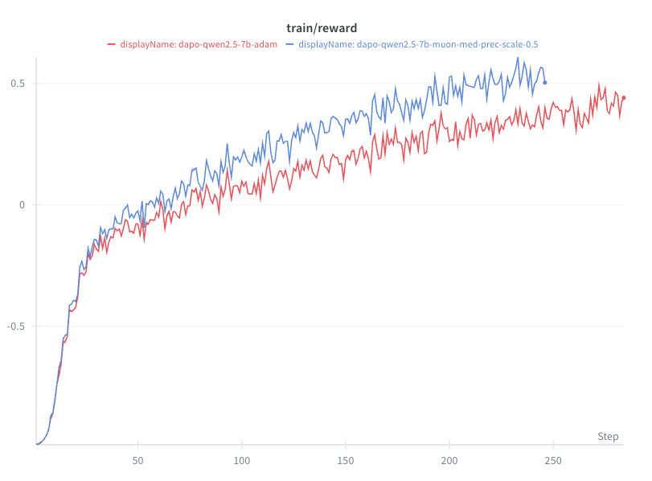
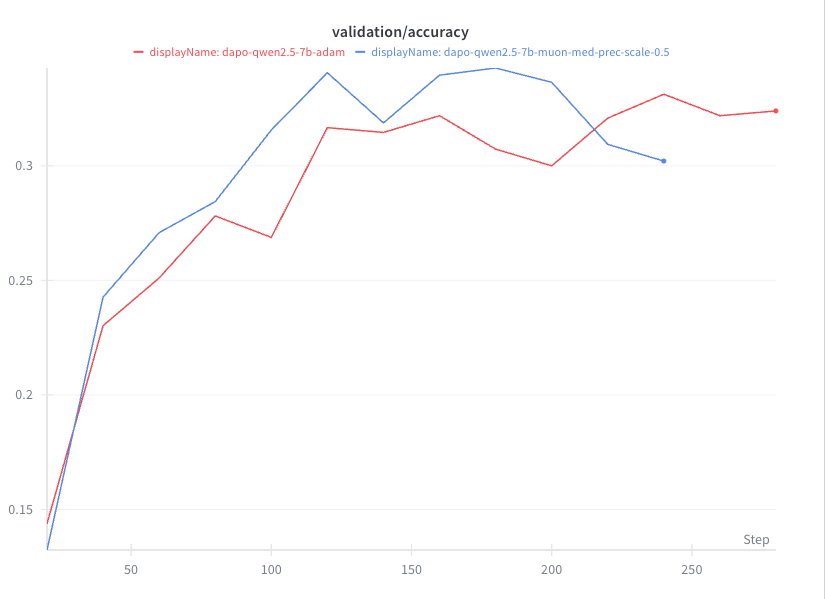

# Muon Optimizer

This guide explains how to use the Muon optimizer with NeMo RL for training large language models.

## What is Muon?

[**Muon** (MomentUm Orthogonalized by Newton-schulz)](https://arxiv.org/abs/2502.16982) is an optimizer from Moonshot AI that achieves higher sample efficiency compared to AdamW. It applies Newton-Schulz orthogonalization to momentum-based updates, which helps prevent weight matrices from becoming poorly conditioned during training. Muon is used for linear layers while Adam handles non-linear parameters (embeddings, layer norms).

## Requirements

Muon is only supported with the **Megatron backend**. Ensure you have:

1. Megatron submodules initialized: `git submodule update --init --recursive`
2. Megatron backend enabled in your configuration: `policy.megatron_cfg.enabled=True`

## Basic Usage

To use Muon with NeMo RL, you need to configure the optimizer through the Megatron configuration. Here's an example command for SFT:

```bash
uv run examples/run_sft.py \
    policy.megatron_cfg.enabled=true \
    policy.dtensor_cfg.enabled=false \
    ++policy.megatron_cfg.optimizer.optimizer=dist_muon \
    ++policy.megatron_cfg.optimizer.muon_scale_mode=spectral \
    ++policy.megatron_cfg.optimizer.muon_momentum=0.9 \
    ++policy.megatron_cfg.optimizer.muon_use_nesterov=False \
    ++policy.megatron_cfg.optimizer.muon_extra_scale_factor=0.5 \
    policy.megatron_cfg.optimizer.use_precision_aware_optimizer=false \
    policy.megatron_cfg.optimizer.use_distributed_optimizer=false
```

For a full list of Muon-related arguments and a description of each, please refer to the [Megatron documentation](https://github.com/terrykong/Megatron-LM/blob/25a62edf77b5130f888328ca8119d6a76117cf23/megatron/core/optimizer/optimizer_config.py#L128-L150). 

_NOTE_: precision_aware_optimizer and distributed_optimizer are not supported with Muon and should be disabled.

## Example YAML Configuration

Here's an example of a complete Megatron optimizer configuration for Muon:

```yaml
policy:
  megatron_cfg:
    enabled: true
    
    optimizer:
      optimizer: "dist_muon"
      lr: 1e-4
      min_lr: 1e-5
      weight_decay: 0.1
      bf16: true
      fp16: false
      
      # Muon-specific settings
      muon_momentum: 0.95
      muon_use_nesterov: false
      muon_scale_mode: "spectral"
      muon_fp32_matmul_prec: "medium"
      muon_num_ns_steps: 5
      muon_tp_mode: "blockwise"
      muon_extra_scale_factor: 1.0
      muon_split_qkv: true
      
      # Disable for Muon
      use_distributed_optimizer: false
      use_precision_aware_optimizer: false
      
      clip_grad: 1.0
    
    scheduler:
      lr_decay_style: "cosine"
      lr_warmup_iters: 100
      lr_decay_iters: 1000
      weight_decay_incr_style: "constant"
      start_weight_decay: 0.1
      end_weight_decay: 0.1
```

## Experimental Results

Muon support in NeMo-RL is experimental. We have tested Muon for SFT and RL on models pre-trained with Adam. While Muon is expected to show the greatest benefit when used for both pre-training and post-training, we have observed minor improvements even when applying Muon only during post-training. 

For example, the following is a comparison between Adam and Muon for running SFT on Qwen3-235B-A22B:

<p align="center">

</p>

The full Muon command used for this run is:

```bash
uv run examples/run_sft.py \
  --config examples/configs/sft_openmathinstruct2_megatron.yaml \
  policy.megatron_cfg.enabled=true \
  policy.dtensor_cfg.enabled=false \
  ++policy.megatron_cfg.optimizer.optimizer=dist_muon \
  ++policy.megatron_cfg.optimizer.muon_scale_mode=spectral \
  ++policy.megatron_cfg.optimizer.muon_momentum=0.9 \
  ++policy.megatron_cfg.optimizer.muon_use_nesterov=False \
  ++policy.megatron_cfg.optimizer.muon_extra_scale_factor=0.2 \
  policy.megatron_cfg.optimizer.use_precision_aware_optimizer=false \
  ++policy.megatron_cfg.optimizer.lr=2e-5 \
  policy.megatron_cfg.optimizer.use_distributed_optimizer=False \
  cluster.num_nodes=4 \
  cluster.gpus_per_node=8 \
  policy.megatron_cfg.pipeline_model_parallel_size=8 \
  policy.megatron_cfg.sequence_parallel=True \
  policy.megatron_cfg.expert_model_parallel_size=8 \
  policy.megatron_cfg.tensor_model_parallel_size=8 \
  policy.sequence_packing.enabled=True \
  policy.model_name=Qwen/Qwen3-235B-A22B \
  policy.tokenizer.name=Qwen/Qwen3-235B-A22B \
  checkpointing.enabled=True \
  cluster.num_nodes=16 \
  policy.megatron_cfg.num_layers_in_first_pipeline_stage=11 \
  policy.megatron_cfg.num_layers_in_last_pipeline_stage=11
```


Here is a comparison of Muon vs Adam for DAPO with Qwen3.5-7B:

<p align="center">


</p>

The command to generate the Muon results is:

```bash
uv run examples/run_grpo_math.py \
  --config examples/configs/recipes/llm/dapo-qwen2.5-7b.yaml \
  policy.megatron_cfg.enabled=true \
  policy.dtensor_cfg.enabled=false \
  ++policy.megatron_cfg.optimizer.optimizer=dist_muon \
  ++policy.megatron_cfg.optimizer.muon_scale_mode=spectral \
  ++policy.megatron_cfg.optimizer.muon_momentum=0.9 \
  ++policy.megatron_cfg.optimizer.muon_use_nesterov=False \
  ++policy.megatron_cfg.optimizer.muon_extra_scale_factor=0.5 \
  policy.megatron_cfg.optimizer.use_precision_aware_optimizer=false \
  policy.megatron_cfg.optimizer.use_distributed_optimizer=False \
  cluster.num_nodes=16 cluster.gpus_per_node=8 \
  policy.sequence_packing.enabled=True \
  ~checkpointing.model_save_format
```
