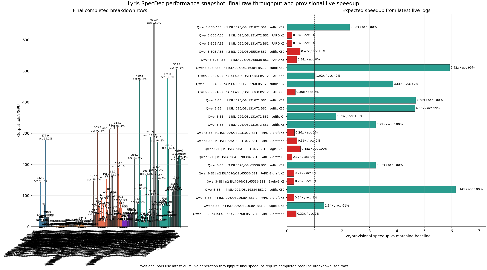

# Lyris SpecDec Expected Performance

Notes:

- Final speedup should use the matching non-speculative baseline for the same model, prompt set, ISL/OSL, TP/PP, batch size, KV-cache dtype, and prompt count.
- The final baseline `breakdown.json` rows are still pending for several jobs, so blank final-speedup cells are expected.
- Provisional speedup uses the latest live vLLM generation-throughput log divided by the live baseline for the same model. Treat it as directional only.
- Live rows are omitted when a final `breakdown.json` row exists for the same job label; final rows are the authoritative measurement.
- `PARD-2 draft` rows use the official PARD-2 checkpoint through vLLM's draft-model proposer path. `PARD-2 native` rows require a vLLM build that accepts `method=pard2`.
- Raw CSV: `lyris_specdec_expected_performance_raw_20260612.csv`

## Final Breakdown Raw Values

| Model | Shape | Method | Batch | tok/s/GPU | Final speedup vs baseline | Acceptance | Mean accept len | Label |
| --- | --- | --- | ---: | ---: | ---: | ---: | ---: | --- |
| **Qwen3-14B / n4 ISL4096/OSL32768 BS1 / batch 1** |  |  |  |  |  |  |  |  |
| `Qwen/Qwen3-14B` | `n4 ISL4096/OSL32768 BS1` | `baseline` | 1 | 33.91 | 1.000x |  |  | `qwen14_baseline` |
| `Qwen/Qwen3-14B` | `n4 ISL4096/OSL32768 BS1` | `suffix K5` | 1 | 141.98 | 4.187x | 98.73% | 5.88 | `qwen14_suffix_k5` |
| `Qwen/Qwen3-14B` | `n4 ISL4096/OSL32768 BS1` | `PARD-2 draft K11` | 1 | 16.74 | 0.494x | 1.58% | 1.17 | `qwen14_pard2_k11` |
| `Qwen/Qwen3-14B` | `n4 ISL4096/OSL32768 BS1` | `PARD-2 draft K5` | 1 | 16.40 | 0.484x | 3.26% | 1.16 | `qwen14_pard2_k5` |
| `Qwen/Qwen3-14B` | `n4 ISL4096/OSL32768 BS1` | `PARD-2 draft K9` | 1 | 16.65 | 0.491x | 1.92% | 1.17 | `qwen14_pard2_k9` |
| **Qwen3-14B / n4 ISL4096/OSL32768 BS2 / batch 2** |  |  |  |  |  |  |  |  |
| `Qwen/Qwen3-14B` | `n4 ISL4096/OSL32768 BS2` | `baseline` | 2 | 68.21 | 1.000x |  |  | `qwen14_baseline` |
| `Qwen/Qwen3-14B` | `n4 ISL4096/OSL32768 BS2` | `suffix K5` | 2 | 277.93 | 4.075x | 99.20% | 5.94 | `qwen14_suffix_k5` |
| `Qwen/Qwen3-14B` | `n4 ISL4096/OSL32768 BS2` | `PARD-2 draft K11` | 2 | 31.51 | 0.462x | 1.58% | 1.17 | `qwen14_pard2_k11` |
| `Qwen/Qwen3-14B` | `n4 ISL4096/OSL32768 BS2` | `PARD-2 draft K5` | 2 | 31.09 | 0.456x | 3.51% | 1.18 | `qwen14_pard2_k5` |
| `Qwen/Qwen3-14B` | `n4 ISL4096/OSL32768 BS2` | `PARD-2 draft K9` | 2 | 31.31 | 0.459x | 1.93% | 1.17 | `qwen14_pard2_k9` |
| **Qwen3-235B-A22B / n1 ISL4096/OSL256 BS1 / batch 1** |  |  |  |  |  |  |  |  |
| `Qwen/Qwen3-235B-A22B` | `n1 ISL4096/OSL256 BS1` | `PARD-2 native K3` | 1 | 3.30 |  | 34.13% | 2.02 | `qwen235b_n1_isl4096_osl256_pard2_native_k3` |
| **Qwen3-235B-A22B / n1 ISL4096/OSL65536 BS1 / batch 1** |  |  |  |  |  |  |  |  |
| `Qwen/Qwen3-235B-A22B` | `n1 ISL4096/OSL65536 BS1` | `baseline` | 1 | 2.09 | 1.000x |  |  | `qwen235b_n1_isl4096_osl65536_baseline` |
| `Qwen/Qwen3-235B-A22B` | `n1 ISL4096/OSL65536 BS1` | `suffix K32` | 1 | 3.82 | 1.830x | 38.93% | 2.88 | `qwen235b_n1_isl4096_osl65536_suffix_k32` |
| `Qwen/Qwen3-235B-A22B` | `n1 ISL4096/OSL65536 BS1` | `suffix K8` | 1 | 4.40 | 2.105x | 46.38% | 3.13 | `qwen235b_n1_isl4096_osl65536_suffix_k8` |
| `Qwen/Qwen3-235B-A22B` | `n1 ISL4096/OSL65536 BS1` | `Eagle-3 K3` | 1 | 2.29 | 1.095x | 21.84% | 1.66 | `qwen235b_n1_isl4096_osl65536_eagle3_k3` |
| **Qwen3-235B-A22B / n16 ISL4096/OSL1024 BS1 / batch 1** |  |  |  |  |  |  |  |  |
| `Qwen/Qwen3-235B-A22B` | `n16 ISL4096/OSL1024 BS1` | `baseline` | 1 | 2.04 | 1.000x |  |  | `qwen235b_n16_isl4096_osl1024_baseline` |
| `Qwen/Qwen3-235B-A22B` | `n16 ISL4096/OSL1024 BS1` | `suffix K1` | 1 | 2.83 | 1.390x | 34.90% | 1.35 | `qwen235b_n16_isl4096_osl1024_suffix_k1` |
| `Qwen/Qwen3-235B-A22B` | `n16 ISL4096/OSL1024 BS1` | `suffix K2` | 1 | 2.98 | 1.460x | 29.10% | 1.45 | `qwen235b_n16_isl4096_osl1024_suffix_k2` |
| `Qwen/Qwen3-235B-A22B` | `n16 ISL4096/OSL1024 BS1` | `suffix K32` | 1 | 3.01 | 1.476x | 23.82% | 1.46 | `qwen235b_n16_isl4096_osl1024_suffix_k32` |
| `Qwen/Qwen3-235B-A22B` | `n16 ISL4096/OSL1024 BS1` | `suffix K4` | 1 | 3.06 | 1.503x | 26.51% | 1.49 | `qwen235b_n16_isl4096_osl1024_suffix_k4` |
| `Qwen/Qwen3-235B-A22B` | `n16 ISL4096/OSL1024 BS1` | `suffix K8` | 1 | 3.01 | 1.478x | 23.96% | 1.46 | `qwen235b_n16_isl4096_osl1024_suffix_k8` |
| `Qwen/Qwen3-235B-A22B` | `n16 ISL4096/OSL1024 BS1` | `PARD-2 draft K3` | 1 | 3.70 | 1.816x | 38.86% | 2.17 | `qwen235b_n16_isl4096_osl1024_pard2_k3` |
| `Qwen/Qwen3-235B-A22B` | `n16 ISL4096/OSL1024 BS1` | `PARD-2 draft K5` | 1 | 3.86 | 1.893x | 26.22% | 2.31 | `qwen235b_n16_isl4096_osl1024_pard2_k5` |
| `Qwen/Qwen3-235B-A22B` | `n16 ISL4096/OSL1024 BS1` | `PARD-2 native K3` | 1 | 3.68 | 1.806x | 38.86% | 2.17 | `qwen235b_n16_isl4096_osl1024_pard2_native_k3` |
| `Qwen/Qwen3-235B-A22B` | `n16 ISL4096/OSL1024 BS1` | `PARD K3` | 1 | 3.82 | 1.876x | 40.77% | 2.22 | `qwen235b_n16_isl4096_osl1024_pard_k3` |
| `Qwen/Qwen3-235B-A22B` | `n16 ISL4096/OSL1024 BS1` | `PARD K5` | 1 | 4.00 | 1.963x | 27.96% | 2.40 | `qwen235b_n16_isl4096_osl1024_pard_k5` |
| `Qwen/Qwen3-235B-A22B` | `n16 ISL4096/OSL1024 BS1` | `Eagle-3 K1` | 1 | 3.38 | 1.656x | 64.57% | 1.65 | `qwen235b_n16_isl4096_osl1024_eagle3_k1` |
| `Qwen/Qwen3-235B-A22B` | `n16 ISL4096/OSL1024 BS1` | `Eagle-3 K3` | 1 | 4.23 | 2.078x | 38.98% | 2.17 | `qwen235b_n16_isl4096_osl1024_eagle3_k3` |
| **Qwen3-235B-A22B / n16 ISL4096/OSL1024 BS2 / batch 2** |  |  |  |  |  |  |  |  |
| `Qwen/Qwen3-235B-A22B` | `n16 ISL4096/OSL1024 BS2` | `baseline` | 2 | 4.08 | 1.000x |  |  | `qwen235b_n16_isl4096_osl1024_baseline` |
| `Qwen/Qwen3-235B-A22B` | `n16 ISL4096/OSL1024 BS2` | `suffix K1` | 2 | 5.86 | 1.437x | 40.11% | 1.40 | `qwen235b_n16_isl4096_osl1024_suffix_k1` |
| `Qwen/Qwen3-235B-A22B` | `n16 ISL4096/OSL1024 BS2` | `suffix K2` | 2 | 6.52 | 1.601x | 35.76% | 1.61 | `qwen235b_n16_isl4096_osl1024_suffix_k2` |
| `Qwen/Qwen3-235B-A22B` | `n16 ISL4096/OSL1024 BS2` | `suffix K32` | 2 | 6.47 | 1.587x | 27.47% | 1.68 | `qwen235b_n16_isl4096_osl1024_suffix_k32` |
| `Qwen/Qwen3-235B-A22B` | `n16 ISL4096/OSL1024 BS2` | `suffix K4` | 2 | 6.53 | 1.601x | 28.48% | 1.63 | `qwen235b_n16_isl4096_osl1024_suffix_k4` |
| `Qwen/Qwen3-235B-A22B` | `n16 ISL4096/OSL1024 BS2` | `suffix K8` | 2 | 6.58 | 1.614x | 27.07% | 1.65 | `qwen235b_n16_isl4096_osl1024_suffix_k8` |
| `Qwen/Qwen3-235B-A22B` | `n16 ISL4096/OSL1024 BS2` | `PARD-2 draft K3` | 2 | 7.12 | 1.748x | 39.14% | 2.17 | `qwen235b_n16_isl4096_osl1024_pard2_k3` |
| `Qwen/Qwen3-235B-A22B` | `n16 ISL4096/OSL1024 BS2` | `PARD-2 draft K5` | 2 | 7.36 | 1.805x | 25.76% | 2.29 | `qwen235b_n16_isl4096_osl1024_pard2_k5` |
| `Qwen/Qwen3-235B-A22B` | `n16 ISL4096/OSL1024 BS2` | `PARD-2 native K3` | 2 | 6.92 | 1.699x | 38.95% | 2.17 | `qwen235b_n16_isl4096_osl1024_pard2_native_k3` |
| `Qwen/Qwen3-235B-A22B` | `n16 ISL4096/OSL1024 BS2` | `PARD K3` | 2 | 7.44 | 1.826x | 41.62% | 2.25 | `qwen235b_n16_isl4096_osl1024_pard_k3` |
| `Qwen/Qwen3-235B-A22B` | `n16 ISL4096/OSL1024 BS2` | `PARD K5` | 2 | 7.61 | 1.868x | 27.28% | 2.36 | `qwen235b_n16_isl4096_osl1024_pard_k5` |
| `Qwen/Qwen3-235B-A22B` | `n16 ISL4096/OSL1024 BS2` | `Eagle-3 K1` | 2 | 6.68 | 1.639x | 64.61% | 1.65 | `qwen235b_n16_isl4096_osl1024_eagle3_k1` |
| `Qwen/Qwen3-235B-A22B` | `n16 ISL4096/OSL1024 BS2` | `Eagle-3 K3` | 2 | 8.04 | 1.972x | 39.45% | 2.18 | `qwen235b_n16_isl4096_osl1024_eagle3_k3` |
| **Qwen3-235B-A22B / n2 ISL4096/OSL32768 BS1 / batch 1** |  |  |  |  |  |  |  |  |
| `Qwen/Qwen3-235B-A22B` | `n2 ISL4096/OSL32768 BS1` | `baseline` | 1 | 2.09 | 1.000x |  |  | `qwen235b_n2_isl4096_osl32768_baseline` |
| `Qwen/Qwen3-235B-A22B` | `n2 ISL4096/OSL32768 BS1` | `suffix K1` | 1 | 3.78 | 1.811x | 82.10% | 1.82 | `qwen235b_n2_isl4096_osl32768_suffix_k1` |
| `Qwen/Qwen3-235B-A22B` | `n2 ISL4096/OSL32768 BS1` | `suffix K2` | 1 | 5.13 | 2.461x | 77.92% | 2.48 | `qwen235b_n2_isl4096_osl32768_suffix_k2` |
| `Qwen/Qwen3-235B-A22B` | `n2 ISL4096/OSL32768 BS1` | `suffix K32` | 1 | 12.60 | 6.042x | 82.63% | 6.28 | `qwen235b_n2_isl4096_osl32768_suffix_k32` |
| `Qwen/Qwen3-235B-A22B` | `n2 ISL4096/OSL32768 BS1` | `suffix K4` | 1 | 7.01 | 3.360x | 75.43% | 3.42 | `qwen235b_n2_isl4096_osl32768_suffix_k4` |
| `Qwen/Qwen3-235B-A22B` | `n2 ISL4096/OSL32768 BS1` | `suffix K8` | 1 | 11.65 | 5.586x | 86.35% | 5.89 | `qwen235b_n2_isl4096_osl32768_suffix_k8` |
| `Qwen/Qwen3-235B-A22B` | `n2 ISL4096/OSL32768 BS1` | `PARD-2 draft K3` | 1 | 1.87 | 0.895x | 4.64% | 1.14 | `qwen235b_n2_isl4096_osl32768_pard2_k3` |
| `Qwen/Qwen3-235B-A22B` | `n2 ISL4096/OSL32768 BS1` | `PARD-2 draft K5` | 1 | 1.89 | 0.906x | 2.86% | 1.14 | `qwen235b_n2_isl4096_osl32768_pard2_k5` |
| `Qwen/Qwen3-235B-A22B` | `n2 ISL4096/OSL32768 BS1` | `PARD-2 native K1` | 1 | 1.88 | 0.899x | 11.53% | 1.12 | `qwen235b_n2_isl4096_osl32768_pard2_native_k1` |
| `Qwen/Qwen3-235B-A22B` | `n2 ISL4096/OSL32768 BS1` | `PARD-2 native K2` | 1 | 1.90 | 0.909x | 6.65% | 1.13 | `qwen235b_n2_isl4096_osl32768_pard2_native_k2` |
| `Qwen/Qwen3-235B-A22B` | `n2 ISL4096/OSL32768 BS1` | `PARD-2 native K3` | 1 | 1.91 | 0.917x | 4.64% | 1.14 | `qwen235b_n2_isl4096_osl32768_pard2_native_k3` |
| `Qwen/Qwen3-235B-A22B` | `n2 ISL4096/OSL32768 BS1` | `PARD K3` | 1 | 3.10 | 1.487x | 29.30% | 1.88 | `qwen235b_n2_isl4096_osl32768_pard_k3` |
| `Qwen/Qwen3-235B-A22B` | `n2 ISL4096/OSL32768 BS1` | `PARD K5` | 1 | 3.19 | 1.529x | 18.39% | 1.92 | `qwen235b_n2_isl4096_osl32768_pard_k5` |
| `Qwen/Qwen3-235B-A22B` | `n2 ISL4096/OSL32768 BS1` | `Eagle-3 K1` | 1 | 3.75 | 1.800x | 86.93% | 1.87 | `qwen235b_n2_isl4096_osl32768_eagle3_k1` |
| `Qwen/Qwen3-235B-A22B` | `n2 ISL4096/OSL32768 BS1` | `Eagle-3 K3` | 1 | 5.19 | 2.488x | 54.28% | 2.63 | `qwen235b_n2_isl4096_osl32768_eagle3_k3` |
| **Qwen3-30B-A3B / MATH500 n4 ISL4096/OSL32768 BS1 / batch 1** |  |  |  |  |  |  |  |  |
| `Qwen/Qwen3-30B-A3B` | `MATH500 n4 ISL4096/OSL32768 BS1` | `baseline` | 1 | 20.11 | 1.000x |  |  | `math500_osl32k_qwen30_baseline` |
| `Qwen/Qwen3-30B-A3B` | `MATH500 n4 ISL4096/OSL32768 BS1` | `suffix K32` | 1 | 146.74 | 7.296x | 88.43% | 7.85 | `math500_osl32k_qwen30_suffix_k32` |
| `Qwen/Qwen3-30B-A3B` | `MATH500 n4 ISL4096/OSL32768 BS1` | `PARD K3` | 1 | 37.20 | 1.849x | 70.67% | 3.12 | `math500_osl32k_qwen30_pard_k3` |
| `Qwen/Qwen3-30B-A3B` | `MATH500 n4 ISL4096/OSL32768 BS1` | `PARD K5` | 1 | 42.33 | 2.105x | 52.15% | 3.61 | `math500_osl32k_qwen30_pard_k5` |
| **Qwen3-30B-A3B / MATH500 n4 ISL4096/OSL32768 BS2 / batch 2** |  |  |  |  |  |  |  |  |
| `Qwen/Qwen3-30B-A3B` | `MATH500 n4 ISL4096/OSL32768 BS2` | `baseline` | 2 | 40.12 | 1.000x |  |  | `math500_osl32k_qwen30_baseline` |
| `Qwen/Qwen3-30B-A3B` | `MATH500 n4 ISL4096/OSL32768 BS2` | `suffix K32` | 2 | 303.81 | 7.572x | 92.52% | 9.81 | `math500_osl32k_qwen30_suffix_k32` |
| `Qwen/Qwen3-30B-A3B` | `MATH500 n4 ISL4096/OSL32768 BS2` | `PARD K3` | 2 | 68.87 | 1.716x | 71.95% | 3.16 | `math500_osl32k_qwen30_pard_k3` |
| `Qwen/Qwen3-30B-A3B` | `MATH500 n4 ISL4096/OSL32768 BS2` | `PARD K5` | 2 | 61.57 | 1.535x | 43.45% | 3.17 | `math500_osl32k_qwen30_pard_k5` |
| **Qwen3-30B-A3B / n1 ISL4096/OSL131072 BS1 / batch 1** |  |  |  |  |  |  |  |  |
| `Qwen/Qwen3-30B-A3B` | `n1 ISL4096/OSL131072 BS1` | `baseline` | 1 | 19.97 | 1.000x |  |  | `verified_osl128k_qwen30_baseline` |
| `Qwen/Qwen3-30B-A3B` | `n1 ISL4096/OSL131072 BS1` | `suffix K32` | 1 | 86.30 | 4.321x | 98.16% | 12.03 | `verified_osl128k_qwen30_suffix_k32` |
| **Qwen3-30B-A3B / n2 ISL4096/OSL65536 BS1 / batch 1** |  |  |  |  |  |  |  |  |
| `Qwen/Qwen3-30B-A3B` | `n2 ISL4096/OSL65536 BS1` | `baseline` | 1 | 19.92 | 1.000x |  |  | `verified_osl64k_qwen30_baseline` |
| `Qwen/Qwen3-30B-A3B` | `n2 ISL4096/OSL65536 BS1` | `suffix K32` | 1 | 72.48 | 3.639x | 71.63% | 6.78 | `verified_osl64k_qwen30_suffix_k32` |
| `Qwen/Qwen3-30B-A3B` | `n2 ISL4096/OSL65536 BS1` | `PARD K5` | 1 | 15.20 | 0.763x | 14.17% | 1.71 | `verified_osl64k_qwen30_pard_k5` |
| **Qwen3-30B-A3B / n4 ISL4096/OSL16384 BS1 / batch 1** |  |  |  |  |  |  |  |  |
| `Qwen/Qwen3-30B-A3B` | `n4 ISL4096/OSL16384 BS1` | `baseline` | 1 | 19.87 | 1.000x |  |  | `verified_osl16k_qwen30_baseline` |
| `Qwen/Qwen3-30B-A3B` | `n4 ISL4096/OSL16384 BS1` | `suffix K32` | 1 | 153.10 | 7.706x | 88.18% | 8.13 | `verified_osl16k_qwen30_suffix_k32` |
| `Qwen/Qwen3-30B-A3B` | `n4 ISL4096/OSL16384 BS1` | `PARD K5` | 1 | 53.78 | 2.707x | 57.68% | 3.88 | `verified_osl16k_qwen30_pard_k5` |
| **Qwen3-30B-A3B / n4 ISL4096/OSL16384 BS2 / batch 2** |  |  |  |  |  |  |  |  |
| `Qwen/Qwen3-30B-A3B` | `n4 ISL4096/OSL16384 BS2` | `baseline` | 2 | 39.94 | 1.000x |  |  | `verified_osl16k_qwen30_baseline` |
| `Qwen/Qwen3-30B-A3B` | `n4 ISL4096/OSL16384 BS2` | `suffix K32` | 2 | 311.62 | 7.803x | 85.29% | 8.47 | `verified_osl16k_qwen30_suffix_k32` |
| `Qwen/Qwen3-30B-A3B` | `n4 ISL4096/OSL16384 BS2` | `PARD K5` | 2 | 106.13 | 2.657x | 64.08% | 4.20 | `verified_osl16k_qwen30_pard_k5` |
| **Qwen3-30B-A3B / n4 ISL4096/OSL32768 BS1 / batch 1** |  |  |  |  |  |  |  |  |
| `Qwen/Qwen3-30B-A3B` | `n4 ISL4096/OSL32768 BS1` | `baseline` | 1 | 19.81 | 1.000x |  |  | `full_osl32k_qwen30_baseline` |
| `Qwen/Qwen3-30B-A3B` | `n4 ISL4096/OSL32768 BS1` | `suffix K32` | 1 | 162.25 | 8.192x | 92.46% | 9.10 | `full_osl32k_qwen30_suffix_k32` |
| `Qwen/Qwen3-30B-A3B` | `n4 ISL4096/OSL32768 BS1` | `suffix K5` | 1 | 94.57 | 4.831x | 92.41% | 5.21 | `qwen30_suffix_k5` |
| `Qwen/Qwen3-30B-A3B` | `n4 ISL4096/OSL32768 BS1` | `PARD K11` | 1 | 35.38 | 1.807x | 19.36% | 3.13 | `qwen30_pard_k11` |
| `Qwen/Qwen3-30B-A3B` | `n4 ISL4096/OSL32768 BS1` | `PARD K5` | 1 | 34.12 | 1.723x | 40.98% | 3.05 | `full_osl32k_qwen30_pard_k5` |
| `Qwen/Qwen3-30B-A3B` | `n4 ISL4096/OSL32768 BS1` | `PARD K9` | 1 | 34.98 | 1.787x | 23.55% | 3.12 | `qwen30_pard_k9` |
| **Qwen3-30B-A3B / n4 ISL4096/OSL32768 BS2 / batch 2** |  |  |  |  |  |  |  |  |
| `Qwen/Qwen3-30B-A3B` | `n4 ISL4096/OSL32768 BS2` | `baseline` | 2 | 39.52 | 1.000x |  |  | `full_osl32k_qwen30_baseline` |
| `Qwen/Qwen3-30B-A3B` | `n4 ISL4096/OSL32768 BS2` | `suffix K32` | 2 | 318.91 | 8.069x | 93.46% | 10.13 | `full_osl32k_qwen30_suffix_k32` |
| `Qwen/Qwen3-30B-A3B` | `n4 ISL4096/OSL32768 BS2` | `suffix K5` | 2 | 188.48 | 4.804x | 93.08% | 5.41 | `qwen30_suffix_k5` |
| `Qwen/Qwen3-30B-A3B` | `n4 ISL4096/OSL32768 BS2` | `PARD K11` | 2 | 59.88 | 1.526x | 22.96% | 3.53 | `qwen30_pard_k11` |
| `Qwen/Qwen3-30B-A3B` | `n4 ISL4096/OSL32768 BS2` | `PARD K5` | 2 | 81.06 | 2.051x | 55.59% | 3.78 | `full_osl32k_qwen30_pard_k5` |
| `Qwen/Qwen3-30B-A3B` | `n4 ISL4096/OSL32768 BS2` | `PARD K9` | 2 | 59.68 | 1.521x | 27.51% | 3.48 | `qwen30_pard_k9` |
| **Qwen3-30B-Think / n4 ISL4096/OSL32768 BS1 / batch 1** |  |  |  |  |  |  |  |  |
| `Qwen/Qwen3-30B-A3B-Thinking-2507` | `n4 ISL4096/OSL32768 BS1` | `baseline` | 1 | 20.13 | 1.000x |  |  | `qwen30thinking_baseline` |
| `Qwen/Qwen3-30B-A3B-Thinking-2507` | `n4 ISL4096/OSL32768 BS1` | `Eagle-3 K1` | 1 | 20.64 | 1.025x | 23.13% | 1.23 | `qwen30thinking_eagle3_k1` |
| `Qwen/Qwen3-30B-A3B-Thinking-2507` | `n4 ISL4096/OSL32768 BS1` | `Eagle-3 K11` | 1 | 19.25 | 0.956x | 2.96% | 1.33 | `qwen30thinking_eagle3_k11` |
| `Qwen/Qwen3-30B-A3B-Thinking-2507` | `n4 ISL4096/OSL32768 BS1` | `Eagle-3 K3` | 1 | 21.17 | 1.052x | 10.11% | 1.30 | `qwen30thinking_eagle3_k3` |
| `Qwen/Qwen3-30B-A3B-Thinking-2507` | `n4 ISL4096/OSL32768 BS1` | `Eagle-3 K5` | 1 | 20.31 | 1.009x | 6.32% | 1.32 | `qwen30thinking_eagle3_k5` |
| `Qwen/Qwen3-30B-A3B-Thinking-2507` | `n4 ISL4096/OSL32768 BS1` | `Eagle-3 K9` | 1 | 19.58 | 0.972x | 3.61% | 1.33 | `qwen30thinking_eagle3_k9` |
| **Qwen3-30B-Think / n4 ISL4096/OSL32768 BS2 / batch 2** |  |  |  |  |  |  |  |  |
| `Qwen/Qwen3-30B-A3B-Thinking-2507` | `n4 ISL4096/OSL32768 BS2` | `baseline` | 2 | 39.97 | 1.000x |  |  | `qwen30thinking_baseline` |
| `Qwen/Qwen3-30B-A3B-Thinking-2507` | `n4 ISL4096/OSL32768 BS2` | `Eagle-3 K1` | 2 | 40.22 | 1.006x | 25.58% | 1.26 | `qwen30thinking_eagle3_k1` |
| `Qwen/Qwen3-30B-A3B-Thinking-2507` | `n4 ISL4096/OSL32768 BS2` | `Eagle-3 K11` | 2 | 37.27 | 0.932x | 2.90% | 1.32 | `qwen30thinking_eagle3_k11` |
| `Qwen/Qwen3-30B-A3B-Thinking-2507` | `n4 ISL4096/OSL32768 BS2` | `Eagle-3 K3` | 2 | 40.68 | 1.018x | 11.34% | 1.34 | `qwen30thinking_eagle3_k3` |
| `Qwen/Qwen3-30B-A3B-Thinking-2507` | `n4 ISL4096/OSL32768 BS2` | `Eagle-3 K5` | 2 | 39.16 | 0.980x | 6.28% | 1.31 | `qwen30thinking_eagle3_k5` |
| `Qwen/Qwen3-30B-A3B-Thinking-2507` | `n4 ISL4096/OSL32768 BS2` | `Eagle-3 K9` | 2 | 37.97 | 0.950x | 3.54% | 1.32 | `qwen30thinking_eagle3_k9` |
| **Qwen3-8B / MATH500 n4 ISL4096/OSL32768 BS1 / batch 1** |  |  |  |  |  |  |  |  |
| `Qwen/Qwen3-8B` | `MATH500 n4 ISL4096/OSL32768 BS1` | `baseline` | 1 | 36.79 | 1.000x |  |  | `math500_osl32k_qwen8_baseline` |
| `Qwen/Qwen3-8B` | `MATH500 n4 ISL4096/OSL32768 BS1` | `suffix K32` | 1 | 216.02 | 5.871x | 84.51% | 6.88 | `math500_osl32k_qwen8_suffix_k32` |
| `Qwen/Qwen3-8B` | `MATH500 n4 ISL4096/OSL32768 BS1` | `PARD-2 draft K3` | 1 | 15.99 | 0.435x | 0.07% | 1.00 | `math500_osl32k_qwen8_official_pard2_k3` |
| `Qwen/Qwen3-8B` | `MATH500 n4 ISL4096/OSL32768 BS1` | `PARD-2 draft K5` | 1 | 16.10 | 0.438x | 0.04% | 1.00 | `math500_osl32k_qwen8_official_pard2_k5` |
| `Qwen/Qwen3-8B` | `MATH500 n4 ISL4096/OSL32768 BS1` | `Eagle-3 K3` | 1 | 74.38 | 2.021x | 62.94% | 2.89 | `math500_osl32k_qwen8_eagle3_k3` |
| **Qwen3-8B / MATH500 n4 ISL4096/OSL32768 BS2 / batch 2** |  |  |  |  |  |  |  |  |
| `Qwen/Qwen3-8B` | `MATH500 n4 ISL4096/OSL32768 BS2` | `baseline` | 2 | 73.79 | 1.000x |  |  | `math500_osl32k_qwen8_baseline` |
| `Qwen/Qwen3-8B` | `MATH500 n4 ISL4096/OSL32768 BS2` | `suffix K32` | 2 | 469.83 | 6.367x | 91.24% | 9.48 | `math500_osl32k_qwen8_suffix_k32` |
| `Qwen/Qwen3-8B` | `MATH500 n4 ISL4096/OSL32768 BS2` | `Eagle-3 K3` | 2 | 118.53 | 1.606x | 63.62% | 2.91 | `math500_osl32k_qwen8_eagle3_k3` |
| **Qwen3-8B / n1 ISL4096/OSL131072 BS1 / batch 1** |  |  |  |  |  |  |  |  |
| `Qwen/Qwen3-8B` | `n1 ISL4096/OSL131072 BS1` | `Eagle-3 K3` | 1 | 22.26 |  | 39.57% | 2.19 | `verified_osl128k_qwen8_eagle3_k3` |
| **Qwen3-8B / n1 ISL4096/OSL98304 BS1 / batch 1** |  |  |  |  |  |  |  |  |
| `Qwen/Qwen3-8B` | `n1 ISL4096/OSL98304 BS1` | `baseline` | 1 | 37.13 | 1.000x |  |  | `verified_osl96k_qwen8_baseline` |
| `Qwen/Qwen3-8B` | `n1 ISL4096/OSL98304 BS1` | `suffix K32` | 1 | 16.40 | 0.442x | 21.31% | 1.75 | `verified_osl96k_qwen8_suffix_k32` |
| `Qwen/Qwen3-8B` | `n1 ISL4096/OSL98304 BS1` | `Eagle-3 K3` | 1 | 13.39 | 0.361x | 11.18% | 1.34 | `verified_osl96k_qwen8_eagle3_k3` |
| **Qwen3-8B / n2 ISL4096/OSL65536 BS1 / batch 1** |  |  |  |  |  |  |  |  |
| `Qwen/Qwen3-8B` | `n2 ISL4096/OSL65536 BS1` | `baseline` | 1 | 36.89 | 1.000x |  |  | `verified_osl64k_qwen8_baseline` |
| `Qwen/Qwen3-8B` | `n2 ISL4096/OSL65536 BS1` | `suffix K32` | 1 | 165.08 | 4.475x | 94.90% | 9.78 | `verified_osl64k_qwen8_suffix_k32` |
| `Qwen/Qwen3-8B` | `n2 ISL4096/OSL65536 BS1` | `PARD-2 draft K5` | 1 | 13.37 | 0.362x | 2.61% | 1.13 | `verified_osl64k_qwen8_pard2_k5` |
| `Qwen/Qwen3-8B` | `n2 ISL4096/OSL65536 BS1` | `Eagle-3 K3` | 1 | 22.35 | 0.606x | 21.10% | 1.63 | `verified_osl64k_qwen8_eagle3_k3` |
| **Qwen3-8B / n4 ISL4096/OSL16384 BS1 / batch 1** |  |  |  |  |  |  |  |  |
| `Qwen/Qwen3-8B` | `n4 ISL4096/OSL16384 BS1` | `baseline` | 1 | 37.11 | 1.000x |  |  | `verified_osl16k_qwen8_baseline` |
| `Qwen/Qwen3-8B` | `n4 ISL4096/OSL16384 BS1` | `suffix K32` | 1 | 288.86 | 7.783x | 89.16% | 8.09 | `verified_osl16k_qwen8_suffix_k32` |
| `Qwen/Qwen3-8B` | `n4 ISL4096/OSL16384 BS1` | `PARD-2 draft K5` | 1 | 33.08 | 0.891x | 11.79% | 1.59 | `verified_osl16k_qwen8_pard2_k5` |
| `Qwen/Qwen3-8B` | `n4 ISL4096/OSL16384 BS1` | `Eagle-3 K3` | 1 | 98.81 | 2.662x | 72.98% | 3.19 | `verified_osl16k_qwen8_eagle3_k3` |
| **Qwen3-8B / n4 ISL4096/OSL16384 BS2 / batch 2** |  |  |  |  |  |  |  |  |
| `Qwen/Qwen3-8B` | `n4 ISL4096/OSL16384 BS2` | `baseline` | 2 | 74.88 | 1.000x |  |  | `verified_osl16k_qwen8_baseline` |
| `Qwen/Qwen3-8B` | `n4 ISL4096/OSL16384 BS2` | `suffix K32` | 2 | 650.01 | 8.680x | 92.01% | 9.64 | `verified_osl16k_qwen8_suffix_k32` |
| `Qwen/Qwen3-8B` | `n4 ISL4096/OSL16384 BS2` | `PARD-2 draft K5` | 2 | 53.08 | 0.709x | 9.64% | 1.48 | `verified_osl16k_qwen8_pard2_k5` |
| `Qwen/Qwen3-8B` | `n4 ISL4096/OSL16384 BS2` | `Eagle-3 K3` | 2 | 177.97 | 2.377x | 71.97% | 3.16 | `verified_osl16k_qwen8_eagle3_k3` |
| **Qwen3-8B / n4 ISL4096/OSL32768 BS1 / batch 1** |  |  |  |  |  |  |  |  |
| `Qwen/Qwen3-8B` | `n4 ISL4096/OSL32768 BS1` | `baseline` | 1 | 37.29 | 1.000x |  |  | `full_osl32k_qwen8_baseline` |
| `Qwen/Qwen3-8B` | `n4 ISL4096/OSL32768 BS1` | `suffix K32` | 1 | 271.84 | 7.291x | 94.33% | 9.66 | `full_osl32k_qwen8_suffix_k32` |
| `Qwen/Qwen3-8B` | `n4 ISL4096/OSL32768 BS1` | `suffix K5` | 1 | 149.99 | 3.972x | 96.52% | 5.52 | `qwen8_suffix_k5` |
| `Qwen/Qwen3-8B` | `n4 ISL4096/OSL32768 BS1` | `PARD-2 draft K11` | 1 | 18.13 | 0.480x | 1.81% | 1.20 | `qwen8_pard2_k11` |
| `Qwen/Qwen3-8B` | `n4 ISL4096/OSL32768 BS1` | `PARD-2 draft K5` | 1 | 17.90 | 0.480x | 4.17% | 1.21 | `full_osl32k_qwen8_pard2_k5` |
| `Qwen/Qwen3-8B` | `n4 ISL4096/OSL32768 BS1` | `PARD-2 draft K9` | 1 | 18.01 | 0.477x | 2.20% | 1.20 | `qwen8_pard2_k9` |
| `Qwen/Qwen3-8B` | `n4 ISL4096/OSL32768 BS1` | `Eagle-3 K11` | 1 | 71.67 | 1.898x | 21.80% | 3.40 | `qwen8_eagle3_k11` |
| `Qwen/Qwen3-8B` | `n4 ISL4096/OSL32768 BS1` | `Eagle-3 K3` | 1 | 65.18 | 1.748x | 55.57% | 2.67 | `full_osl32k_qwen8_eagle3_k3` |
| `Qwen/Qwen3-8B` | `n4 ISL4096/OSL32768 BS1` | `Eagle-3 K5` | 1 | 75.31 | 1.994x | 44.06% | 3.20 | `qwen8_eagle3_k5` |
| `Qwen/Qwen3-8B` | `n4 ISL4096/OSL32768 BS1` | `Eagle-3 K9` | 1 | 73.52 | 1.947x | 26.40% | 3.38 | `qwen8_eagle3_k9` |
| **Qwen3-8B / n4 ISL4096/OSL32768 BS2 / batch 2** |  |  |  |  |  |  |  |  |
| `Qwen/Qwen3-8B` | `n4 ISL4096/OSL32768 BS2` | `baseline` | 2 | 75.03 | 1.000x |  |  | `full_osl32k_qwen8_baseline` |
| `Qwen/Qwen3-8B` | `n4 ISL4096/OSL32768 BS2` | `suffix K32` | 2 | 475.81 | 6.342x | 92.73% | 9.82 | `full_osl32k_qwen8_suffix_k32` |
| `Qwen/Qwen3-8B` | `n4 ISL4096/OSL32768 BS2` | `suffix K5` | 2 | 248.06 | 3.293x | 91.05% | 5.28 | `qwen8_suffix_k5` |
| `Qwen/Qwen3-8B` | `n4 ISL4096/OSL32768 BS2` | `PARD-2 draft K11` | 2 | 32.14 | 0.427x | 2.13% | 1.23 | `qwen8_pard2_k11` |
| `Qwen/Qwen3-8B` | `n4 ISL4096/OSL32768 BS2` | `PARD-2 draft K5` | 2 | 33.52 | 0.447x | 3.78% | 1.19 | `full_osl32k_qwen8_pard2_k5` |
| `Qwen/Qwen3-8B` | `n4 ISL4096/OSL32768 BS2` | `PARD-2 draft K9` | 2 | 31.98 | 0.424x | 2.59% | 1.23 | `qwen8_pard2_k9` |
| `Qwen/Qwen3-8B` | `n4 ISL4096/OSL32768 BS2` | `Eagle-3 K11` | 2 | 112.19 | 1.489x | 21.85% | 3.40 | `qwen8_eagle3_k11` |
| `Qwen/Qwen3-8B` | `n4 ISL4096/OSL32768 BS2` | `Eagle-3 K3` | 2 | 117.25 | 1.563x | 57.48% | 2.72 | `full_osl32k_qwen8_eagle3_k3` |
| `Qwen/Qwen3-8B` | `n4 ISL4096/OSL32768 BS2` | `Eagle-3 K5` | 2 | 121.51 | 1.613x | 44.12% | 3.21 | `qwen8_eagle3_k5` |
| `Qwen/Qwen3-8B` | `n4 ISL4096/OSL32768 BS2` | `Eagle-3 K9` | 2 | 115.38 | 1.532x | 26.41% | 3.38 | `qwen8_eagle3_k9` |
| **Qwen3-8B / n4 ISL4096/OSL32768 BS4 / batch 4** |  |  |  |  |  |  |  |  |
| `Qwen/Qwen3-8B` | `n4 ISL4096/OSL32768 BS4` | `baseline` | 4 | 152.92 | 1.000x |  |  | `qwen8_baseline` |
| `Qwen/Qwen3-8B` | `n4 ISL4096/OSL32768 BS4` | `suffix K5` | 4 | 505.84 | 3.308x | 94.25% | 5.62 | `qwen8_suffix_k5` |
| `Qwen/Qwen3-8B` | `n4 ISL4096/OSL32768 BS4` | `Eagle-3 K11` | 4 | 211.53 | 1.383x | 21.86% | 3.40 | `qwen8_eagle3_k11` |
| `Qwen/Qwen3-8B` | `n4 ISL4096/OSL32768 BS4` | `Eagle-3 K3` | 4 | 227.11 | 1.485x | 63.10% | 2.89 | `qwen8_eagle3_k3` |
| `Qwen/Qwen3-8B` | `n4 ISL4096/OSL32768 BS4` | `Eagle-3 K5` | 4 | 229.49 | 1.501x | 44.12% | 3.21 | `qwen8_eagle3_k5` |
| `Qwen/Qwen3-8B` | `n4 ISL4096/OSL32768 BS4` | `Eagle-3 K9` | 4 | 217.98 | 1.425x | 26.42% | 3.38 | `qwen8_eagle3_k9` |

## Live Provisional Speedup Raw Values

| Model | Shape | Method | Job | Live gen tok/s | Matching baseline tok/s | Provisional speedup | Live acceptance | Mean accept len | Label |
| --- | --- | --- | ---: | ---: | ---: | ---: | ---: | ---: | --- |
| **Qwen3-235B-A22B / n1 ISL4096/OSL65536 BS1 / batch 1** |  |  |  |  |  |  |  |  |  |
| `Qwen/Qwen3-235B-A22B` | `n1 ISL4096/OSL65536 BS1` | `PARD-2 native K1` | `2104340` |  | 8.30 |  |  |  | `qwen235b_n1_isl4096_osl65536_pard2_native_k1` |
| `Qwen/Qwen3-235B-A22B` | `n1 ISL4096/OSL65536 BS1` | `PARD K3` | `2104995` |  | 8.30 |  |  |  | `qwen235b_n1_isl4096_osl65536_pard_k3` |
| `Qwen/Qwen3-235B-A22B` | `n1 ISL4096/OSL65536 BS1` | `PARD K5` | `2104337` |  | 8.30 |  |  |  | `qwen235b_n1_isl4096_osl65536_pard_k5` |
| **Qwen3-30B-A3B / n1 ISL4096/OSL131072 BS1 / batch 1** |  |  |  |  |  |  |  |  |  |
| `Qwen/Qwen3-30B-A3B` | `n1 ISL4096/OSL131072 BS1` | `baseline` | `2102332` | 20.10 | 20.10 | 1.000x |  |  | `full_osl128k_qwen30_baseline` |
| `Qwen/Qwen3-30B-A3B` | `n1 ISL4096/OSL131072 BS1` | `suffix K32` | `2102333` | 45.80 | 20.10 | 2.279x | 100.00% | 13.00 | `full_osl128k_qwen30_suffix_k32` |
| `Qwen/Qwen3-30B-A3B` | `n1 ISL4096/OSL131072 BS1` | `PARD K5` | `2102334` | 3.60 | 20.10 | 0.179x | 0.00% | 1.00 | `full_osl128k_qwen30_pard_k5` |
| `Qwen/Qwen3-30B-A3B` | `n1 ISL4096/OSL131072 BS1` | `PARD K5` | `2102304` | 3.60 | 20.10 | 0.179x | 0.00% | 1.00 | `verified_osl128k_qwen30_pard_k5` |
| **Qwen3-30B-A3B / n2 ISL4096/OSL65536 BS1 / batch 1** |  |  |  |  |  |  |  |  |  |
| `Qwen/Qwen3-30B-A3B` | `n2 ISL4096/OSL65536 BS1` | `baseline` | `2102325` | 19.00 | 19.00 | 1.000x |  |  | `full_osl64k_qwen30_baseline` |
| `Qwen/Qwen3-30B-A3B` | `n2 ISL4096/OSL65536 BS1` | `suffix K32` | `2102326` | 9.60 | 20.30 | 0.473x | 9.90% | 1.40 | `full_osl64k_qwen30_suffix_k32` |
| `Qwen/Qwen3-30B-A3B` | `n2 ISL4096/OSL65536 BS1` | `PARD K5` | `2102327` | 6.90 | 20.30 | 0.340x | 0.00% | 1.00 | `full_osl64k_qwen30_pard_k5` |
| **Qwen3-30B-A3B / n4 ISL4096/OSL16384 BS1 2 / batch 1 2** |  |  |  |  |  |  |  |  |  |
| `Qwen/Qwen3-30B-A3B` | `n4 ISL4096/OSL16384 BS1 2` | `baseline` | `2102310` | 38.70 | 38.70 | 1.000x |  |  | `full_osl16k_qwen30_baseline` |
| `Qwen/Qwen3-30B-A3B` | `n4 ISL4096/OSL16384 BS1 2` | `suffix K32` | `2102311` | 233.80 | 39.50 | 5.919x | 93.30% | 11.73 | `full_osl16k_qwen30_suffix_k32` |
| `Qwen/Qwen3-30B-A3B` | `n4 ISL4096/OSL16384 BS1 2` | `PARD K5` | `2102312` | 40.40 | 39.50 | 1.023x | 40.30% | 3.01 | `full_osl16k_qwen30_pard_k5` |
| **Qwen3-30B-A3B / n4 ISL4096/OSL32768 BS1 2 / batch 1 2** |  |  |  |  |  |  |  |  |  |
| `Qwen/Qwen3-30B-A3B` | `n4 ISL4096/OSL32768 BS1 2` | `baseline` | `2100972` | 39.80 | 39.80 | 1.000x |  |  | `qwen30_baseline` |
| `Qwen/Qwen3-30B-A3B` | `n4 ISL4096/OSL32768 BS1 2` | `suffix K32` | `2100976` | 151.70 | 39.30 | 3.860x | 89.20% | 11.59 | `qwen30_suffix_k32` |
| `Qwen/Qwen3-30B-A3B` | `n4 ISL4096/OSL32768 BS1 2` | `PARD K5` | `2100980` | 11.60 | 39.30 | 0.295x | 8.60% | 1.43 | `qwen30_pard_k5` |
| **Qwen3-8B / n1 ISL4096/OSL131072 BS1 / batch 1** |  |  |  |  |  |  |  |  |  |
| `Qwen/Qwen3-8B` | `n1 ISL4096/OSL131072 BS1` | `baseline` | `2102338` | 35.00 | 35.00 | 1.000x |  |  | `full_osl128k_qwen8_baseline` |
| `Qwen/Qwen3-8B` | `n1 ISL4096/OSL131072 BS1` | `baseline` | `2102305` | 36.40 | 36.40 | 1.000x |  |  | `verified_osl128k_qwen8_baseline` |
| `Qwen/Qwen3-8B` | `n1 ISL4096/OSL131072 BS1` | `baseline` | `2102585` | 37.90 | 37.90 | 1.000x |  |  | `verified_osl128k_qwen8_baseline` |
| `Qwen/Qwen3-8B` | `n1 ISL4096/OSL131072 BS1` | `baseline` | `2102797` |  | 37.90 |  |  |  | `verified_osl128k_qwen8_baseline` |
| `Qwen/Qwen3-8B` | `n1 ISL4096/OSL131072 BS1` | `baseline` | `2102987` |  | 37.90 |  |  |  | `verified_osl128k_qwen8_baseline` |
| `Qwen/Qwen3-8B` | `n1 ISL4096/OSL131072 BS1` | `suffix K32` | `2102341` | 177.40 | 37.90 | 4.681x | 100.00% | 13.00 | `full_osl128k_qwen8_suffix_k32` |
| `Qwen/Qwen3-8B` | `n1 ISL4096/OSL131072 BS1` | `suffix K32` | `2102306` | 176.50 | 37.90 | 4.657x | 99.10% | 12.49 | `verified_osl128k_qwen8_suffix_k32` |
| `Qwen/Qwen3-8B` | `n1 ISL4096/OSL131072 BS1` | `suffix K4` | `2102675` | 67.50 | 37.90 | 1.781x | 100.00% | 5.00 | `verified_osl128k_qwen8_suffix_k4` |
| `Qwen/Qwen3-8B` | `n1 ISL4096/OSL131072 BS1` | `suffix K8` | `2102541` | 122.20 | 37.90 | 3.224x | 100.00% | 9.00 | `verified_osl128k_qwen8_suffix_k8` |
| `Qwen/Qwen3-8B` | `n1 ISL4096/OSL131072 BS1` | `PARD-2 draft K5` | `2102349` | 10.00 | 37.90 | 0.264x | 1.10% | 1.05 | `full_osl128k_qwen8_pard2_k5` |
| `Qwen/Qwen3-8B` | `n1 ISL4096/OSL131072 BS1` | `PARD-2 draft K5` | `2102307` | 13.50 | 37.90 | 0.356x | 0.00% | 1.00 | `verified_osl128k_qwen8_pard2_k5` |
| `Qwen/Qwen3-8B` | `n1 ISL4096/OSL131072 BS1` | `Eagle-3 K3` | `2102361` | 18.30 | 37.90 | 0.483x | 100.00% | 4.00 | `full_osl128k_qwen8_eagle3_k3` |
| **Qwen3-8B / n1 ISL4096/OSL98304 BS1 / batch 1** |  |  |  |  |  |  |  |  |  |
| `Qwen/Qwen3-8B` | `n1 ISL4096/OSL98304 BS1` | `PARD-2 draft K5` | `2103214` | 6.40 | 36.90 | 0.173x | 0.00% | 1.00 | `verified_osl96k_qwen8_pard2_k5` |
| **Qwen3-8B / n2 ISL4096/OSL65536 BS1 / batch 1** |  |  |  |  |  |  |  |  |  |
| `Qwen/Qwen3-8B` | `n2 ISL4096/OSL65536 BS1` | `baseline` | `2102328` | 37.40 | 37.40 | 1.000x |  |  | `full_osl64k_qwen8_baseline` |
| `Qwen/Qwen3-8B` | `n2 ISL4096/OSL65536 BS1` | `suffix K32` | `2102329` | 118.90 | 36.90 | 3.222x | 100.00% | 13.00 | `full_osl64k_qwen8_suffix_k32` |
| `Qwen/Qwen3-8B` | `n2 ISL4096/OSL65536 BS1` | `PARD-2 draft K5` | `2102330` | 9.00 | 36.90 | 0.244x | 0.00% | 1.00 | `full_osl64k_qwen8_pard2_k5` |
| `Qwen/Qwen3-8B` | `n2 ISL4096/OSL65536 BS1` | `Eagle-3 K3` | `2102331` | 9.20 | 36.90 | 0.249x | 0.00% | 1.00 | `full_osl64k_qwen8_eagle3_k3` |
| **Qwen3-8B / n4 ISL4096/OSL16384 BS1 2 / batch 1 2** |  |  |  |  |  |  |  |  |  |
| `Qwen/Qwen3-8B` | `n4 ISL4096/OSL16384 BS1 2` | `baseline` | `2102313` | 74.50 | 74.50 | 1.000x |  |  | `full_osl16k_qwen8_baseline` |
| `Qwen/Qwen3-8B` | `n4 ISL4096/OSL16384 BS1 2` | `suffix K32` | `2102314` | 462.30 | 75.30 | 6.139x | 100.00% | 12.97 | `full_osl16k_qwen8_suffix_k32` |
| `Qwen/Qwen3-8B` | `n4 ISL4096/OSL16384 BS1 2` | `PARD-2 draft K5` | `2102316` | 18.40 | 75.30 | 0.244x | 1.00% | 1.05 | `full_osl16k_qwen8_pard2_k5` |
| `Qwen/Qwen3-8B` | `n4 ISL4096/OSL16384 BS1 2` | `Eagle-3 K3` | `2102317` | 100.90 | 75.30 | 1.340x | 61.40% | 2.84 | `full_osl16k_qwen8_eagle3_k3` |
| **Qwen3-8B / n4 ISL4096/OSL32768 BS1 2 4 / batch 1 2 4** |  |  |  |  |  |  |  |  |  |
| `Qwen/Qwen3-8B` | `n4 ISL4096/OSL32768 BS1 2 4` | `PARD-2 draft K5` | `2100977` | 50.20 | 153.10 | 0.328x | 1.20% | 1.06 | `qwen8_pard2_k5` |
