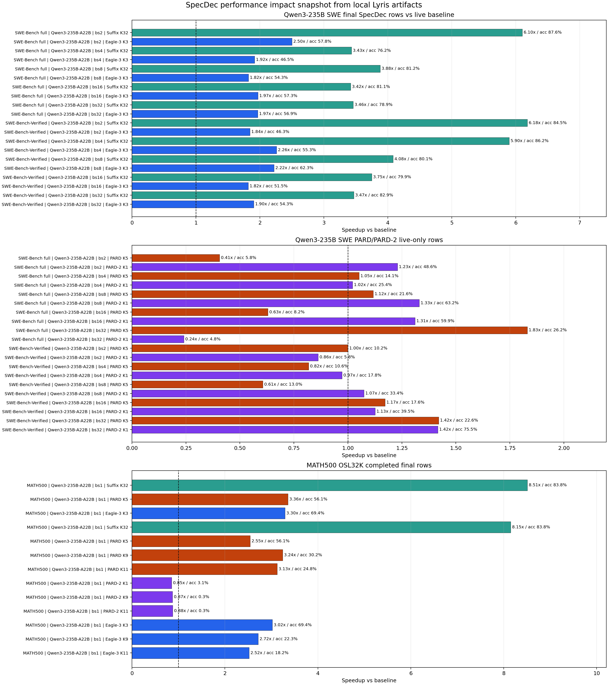

# Qwen3-235B SpecDec SWE/Math Status - 2026-06-13

## Current Read

- SWE-Bench full Suffix K32: 25.17-223.15 tok/s/GPU, 3.42x-6.10x, 76.24%-87.55% acceptance.
- SWE-Bench-Verified Suffix K32: 25.80-223.25 tok/s/GPU, 3.47x-6.18x, 79.92%-86.20% acceptance.
- SWE-Bench full Eagle-3 K3: 10.32-126.83 tok/s/GPU, 1.82x-2.50x, 46.47%-57.78% acceptance.
- SWE-Bench-Verified Eagle-3 K3: 7.69-122.58 tok/s/GPU, 1.82x-2.26x, 46.33%-62.34% acceptance.
- SWE-Bench full PARD K9/K11 final breakdown rows without matched final baseline: 6.18-71.81 tok/s/GPU, 10.43%-18.12% acceptance.
- SWE-Bench full PARD-2 K9/K11 final breakdown rows: 3.68-49.98 tok/s/GPU, 1.68%-5.09% acceptance.
- SWE PARD K5 live-only: 1.68-118.15 tok/s/GPU, 0.41x-1.83x, 5.80%-26.20% acceptance.
- SWE PARD-2 K1 live-only: 3.60-91.20 tok/s/GPU, 0.24x-1.42x, 4.80%-75.50% acceptance.
- Current Lyris K9/K11 sweep has 20 (PARD K9=10, PARD K11=10) PARD final rows and 20 (PARD-2 K9=10, PARD-2 K11=10) PARD-2 final rows; older PARD K5/PARD-2 K1 rows remain live telemetry only because `completed_batch_rows=0`.
- Suffix K32 remains the strongest completed Qwen3-235B SWE OSL32K setting with baseline-relative speedup, while newer Lyris K8/K16 Suffix, PARD K9, and Eagle-3 K9/K11 rows are arriving as final breakdowns but still need matched final baseline rows for speedup.
- Qwen3-235B MATH500 completed final rows: Suffix K32 batch 1 on Lyris: 15.98 tok/s/GPU, 83.79% acceptance, mean accept len 7.82; PARD K5 batch 1 on Lyris: 6.31 tok/s/GPU, 56.10% acceptance, mean accept len 3.80; Eagle-3 K3 batch 1 on Lyris: 6.19 tok/s/GPU, 69.42% acceptance, mean accept len 3.08; Suffix K32 batch 2 on Lyris: 32.18 tok/s/GPU, 88.71% acceptance, mean accept len 8.71; PARD K5 batch 2 on Lyris: 10.59 tok/s/GPU, 50.08% acceptance, mean accept len 3.50; Eagle-3 K3 batch 2 on Lyris: 12.00 tok/s/GPU, 69.74% acceptance, mean accept len 3.09; baseline batch 1 on OCI-HSG: 1.88 tok/s/GPU; Suffix K32 batch 1 on OCI-HSG: 15.31 tok/s/GPU, 83.79% acceptance, mean accept len 7.82; PARD K5 batch 1 on OCI-HSG: 4.78 tok/s/GPU, 56.10% acceptance, mean accept len 3.80; PARD K9 batch 1 on OCI-HSG: 6.10 tok/s/GPU, 30.22% acceptance, mean accept len 3.72; PARD K11 batch 1 on OCI-HSG: 5.87 tok/s/GPU, 24.85% acceptance, mean accept len 3.73; PARD-2 K1 batch 1 on OCI-HSG: 1.60 tok/s/GPU, 3.11% acceptance, mean accept len 1.03; PARD-2 K9 batch 1 on OCI-HSG: 1.64 tok/s/GPU, 0.33% acceptance, mean accept len 1.03; PARD-2 K11 batch 1 on OCI-HSG: 1.65 tok/s/GPU, 0.26% acceptance, mean accept len 1.03; Eagle-3 K3 batch 1 on OCI-HSG: 5.67 tok/s/GPU, 69.42% acceptance, mean accept len 3.08; Eagle-3 K9 batch 1 on OCI-HSG: 5.11 tok/s/GPU, 22.26% acceptance, mean accept len 3.00; Eagle-3 K11 batch 1 on OCI-HSG: 4.73 tok/s/GPU, 18.21% acceptance, mean accept len 3.00; Suffix K32 batch 2 on OCI-HSG: 28.72 tok/s/GPU, 86.04% acceptance, mean accept len 8.31; PARD K5 batch 2 on OCI-HSG: 10.40 tok/s/GPU, 50.08% acceptance, mean accept len 3.50; PARD K9 batch 2 on OCI-HSG: 12.30 tok/s/GPU, 32.55% acceptance, mean accept len 3.93; PARD K11 batch 2 on OCI-HSG: 12.76 tok/s/GPU, 29.98% acceptance, mean accept len 4.30; Eagle-3 K3 batch 2 on OCI-HSG: 10.94 tok/s/GPU, 69.74% acceptance, mean accept len 3.09; Eagle-3 K9 batch 2 on OCI-HSG: 10.66 tok/s/GPU, 24.31% acceptance, mean accept len 3.19; Eagle-3 K11 batch 2 on OCI-HSG: 9.01 tok/s/GPU, 17.81% acceptance, mean accept len 2.96.
- Qwen3-235B MATH500 OSL32K final coverage is partial; OCI-HSG fallback jobs are submitted (COMPLETED=7, FAILED=1, TIMEOUT=4). Jobs: baseline `3288484`, suffix_k32 `3288487`, pard_k5 `3288488`, official_pard2_k1 `3288490`, eagle3_k3 `3288491`, suffix_k32 `3288594`, pard_k9 `3288918`, official_pard2_k9 `3288922`, eagle3_k9 `3288926`, pard_k11 `3288919`, official_pard2_k11 `3288921`, eagle3_k11 `3288927`.
- OCI-HSG MATH500 live logger telemetry, not final breakdown and volatile by prompt: baseline 15.24 gen tok/s (gen n=5, spec n=0); pard_k5 16.40 gen tok/s (1.076x, 36.76% draft acceptance; gen n=5, spec n=5); official_pard2_k1 11.02 gen tok/s (0.723x, 1.44% draft acceptance; gen n=5, spec n=5); eagle3_k3 25.62 gen tok/s (1.681x, 69.96% draft acceptance; gen n=5, spec n=5); suffix_k32 88.70 gen tok/s (5.820x, 87.22% draft acceptance; gen n=5, spec n=5); pard_k9 16.72 gen tok/s (1.097x, 21.04% draft acceptance; gen n=5, spec n=5); official_pard2_k9 13.18 gen tok/s (0.865x, 0.22% draft acceptance; gen n=5, spec n=5); eagle3_k9 24.84 gen tok/s (1.630x, 28.90% draft acceptance; gen n=5, spec n=5); pard_k11 35.78 gen tok/s (2.348x, 19.72% draft acceptance; gen n=5, spec n=5); official_pard2_k11 13.26 gen tok/s (0.870x, 0.10% draft acceptance; gen n=5, spec n=5); eagle3_k11 17.70 gen tok/s (1.161x, 17.20% draft acceptance; gen n=5, spec n=5).
- Raw normalized CSV: `qwen235b_specdec_swe_math_status_20260613.csv`

## Qwen3-235B SWE Final/Provisional Rows

| Domain | Dataset | Model | Source | Batch | Method | Measurement | tok/s/GPU | Baseline tok/s/GPU | Speedup | Acceptance | Mean accept len | Job | State | Final rows |
| --- | --- | --- | --- | ---: | --- | --- | ---: | ---: | ---: | ---: | ---: | --- | --- | ---: |
| SWE OSL32K | SWE-Bench full | `Qwen/Qwen3-235B-A22B` | Lyris | 2 | Suffix K8 | final_breakdown_no_baseline | 23.39 |  |  | 86.50% | 6.44 |  |  | 1 |
| SWE OSL32K | SWE-Bench full | `Qwen/Qwen3-235B-A22B` | Lyris | 2 | Suffix K16 | final_breakdown_no_baseline | 25.44 |  |  | 87.55% | 7.43 |  |  | 1 |
| SWE OSL32K | SWE-Bench full | `Qwen/Qwen3-235B-A22B` | Lyris | 2 | Suffix K32 | final_spec_vs_live_baseline | 25.17 | 4.12 | 6.103x | 87.55% | 7.43 |  |  |  |
| SWE OSL32K | SWE-Bench full | `Qwen/Qwen3-235B-A22B` | Lyris | 2 | PARD K9 | final_breakdown_no_baseline | 6.18 |  |  | 16.25% | 2.46 |  |  | 1 |
| SWE OSL32K | SWE-Bench full | `Qwen/Qwen3-235B-A22B` | Lyris | 2 | PARD K11 | final_breakdown_no_baseline | 7.81 |  |  | 17.94% | 2.97 |  |  | 1 |
| SWE OSL32K | SWE-Bench full | `Qwen/Qwen3-235B-A22B` | Lyris | 2 | PARD-2 K9 | final_breakdown_no_baseline | 3.76 |  |  | 5.09% | 1.46 |  |  | 1 |
| SWE OSL32K | SWE-Bench full | `Qwen/Qwen3-235B-A22B` | Lyris | 2 | PARD-2 K11 | final_breakdown_no_baseline | 3.68 |  |  | 1.85% | 1.20 |  |  | 1 |
| SWE OSL32K | SWE-Bench full | `Qwen/Qwen3-235B-A22B` | Lyris | 2 | Eagle-3 K3 | final_spec_vs_live_baseline | 10.32 | 4.12 | 2.501x | 57.78% | 2.73 |  |  |  |
| SWE OSL32K | SWE-Bench full | `Qwen/Qwen3-235B-A22B` | Lyris | 2 | Eagle-3 K9 | final_breakdown_no_baseline | 8.54 |  |  | 19.15% | 2.72 |  |  | 1 |
| SWE OSL32K | SWE-Bench full | `Qwen/Qwen3-235B-A22B` | Lyris | 2 | Eagle-3 K11 | final_breakdown_no_baseline | 9.85 |  |  | 17.28% | 2.90 |  |  | 1 |
| SWE OSL32K | SWE-Bench full | `Qwen/Qwen3-235B-A22B` | Lyris | 4 | Suffix K8 | final_breakdown_no_baseline | 30.55 |  |  | 77.12% | 5.03 |  |  | 1 |
| SWE OSL32K | SWE-Bench full | `Qwen/Qwen3-235B-A22B` | Lyris | 4 | Suffix K16 | final_breakdown_no_baseline | 28.27 |  |  | 76.24% | 5.42 |  |  | 1 |
| SWE OSL32K | SWE-Bench full | `Qwen/Qwen3-235B-A22B` | Lyris | 4 | Suffix K32 | final_spec_vs_live_baseline | 27.97 | 8.15 | 3.432x | 76.24% | 5.42 |  |  |  |
| SWE OSL32K | SWE-Bench full | `Qwen/Qwen3-235B-A22B` | Lyris | 4 | PARD K9 | final_breakdown_no_baseline | 9.59 |  |  | 14.46% | 2.30 |  |  | 1 |
| SWE OSL32K | SWE-Bench full | `Qwen/Qwen3-235B-A22B` | Lyris | 4 | PARD K11 | final_breakdown_no_baseline | 11.80 |  |  | 12.88% | 2.42 |  |  | 1 |
| SWE OSL32K | SWE-Bench full | `Qwen/Qwen3-235B-A22B` | Lyris | 4 | PARD-2 K9 | final_breakdown_no_baseline | 7.10 |  |  | 1.83% | 1.16 |  |  | 1 |
| SWE OSL32K | SWE-Bench full | `Qwen/Qwen3-235B-A22B` | Lyris | 4 | PARD-2 K11 | final_breakdown_no_baseline | 7.30 |  |  | 1.68% | 1.19 |  |  | 1 |
| SWE OSL32K | SWE-Bench full | `Qwen/Qwen3-235B-A22B` | Lyris | 4 | Eagle-3 K3 | final_spec_vs_live_baseline | 15.62 | 8.15 | 1.917x | 46.47% | 2.39 |  |  |  |
| SWE OSL32K | SWE-Bench full | `Qwen/Qwen3-235B-A22B` | Lyris | 4 | Eagle-3 K9 | final_breakdown_no_baseline | 16.38 |  |  | 17.04% | 2.53 |  |  | 1 |
| SWE OSL32K | SWE-Bench full | `Qwen/Qwen3-235B-A22B` | Lyris | 4 | Eagle-3 K11 | final_breakdown_no_baseline | 14.25 |  |  | 12.41% | 2.37 |  |  | 1 |
| SWE OSL32K | SWE-Bench full | `Qwen/Qwen3-235B-A22B` | Lyris | 8 | Suffix K8 | final_breakdown_no_baseline | 56.81 |  |  | 81.41% | 5.55 |  |  | 1 |
| SWE OSL32K | SWE-Bench full | `Qwen/Qwen3-235B-A22B` | Lyris | 8 | Suffix K16 | final_breakdown_no_baseline | 62.96 |  |  | 81.19% | 6.84 |  |  | 1 |
| SWE OSL32K | SWE-Bench full | `Qwen/Qwen3-235B-A22B` | Lyris | 8 | Suffix K32 | final_spec_vs_live_baseline | 63.64 | 16.40 | 3.881x | 81.19% | 6.84 |  |  |  |
| SWE OSL32K | SWE-Bench full | `Qwen/Qwen3-235B-A22B` | Lyris | 8 | PARD K9 | final_breakdown_no_baseline | 19.98 |  |  | 18.12% | 2.63 |  |  | 1 |
| SWE OSL32K | SWE-Bench full | `Qwen/Qwen3-235B-A22B` | Lyris | 8 | PARD K11 | final_breakdown_no_baseline | 19.74 |  |  | 13.91% | 2.53 |  |  | 1 |
| SWE OSL32K | SWE-Bench full | `Qwen/Qwen3-235B-A22B` | Lyris | 8 | PARD-2 K9 | final_breakdown_no_baseline | 13.56 |  |  | 3.31% | 1.30 |  |  | 1 |
| SWE OSL32K | SWE-Bench full | `Qwen/Qwen3-235B-A22B` | Lyris | 8 | PARD-2 K11 | final_breakdown_no_baseline | 13.59 |  |  | 2.77% | 1.30 |  |  | 1 |
| SWE OSL32K | SWE-Bench full | `Qwen/Qwen3-235B-A22B` | Lyris | 8 | Eagle-3 K3 | final_spec_vs_live_baseline | 29.85 | 16.40 | 1.820x | 54.29% | 2.63 |  |  |  |
| SWE OSL32K | SWE-Bench full | `Qwen/Qwen3-235B-A22B` | Lyris | 8 | Eagle-3 K9 | final_breakdown_no_baseline | 30.44 |  |  | 18.86% | 2.70 |  |  | 1 |
| SWE OSL32K | SWE-Bench full | `Qwen/Qwen3-235B-A22B` | Lyris | 8 | Eagle-3 K11 | final_breakdown_no_baseline | 27.98 |  |  | 15.10% | 2.66 |  |  | 1 |
| SWE OSL32K | SWE-Bench full | `Qwen/Qwen3-235B-A22B` | Lyris | 16 | Suffix K8 | final_breakdown_no_baseline | 90.80 |  |  | 75.59% | 5.09 |  |  | 1 |
| SWE OSL32K | SWE-Bench full | `Qwen/Qwen3-235B-A22B` | Lyris | 16 | Suffix K16 | final_breakdown_no_baseline | 109.24 |  |  | 81.08% | 6.87 |  |  | 1 |
| SWE OSL32K | SWE-Bench full | `Qwen/Qwen3-235B-A22B` | Lyris | 16 | Suffix K32 | final_spec_vs_live_baseline | 110.07 | 32.20 | 3.418x | 81.08% | 6.87 |  |  |  |
| SWE OSL32K | SWE-Bench full | `Qwen/Qwen3-235B-A22B` | Lyris | 16 | PARD K9 | final_breakdown_no_baseline | 29.51 |  |  | 10.43% | 1.94 |  |  | 1 |
| SWE OSL32K | SWE-Bench full | `Qwen/Qwen3-235B-A22B` | Lyris | 16 | PARD K11 | final_breakdown_no_baseline | 35.14 |  |  | 10.83% | 2.19 |  |  | 1 |
| SWE OSL32K | SWE-Bench full | `Qwen/Qwen3-235B-A22B` | Lyris | 16 | PARD-2 K9 | final_breakdown_no_baseline | 25.38 |  |  | 2.06% | 1.19 |  |  | 1 |
| SWE OSL32K | SWE-Bench full | `Qwen/Qwen3-235B-A22B` | Lyris | 16 | PARD-2 K11 | final_breakdown_no_baseline | 25.51 |  |  | 1.78% | 1.20 |  |  | 1 |
| SWE OSL32K | SWE-Bench full | `Qwen/Qwen3-235B-A22B` | Lyris | 16 | Eagle-3 K3 | final_spec_vs_live_baseline | 63.42 | 32.20 | 1.970x | 57.29% | 2.72 |  |  |  |
| SWE OSL32K | SWE-Bench full | `Qwen/Qwen3-235B-A22B` | Lyris | 16 | Eagle-3 K9 | final_breakdown_no_baseline | 66.08 |  |  | 20.03% | 2.80 |  |  | 1 |
| SWE OSL32K | SWE-Bench full | `Qwen/Qwen3-235B-A22B` | Lyris | 16 | Eagle-3 K11 | final_breakdown_no_baseline | 60.85 |  |  | 16.57% | 2.82 |  |  | 1 |
| SWE OSL32K | SWE-Bench full | `Qwen/Qwen3-235B-A22B` | Lyris | 32 | Suffix K8 | final_breakdown_no_baseline | 101.19 |  |  | 72.68% | 4.90 |  |  | 1 |
| SWE OSL32K | SWE-Bench full | `Qwen/Qwen3-235B-A22B` | Lyris | 32 | Suffix K16 | final_breakdown_no_baseline | 220.88 |  |  | 78.86% | 6.46 |  |  | 1 |
| SWE OSL32K | SWE-Bench full | `Qwen/Qwen3-235B-A22B` | Lyris | 32 | Suffix K32 | final_spec_vs_live_baseline | 223.15 | 64.53 | 3.458x | 78.92% | 6.46 |  |  |  |
| SWE OSL32K | SWE-Bench full | `Qwen/Qwen3-235B-A22B` | Lyris | 32 | PARD K9 | final_breakdown_no_baseline | 71.81 |  |  | 17.21% | 2.55 |  |  | 1 |
| SWE OSL32K | SWE-Bench full | `Qwen/Qwen3-235B-A22B` | Lyris | 32 | PARD K11 | final_breakdown_no_baseline | 69.25 |  |  | 12.06% | 2.33 |  |  | 1 |
| SWE OSL32K | SWE-Bench full | `Qwen/Qwen3-235B-A22B` | Lyris | 32 | PARD-2 K9 | final_breakdown_no_baseline | 49.45 |  |  | 2.45% | 1.22 |  |  | 1 |
| SWE OSL32K | SWE-Bench full | `Qwen/Qwen3-235B-A22B` | Lyris | 32 | PARD-2 K11 | final_breakdown_no_baseline | 49.98 |  |  | 1.78% | 1.20 |  |  | 1 |
| SWE OSL32K | SWE-Bench full | `Qwen/Qwen3-235B-A22B` | Lyris | 32 | Eagle-3 K3 | final_spec_vs_live_baseline | 126.83 | 64.53 | 1.966x | 56.89% | 2.71 |  |  |  |
| SWE OSL32K | SWE-Bench full | `Qwen/Qwen3-235B-A22B` | Lyris | 32 | Eagle-3 K9 | final_breakdown_no_baseline | 108.23 |  |  | 18.25% | 2.64 |  |  | 1 |
| SWE OSL32K | SWE-Bench full | `Qwen/Qwen3-235B-A22B` | Lyris | 32 | Eagle-3 K11 | final_breakdown_no_baseline | 115.76 |  |  | 16.32% | 2.80 |  |  | 1 |
| SWE OSL32K | SWE-Bench-Verified | `Qwen/Qwen3-235B-A22B` | Lyris | 2 | Suffix K8 | final_breakdown_no_baseline | 19.95 |  |  | 83.58% | 5.76 |  |  | 1 |
| SWE OSL32K | SWE-Bench-Verified | `Qwen/Qwen3-235B-A22B` | Lyris | 2 | Suffix K16 | final_breakdown_no_baseline | 18.95 |  |  | 71.53% | 5.63 |  |  | 1 |
| SWE OSL32K | SWE-Bench-Verified | `Qwen/Qwen3-235B-A22B` | Lyris | 2 | Suffix K32 | final_spec_vs_live_baseline | 25.80 | 4.17 | 6.180x | 84.52% | 7.23 |  |  |  |
| SWE OSL32K | SWE-Bench-Verified | `Qwen/Qwen3-235B-A22B` | Lyris | 2 | PARD K9 | final_breakdown_no_baseline | 5.60 |  |  | 8.77% | 1.79 |  |  | 1 |
| SWE OSL32K | SWE-Bench-Verified | `Qwen/Qwen3-235B-A22B` | Lyris | 2 | PARD K11 | final_breakdown_no_baseline | 5.69 |  |  | 7.18% | 1.79 |  |  | 1 |
| SWE OSL32K | SWE-Bench-Verified | `Qwen/Qwen3-235B-A22B` | Lyris | 2 | PARD-2 K9 | final_breakdown_no_baseline | 3.77 |  |  | 1.68% | 1.15 |  |  | 1 |
| SWE OSL32K | SWE-Bench-Verified | `Qwen/Qwen3-235B-A22B` | Lyris | 2 | PARD-2 K11 | final_breakdown_no_baseline | 3.73 |  |  | 1.37% | 1.15 |  |  | 1 |
| SWE OSL32K | SWE-Bench-Verified | `Qwen/Qwen3-235B-A22B` | Lyris | 2 | Eagle-3 K3 | final_spec_vs_live_baseline | 7.69 | 4.17 | 1.843x | 46.33% | 2.39 |  |  |  |
| SWE OSL32K | SWE-Bench-Verified | `Qwen/Qwen3-235B-A22B` | Lyris | 2 | Eagle-3 K9 | final_breakdown_no_baseline | 10.23 |  |  | 21.98% | 2.98 |  |  | 1 |
| SWE OSL32K | SWE-Bench-Verified | `Qwen/Qwen3-235B-A22B` | Lyris | 2 | Eagle-3 K11 | final_breakdown_no_baseline | 7.62 |  |  | 12.49% | 2.37 |  |  | 1 |
| SWE OSL32K | SWE-Bench-Verified | `Qwen/Qwen3-235B-A22B` | Lyris | 4 | Suffix K8 | final_breakdown_no_baseline | 33.75 |  |  | 84.78% | 5.75 |  |  | 1 |
| SWE OSL32K | SWE-Bench-Verified | `Qwen/Qwen3-235B-A22B` | Lyris | 4 | Suffix K16 | final_breakdown_no_baseline | 48.99 |  |  | 86.20% | 7.62 |  |  | 1 |
| SWE OSL32K | SWE-Bench-Verified | `Qwen/Qwen3-235B-A22B` | Lyris | 4 | Suffix K32 | final_spec_vs_live_baseline | 48.66 | 8.25 | 5.898x | 86.20% | 7.62 |  |  |  |
| SWE OSL32K | SWE-Bench-Verified | `Qwen/Qwen3-235B-A22B` | Lyris | 4 | PARD K9 | final_breakdown_no_baseline | 9.80 |  |  | 10.52% | 1.95 |  |  | 1 |
| SWE OSL32K | SWE-Bench-Verified | `Qwen/Qwen3-235B-A22B` | Lyris | 4 | PARD K11 | final_breakdown_no_baseline | 9.11 |  |  | 9.95% | 2.09 |  |  | 1 |
| SWE OSL32K | SWE-Bench-Verified | `Qwen/Qwen3-235B-A22B` | Lyris | 4 | PARD-2 K9 | final_breakdown_no_baseline | 7.08 |  |  | 1.50% | 1.13 |  |  | 1 |
| SWE OSL32K | SWE-Bench-Verified | `Qwen/Qwen3-235B-A22B` | Lyris | 4 | PARD-2 K11 | final_breakdown_no_baseline | 7.07 |  |  | 1.42% | 1.16 |  |  | 1 |
| SWE OSL32K | SWE-Bench-Verified | `Qwen/Qwen3-235B-A22B` | Lyris | 4 | Eagle-3 K3 | final_spec_vs_live_baseline | 18.65 | 8.25 | 2.261x | 55.28% | 2.66 |  |  |  |
| SWE OSL32K | SWE-Bench-Verified | `Qwen/Qwen3-235B-A22B` | Lyris | 4 | Eagle-3 K9 | final_breakdown_no_baseline | 19.45 |  |  | 22.15% | 2.99 |  |  | 1 |
| SWE OSL32K | SWE-Bench-Verified | `Qwen/Qwen3-235B-A22B` | Lyris | 4 | Eagle-3 K11 | final_breakdown_no_baseline | 18.10 |  |  | 16.07% | 2.77 |  |  | 1 |
| SWE OSL32K | SWE-Bench-Verified | `Qwen/Qwen3-235B-A22B` | Lyris | 8 | Suffix K8 | final_breakdown_no_baseline | 66.12 |  |  | 81.39% | 5.43 |  |  | 1 |
| SWE OSL32K | SWE-Bench-Verified | `Qwen/Qwen3-235B-A22B` | Lyris | 8 | Suffix K16 | final_breakdown_no_baseline | 65.70 |  |  | 80.05% | 6.35 |  |  | 1 |
| SWE OSL32K | SWE-Bench-Verified | `Qwen/Qwen3-235B-A22B` | Lyris | 8 | Suffix K32 | final_spec_vs_live_baseline | 67.05 | 16.43 | 4.082x | 80.05% | 6.35 |  |  |  |
| SWE OSL32K | SWE-Bench-Verified | `Qwen/Qwen3-235B-A22B` | Lyris | 8 | PARD K9 | final_breakdown_no_baseline | 16.38 |  |  | 11.67% | 2.05 |  |  | 1 |
| SWE OSL32K | SWE-Bench-Verified | `Qwen/Qwen3-235B-A22B` | Lyris | 8 | PARD K11 | final_breakdown_no_baseline | 17.17 |  |  | 12.48% | 2.37 |  |  | 1 |
| SWE OSL32K | SWE-Bench-Verified | `Qwen/Qwen3-235B-A22B` | Lyris | 8 | PARD-2 K9 | final_breakdown_no_baseline | 13.85 |  |  | 1.89% | 1.17 |  |  | 1 |
| SWE OSL32K | SWE-Bench-Verified | `Qwen/Qwen3-235B-A22B` | Lyris | 8 | PARD-2 K11 | final_breakdown_no_baseline | 13.41 |  |  | 2.19% | 1.24 |  |  | 1 |
| SWE OSL32K | SWE-Bench-Verified | `Qwen/Qwen3-235B-A22B` | Lyris | 8 | Eagle-3 K3 | final_spec_vs_live_baseline | 36.46 | 16.43 | 2.220x | 62.34% | 2.87 |  |  |  |
| SWE OSL32K | SWE-Bench-Verified | `Qwen/Qwen3-235B-A22B` | Lyris | 8 | Eagle-3 K9 | final_breakdown_no_baseline | 30.97 |  |  | 18.93% | 2.70 |  |  | 1 |
| SWE OSL32K | SWE-Bench-Verified | `Qwen/Qwen3-235B-A22B` | Lyris | 8 | Eagle-3 K11 | final_breakdown_no_baseline | 29.32 |  |  | 15.69% | 2.73 |  |  | 1 |
| SWE OSL32K | SWE-Bench-Verified | `Qwen/Qwen3-235B-A22B` | Lyris | 16 | Suffix K8 | final_breakdown_no_baseline | 105.89 |  |  | 79.69% | 5.38 |  |  | 1 |
| SWE OSL32K | SWE-Bench-Verified | `Qwen/Qwen3-235B-A22B` | Lyris | 16 | Suffix K16 | final_breakdown_no_baseline | 124.25 |  |  | 79.92% | 6.52 |  |  | 1 |
| SWE OSL32K | SWE-Bench-Verified | `Qwen/Qwen3-235B-A22B` | Lyris | 16 | Suffix K32 | final_spec_vs_live_baseline | 124.50 | 33.23 | 3.747x | 79.92% | 6.52 |  |  |  |
| SWE OSL32K | SWE-Bench-Verified | `Qwen/Qwen3-235B-A22B` | Lyris | 16 | PARD K9 | final_breakdown_no_baseline | 33.72 |  |  | 13.76% | 2.24 |  |  | 1 |
| SWE OSL32K | SWE-Bench-Verified | `Qwen/Qwen3-235B-A22B` | Lyris | 16 | PARD K11 | final_breakdown_no_baseline | 32.50 |  |  | 10.99% | 2.21 |  |  | 1 |
| SWE OSL32K | SWE-Bench-Verified | `Qwen/Qwen3-235B-A22B` | Lyris | 16 | PARD-2 K9 | final_breakdown_no_baseline | 27.50 |  |  | 1.78% | 1.16 |  |  | 1 |
| SWE OSL32K | SWE-Bench-Verified | `Qwen/Qwen3-235B-A22B` | Lyris | 16 | PARD-2 K11 | final_breakdown_no_baseline | 26.54 |  |  | 1.80% | 1.20 |  |  | 1 |
| SWE OSL32K | SWE-Bench-Verified | `Qwen/Qwen3-235B-A22B` | Lyris | 16 | Eagle-3 K3 | final_spec_vs_live_baseline | 60.36 | 33.23 | 1.817x | 51.45% | 2.54 |  |  |  |
| SWE OSL32K | SWE-Bench-Verified | `Qwen/Qwen3-235B-A22B` | Lyris | 16 | Eagle-3 K9 | final_breakdown_no_baseline | 59.01 |  |  | 18.10% | 2.63 |  |  | 1 |
| SWE OSL32K | SWE-Bench-Verified | `Qwen/Qwen3-235B-A22B` | Lyris | 16 | Eagle-3 K11 | final_breakdown_no_baseline | 55.13 |  |  | 15.43% | 2.70 |  |  | 1 |
| SWE OSL32K | SWE-Bench-Verified | `Qwen/Qwen3-235B-A22B` | Lyris | 32 | Suffix K8 | final_breakdown_no_baseline | 170.08 |  |  | 82.01% | 5.77 |  |  | 1 |
| SWE OSL32K | SWE-Bench-Verified | `Qwen/Qwen3-235B-A22B` | Lyris | 32 | Suffix K16 | final_breakdown_no_baseline | 163.80 |  |  | 81.30% | 6.93 |  |  | 1 |
| SWE OSL32K | SWE-Bench-Verified | `Qwen/Qwen3-235B-A22B` | Lyris | 32 | Suffix K32 | final_spec_vs_live_baseline | 223.25 | 64.38 | 3.468x | 82.93% | 7.31 |  |  |  |
| SWE OSL32K | SWE-Bench-Verified | `Qwen/Qwen3-235B-A22B` | Lyris | 32 | PARD K9 | final_breakdown_no_baseline | 64.59 |  |  | 18.18% | 2.64 |  |  | 1 |
| SWE OSL32K | SWE-Bench-Verified | `Qwen/Qwen3-235B-A22B` | Lyris | 32 | PARD K11 | final_breakdown_no_baseline | 66.37 |  |  | 12.63% | 2.39 |  |  | 1 |
| SWE OSL32K | SWE-Bench-Verified | `Qwen/Qwen3-235B-A22B` | Lyris | 32 | PARD-2 K9 | final_breakdown_no_baseline | 48.05 |  |  | 3.18% | 1.29 |  |  | 1 |
| SWE OSL32K | SWE-Bench-Verified | `Qwen/Qwen3-235B-A22B` | Lyris | 32 | PARD-2 K11 | final_breakdown_no_baseline | 46.85 |  |  | 2.04% | 1.22 |  |  | 1 |
| SWE OSL32K | SWE-Bench-Verified | `Qwen/Qwen3-235B-A22B` | Lyris | 32 | Eagle-3 K3 | final_spec_vs_live_baseline | 122.58 | 64.38 | 1.904x | 54.29% | 2.63 |  |  |  |
| SWE OSL32K | SWE-Bench-Verified | `Qwen/Qwen3-235B-A22B` | Lyris | 32 | Eagle-3 K9 | final_breakdown_no_baseline | 116.16 |  |  | 19.23% | 2.73 |  |  | 1 |
| SWE OSL32K | SWE-Bench-Verified | `Qwen/Qwen3-235B-A22B` | Lyris | 32 | Eagle-3 K11 | final_breakdown_no_baseline | 114.66 |  |  | 15.95% | 2.75 |  |  | 1 |

## Qwen3-235B SWE PARD/PARD-2 Live Rows

| Domain | Dataset | Model | Source | Batch | Method | Measurement | tok/s/GPU | Baseline tok/s/GPU | Speedup | Acceptance | Mean accept len | Job | State | Final rows |
| --- | --- | --- | --- | ---: | --- | --- | ---: | ---: | ---: | ---: | ---: | --- | --- | ---: |
| SWE OSL32K | SWE-Bench full | `Qwen/Qwen3-235B-A22B` | Lyris | 2 | PARD K5 | live_only | 1.68 | 4.12 | 0.406x | 5.80% | 1.29 | `2109551` | `RUNNING` | 0 |
| SWE OSL32K | SWE-Bench full | `Qwen/Qwen3-235B-A22B` | Lyris | 2 | PARD-2 K1 | live_only | 5.08 | 4.12 | 1.230x | 48.60% | 1.49 | `2109552` | `RUNNING` | 0 |
| SWE OSL32K | SWE-Bench full | `Qwen/Qwen3-235B-A22B` | Lyris | 4 | PARD K5 | live_only | 8.57 | 8.15 | 1.052x | 14.10% | 1.71 | `2109556` | `RUNNING` | 0 |
| SWE OSL32K | SWE-Bench full | `Qwen/Qwen3-235B-A22B` | Lyris | 4 | PARD-2 K1 | live_only | 8.32 | 8.15 | 1.021x | 25.40% | 1.25 | `2109557` | `RUNNING` | 0 |
| SWE OSL32K | SWE-Bench full | `Qwen/Qwen3-235B-A22B` | Lyris | 8 | PARD K5 | live_only | 18.32 | 16.40 | 1.117x | 21.60% | 2.08 | `2109563` | `RUNNING` | 0 |
| SWE OSL32K | SWE-Bench full | `Qwen/Qwen3-235B-A22B` | Lyris | 8 | PARD-2 K1 | live_only | 21.82 | 16.40 | 1.331x | 63.20% | 1.63 | `2109564` | `RUNNING` | 0 |
| SWE OSL32K | SWE-Bench full | `Qwen/Qwen3-235B-A22B` | Lyris | 16 | PARD K5 | live_only | 20.27 | 32.20 | 0.630x | 8.20% | 1.41 | `2109572` | `RUNNING` | 0 |
| SWE OSL32K | SWE-Bench full | `Qwen/Qwen3-235B-A22B` | Lyris | 16 | PARD-2 K1 | live_only | 42.20 | 32.20 | 1.311x | 59.90% | 1.60 | `2109574` | `RUNNING` | 0 |
| SWE OSL32K | SWE-Bench full | `Qwen/Qwen3-235B-A22B` | Lyris | 32 | PARD K5 | live_only | 118.15 | 64.53 | 1.831x | 26.20% | 2.31 | `2109578` | `RUNNING` | 0 |
| SWE OSL32K | SWE-Bench full | `Qwen/Qwen3-235B-A22B` | Lyris | 32 | PARD-2 K1 | live_only | 15.55 | 64.53 | 0.241x | 4.80% | 1.05 | `2109579` | `RUNNING` | 0 |
| SWE OSL32K | SWE-Bench-Verified | `Qwen/Qwen3-235B-A22B` | Lyris | 2 | PARD K5 | live_only | 4.17 | 4.17 | 1.000x | 10.20% | 1.51 | `2109519` | `RUNNING` | 0 |
| SWE OSL32K | SWE-Bench-Verified | `Qwen/Qwen3-235B-A22B` | Lyris | 2 | PARD-2 K1 | live_only | 3.60 | 4.17 | 0.862x | 5.80% | 1.06 | `2109521` | `RUNNING` | 0 |
| SWE OSL32K | SWE-Bench-Verified | `Qwen/Qwen3-235B-A22B` | Lyris | 4 | PARD K5 | live_only | 6.75 | 8.25 | 0.818x | 10.60% | 1.53 | `2109528` | `RUNNING` | 0 |
| SWE OSL32K | SWE-Bench-Verified | `Qwen/Qwen3-235B-A22B` | Lyris | 4 | PARD-2 K1 | live_only | 8.03 | 8.25 | 0.973x | 17.80% | 1.18 | `2109530` | `RUNNING` | 0 |
| SWE OSL32K | SWE-Bench-Verified | `Qwen/Qwen3-235B-A22B` | Lyris | 8 | PARD K5 | live_only | 9.95 | 16.43 | 0.606x | 13.00% | 1.65 | `2109535` | `RUNNING` | 0 |
| SWE OSL32K | SWE-Bench-Verified | `Qwen/Qwen3-235B-A22B` | Lyris | 8 | PARD-2 K1 | live_only | 17.65 | 16.43 | 1.075x | 33.40% | 1.33 | `2109536` | `RUNNING` | 0 |
| SWE OSL32K | SWE-Bench-Verified | `Qwen/Qwen3-235B-A22B` | Lyris | 16 | PARD K5 | live_only | 38.95 | 33.23 | 1.172x | 17.60% | 1.88 | `2109540` | `RUNNING` | 0 |
| SWE OSL32K | SWE-Bench-Verified | `Qwen/Qwen3-235B-A22B` | Lyris | 16 | PARD-2 K1 | live_only | 37.42 | 33.23 | 1.126x | 39.50% | 1.40 | `2109541` | `RUNNING` | 0 |
| SWE OSL32K | SWE-Bench-Verified | `Qwen/Qwen3-235B-A22B` | Lyris | 32 | PARD K5 | live_only | 91.42 | 64.38 | 1.420x | 22.60% | 2.13 | `2109545` | `RUNNING` | 0 |
| SWE OSL32K | SWE-Bench-Verified | `Qwen/Qwen3-235B-A22B` | Lyris | 32 | PARD-2 K1 | live_only | 91.20 | 64.38 | 1.417x | 75.50% | 1.76 | `2109546` | `RUNNING` | 0 |

## MATH500 OSL32K Completed Rows

| Domain | Dataset | Model | Source | Batch | Method | Measurement | tok/s/GPU | Baseline tok/s/GPU | Speedup | Acceptance | Mean accept len | Job | State | Final rows |
| --- | --- | --- | --- | ---: | --- | --- | ---: | ---: | ---: | ---: | ---: | --- | --- | ---: |
| MATH500 OSL32K | MATH500 | `Qwen/Qwen3-235B-A22B` | Lyris | 1 | Suffix K32 | final_breakdown | 15.98 | 1.88 | 8.508x | 83.79% | 7.82 |  |  | 1 |
| MATH500 OSL32K | MATH500 | `Qwen/Qwen3-235B-A22B` | Lyris | 1 | PARD K5 | final_breakdown | 6.31 | 1.88 | 3.359x | 56.10% | 3.80 |  |  | 1 |
| MATH500 OSL32K | MATH500 | `Qwen/Qwen3-235B-A22B` | Lyris | 1 | Eagle-3 K3 | final_breakdown | 6.19 | 1.88 | 3.295x | 69.42% | 3.08 |  |  | 1 |
| MATH500 OSL32K | MATH500 | `Qwen/Qwen3-235B-A22B` | Lyris | 2 | Suffix K32 | final_breakdown | 32.18 |  |  | 88.71% | 8.71 |  |  | 1 |
| MATH500 OSL32K | MATH500 | `Qwen/Qwen3-235B-A22B` | Lyris | 2 | PARD K5 | final_breakdown | 10.59 |  |  | 50.08% | 3.50 |  |  | 1 |
| MATH500 OSL32K | MATH500 | `Qwen/Qwen3-235B-A22B` | Lyris | 2 | Eagle-3 K3 | final_breakdown | 12.00 |  |  | 69.74% | 3.09 |  |  | 1 |
| MATH500 OSL32K | MATH500 | `Qwen/Qwen3-235B-A22B` | OCI-HSG | 1 | baseline | final_breakdown | 1.88 | 1.88 | 1.000x |  |  |  |  | 1 |
| MATH500 OSL32K | MATH500 | `Qwen/Qwen3-235B-A22B` | OCI-HSG | 1 | Suffix K32 | final_breakdown | 15.31 | 1.88 | 8.147x | 83.79% | 7.82 |  |  | 1 |
| MATH500 OSL32K | MATH500 | `Qwen/Qwen3-235B-A22B` | OCI-HSG | 1 | PARD K5 | final_breakdown | 4.78 | 1.88 | 2.545x | 56.10% | 3.80 |  |  | 1 |
| MATH500 OSL32K | MATH500 | `Qwen/Qwen3-235B-A22B` | OCI-HSG | 1 | PARD K9 | final_breakdown | 6.10 | 1.88 | 3.245x | 30.22% | 3.72 |  |  | 1 |
| MATH500 OSL32K | MATH500 | `Qwen/Qwen3-235B-A22B` | OCI-HSG | 1 | PARD K11 | final_breakdown | 5.87 | 1.88 | 3.126x | 24.85% | 3.73 |  |  | 1 |
| MATH500 OSL32K | MATH500 | `Qwen/Qwen3-235B-A22B` | OCI-HSG | 1 | PARD-2 K1 | final_breakdown | 1.60 | 1.88 | 0.853x | 3.11% | 1.03 |  |  | 1 |
| MATH500 OSL32K | MATH500 | `Qwen/Qwen3-235B-A22B` | OCI-HSG | 1 | PARD-2 K9 | final_breakdown | 1.64 | 1.88 | 0.874x | 0.33% | 1.03 |  |  | 1 |
| MATH500 OSL32K | MATH500 | `Qwen/Qwen3-235B-A22B` | OCI-HSG | 1 | PARD-2 K11 | final_breakdown | 1.65 | 1.88 | 0.879x | 0.26% | 1.03 |  |  | 1 |
| MATH500 OSL32K | MATH500 | `Qwen/Qwen3-235B-A22B` | OCI-HSG | 1 | Eagle-3 K3 | final_breakdown | 5.67 | 1.88 | 3.019x | 69.42% | 3.08 |  |  | 1 |
| MATH500 OSL32K | MATH500 | `Qwen/Qwen3-235B-A22B` | OCI-HSG | 1 | Eagle-3 K9 | final_breakdown | 5.11 | 1.88 | 2.718x | 22.26% | 3.00 |  |  | 1 |
| MATH500 OSL32K | MATH500 | `Qwen/Qwen3-235B-A22B` | OCI-HSG | 1 | Eagle-3 K11 | final_breakdown | 4.73 | 1.88 | 2.519x | 18.21% | 3.00 |  |  | 1 |
| MATH500 OSL32K | MATH500 | `Qwen/Qwen3-235B-A22B` | OCI-HSG | 2 | Suffix K32 | final_breakdown | 28.72 |  |  | 86.04% | 8.31 |  |  | 1 |
| MATH500 OSL32K | MATH500 | `Qwen/Qwen3-235B-A22B` | OCI-HSG | 2 | PARD K5 | final_breakdown | 10.40 |  |  | 50.08% | 3.50 |  |  | 1 |
| MATH500 OSL32K | MATH500 | `Qwen/Qwen3-235B-A22B` | OCI-HSG | 2 | PARD K9 | final_breakdown | 12.30 |  |  | 32.55% | 3.93 |  |  | 1 |
| MATH500 OSL32K | MATH500 | `Qwen/Qwen3-235B-A22B` | OCI-HSG | 2 | PARD K11 | final_breakdown | 12.76 |  |  | 29.98% | 4.30 |  |  | 1 |
| MATH500 OSL32K | MATH500 | `Qwen/Qwen3-235B-A22B` | OCI-HSG | 2 | Eagle-3 K3 | final_breakdown | 10.94 |  |  | 69.74% | 3.09 |  |  | 1 |
| MATH500 OSL32K | MATH500 | `Qwen/Qwen3-235B-A22B` | OCI-HSG | 2 | Eagle-3 K9 | final_breakdown | 10.66 |  |  | 24.31% | 3.19 |  |  | 1 |
| MATH500 OSL32K | MATH500 | `Qwen/Qwen3-235B-A22B` | OCI-HSG | 2 | Eagle-3 K11 | final_breakdown | 9.01 |  |  | 17.81% | 2.96 |  |  | 1 |

Notes:

- `final_spec_vs_live_baseline` means the SpecDec row has a final breakdown, but the speedup uses live baseline telemetry until matching baseline final breakdown rows are collected.
- `live_only` means the job had telemetry but no final breakdown row in the latest local refresh.
- `final_breakdown` is a completed benchmark JSON row with speedup from the benchmark parser.
