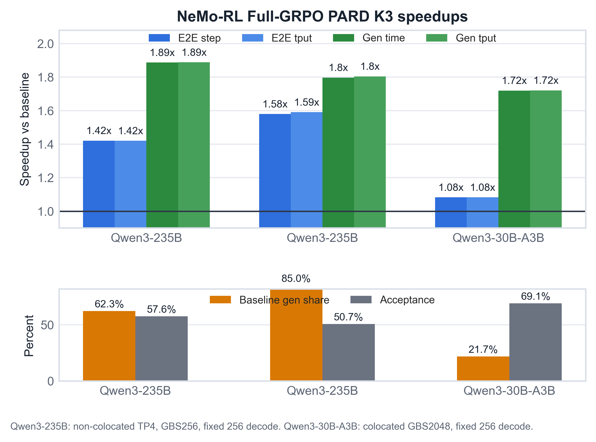
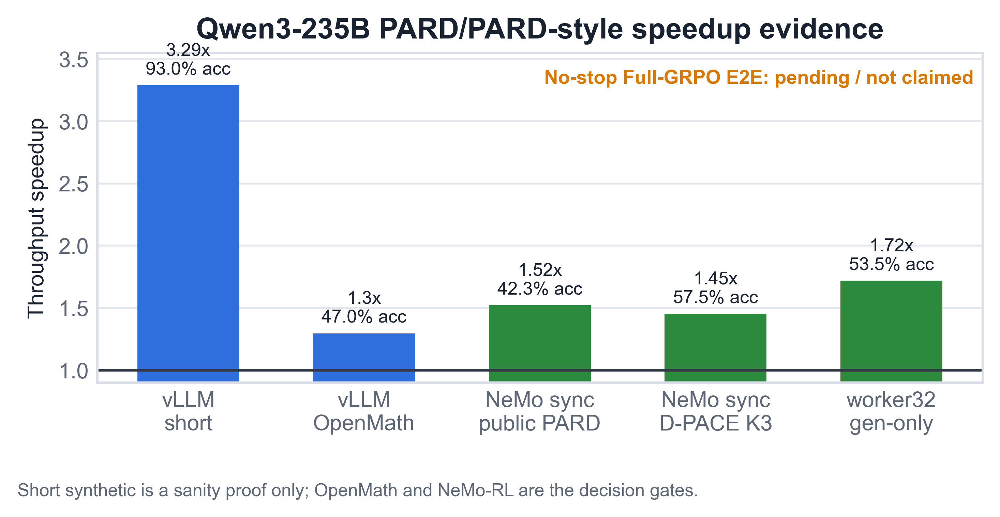
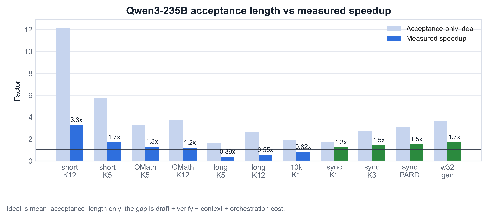

# Qwen3-235B Speculative Decoding Team Report

Date: 2026-06-06 PDT, latest update 2026-06-08 CEST / 2026-06-07 PDT

## Executive Summary

- PARD now shows real Qwen3-235B **NeMo-RL Full-GRPO E2E** benefit in the
  clean non-colocated TP4 branch under vLLM `0.20.0`. Public PARD K3 fixed
  `max_new_tokens=256` job `3209048` vs baseline `3209047`, Step 2-5, gives
  total-step speedup `1.421x`, E2E throughput speedup `1.420x`,
  generation-time speedup `1.887x`, and generation throughput speedup
  `1.888x`.
- The first decode-heavy ramp beyond fixed256 is also positive. Public PARD
  K3 fixed `max_new_tokens=1024` job `3209171` vs baseline `3209170`,
  Step 2-3, gives total-step speedup `1.580x`, E2E throughput speedup
  `1.591x`, generation-time speedup `1.797x`, and generation throughput
  speedup `1.804x` with `50.66%` Step2-3 acceptance.
- The realistic Qwen3-235B GBS512 fixed256 gate is now completed. Public PARD
  K5 job `3212209` vs baseline `3212012`, Step 2-5, gives total-step speedup
  `1.810x`, E2E throughput speedup `1.815x`, generation-time speedup `2.285x`,
  generation-worker throughput speedup `2.287x`, and `43.08%` acceptance.
- Standalone OpenMath batch64/128 and NeMo-RL GBS512 do not pick the same K:
  standalone OpenMath favors K3, while NeMo-RL GBS512 still favors K5. The
  dynamic-K medium16 run `3213606` completed without OOM but was K3-like and
  slower than static K5.
- The Qwen3-235B result is still not an 8K/16K long-output result. The
  fixed1024 run uses GBS `256`, generation TP `4`, draft TP `4`,
  `max_model_len=8192`, and non-colocated generation resources: 32 training
  nodes plus 4 generation-only nodes.
- Qwen3-30B-A3B GBS2048 also completed a 20-step PARD K3 pair. Step 2-20 gives
  generation-time speedup `1.719x` but E2E throughput speedup only `1.083x`
  because baseline generation is only `21.7%` of total step time.
- 8K/16K generation length is not yet a stable Qwen3-235B Full-GRPO result.
  The Qwen3-30B-A3B long-OSL diagnostic produced a positive Step 1 result but
  then failed in the vLLM sleep/wake CuMem path.
- DFlash is not promoted: runtime was made to work, but the current
  Qwen3-235B OpenMath checkpoint acceptance is near zero.

## Full-GRPO Result Summary

| Model | Shape | Jobs | Window | Step speedup | E2E tput speedup | Gen-time speedup | Gen tput speedup | Acceptance | Baseline gen share |
| --- | --- | --- | --- | --- | --- | --- | --- | --- | --- |
| Qwen3-235B-A22B | noncolocated_tp4_32train_4gen | 3209047 -> 3209048 | step2-5 | 1.421x | 1.420x | 1.887x | 1.888x | 57.58% | 62.29% |
| Qwen3-235B-A22B | noncolocated_tp4_32train_4gen | 3209170 -> 3209171 | step2-3 | 1.580x | 1.591x | 1.797x | 1.804x | 50.66% | 85.05% |
| Qwen3-235B-A22B | noncolocated_tp4_32train_4gen_gbs512 | 3212012 -> 3212209 | step2-5 | 1.810x | 1.815x | 2.285x | 2.287x | 43.08% | 75.16% |
| Qwen3-235B-A22B | noncolocated_tp4_32train_4gen_gbs512_dynamic_k5cap3_medium16 | 3212012 -> 3213606 | step2-5 | 1.565x | 1.575x | 1.907x | 1.908x | 56.83% | 75.16% |
| Qwen3-30B-A3B | colocated_4n4g_gbs2048 | 3207492 -> 3207978 | step2-20 | 1.083x | 1.083x | 1.719x | 1.720x | 69.10% | 21.74% |

## Current Evidence

| Area | Best / Status | Evidence | Decision |
| --- | --- | --- | --- |
| Qwen3-235B no-stop Full-GRPO | non-colocated TP4 public PARD K3 fixed256 and fixed1024 | Fixed256 `3209048` vs `3209047`, Step 2-5: total-step `1.421x`, E2E throughput `1.420x`, generation-time `1.887x`; fixed1024 `3209171` vs `3209170`, Step 2-3: total-step `1.580x`, E2E throughput `1.591x`, generation-time `1.797x`. | Clean Qwen3-235B Full-GRPO E2E win, now reproduced at fixed1024. Non-colocated generation avoids colocated TP4 host-memory OOM and keeps generation TP4. |
| Qwen3-235B GBS512 fixed256 | public PARD K5 `3212209` vs baseline `3212012` | Step 2-5: total-step `1.810x`, E2E throughput `1.815x`, generation-time `2.285x`, generation-worker throughput `2.287x`, acceptance `43.08%`; no OOM. | Current validated NeMo-RL GBS512 default. K3 and medium16 dynamic-K completed but are slower than K5. |
| Qwen3-235B standalone OpenMath high-batch | public PARD K3 | Batch64: `1.308x`, `57.82%`; batch128: `1.244x`, `58.30%`. | Use K3 as standalone high-batch OpenMath winner. Do not infer it beats K5 inside NeMo-RL GBS512. |
| Qwen3-30B-A3B Full-GRPO GBS2048 | public PARD K3 `3207978` vs baseline `3207492` | Step 2-20: total-step `1.083x`, E2E throughput `1.083x`, generation-time `1.719x`, generation throughput `1.720x`, acceptance `69.10%` | Generation improves strongly, but E2E is limited by low generation fraction. |
| vLLM standalone short synthetic | PARD K=12 bs32 | 3.290x, 92.95% acceptance | Useful sanity proof only; not representative of OpenMath or RL. |
| vLLM standalone OpenMath current local | local_pard_k5_dpace_draft_ce_2048_gate | job 3190567; 1.296x, 47.01% acceptance | Promote 2K dynamic D-PACE K5 as the current local checkpoint gate. |
| NeMo-RL latest-main vLLM0.20 generation-only | public_pard_k5 job 3197509 | 1.591x generation throughput only, 42.17% acceptance, mean accepted length 3.108 | Version-skew control was positive and led to the Full-GRPO non-colocated TP4 validation branch. |
| DFlash | DFlash K3 bs1 | max observed acceptance 1.22% | Do not promote current checkpoint; training/alignment issue, not runtime priority. |

## Figures







## Operability Status

| Area | Status | Evidence |
| --- | --- | --- |
| Qwen3-235B no-stop Full-GRPO E2E | proven_positive_noncolocated_tp4 | `3209048` vs `3209047`, Step 2-5, E2E throughput `1.420x`, total step-time `1.421x`, generation-time `1.887x`, acceptance `57.58%`; fixed1024 `3209171` vs `3209170`, Step 2-3, E2E throughput `1.591x`, total step-time `1.580x`, generation-time `1.797x`, acceptance `50.66%`. |
| Qwen3-30B-A3B GBS2048 Full-GRPO | completed_positive_generation | `3207978` vs `3207492`, Step 2-20, generation-time `1.719x` and E2E throughput `1.083x`. |
| Historical Qwen3-235B colocated TP4 Full-GRPO attempts | superseded_by_noncolocated_tp4_result | Earlier attempts failed through reference-logprob, packed-loss, vLLM wake-up, or Ray host-memory paths. The positive branch separates generation workers onto 4 generation-only nodes. |
| TP8 colocated probe | partial_positive_cross_node_tp | `3208891` showed Step 2-4 E2E throughput `1.133x` and generation-time `1.587x` vs TP8 baseline, but Step 5 ended with ActorDied/NCCL timeout signatures. |
| Long OSL 8K/16K | not_yet_stable_for_qwen235b_fullgrpo | Qwen3-30B-A3B long-OSL Step 1 was positive, but Step 2 hit vLLM sleep/wake CuMem OOM; Qwen3-235B long-OSL is still open. |

## vLLM Runtime Versions

| Path | vLLM version | Runtime | Implication |
| --- | --- | --- | --- |
| Qwen3-235B vLLM standalone PARD / OpenMath / high-batch gates | v0.20.2 | vllm-hsg-ultra-rl-v0.20.2-nemo-speed-pr24.sqsh | Standalone numbers are from a newer vLLM engine than most NeMo-RL runs; do not treat them as version-identical. |
| Qwen3-235B NeMo-RL latest-main/nightly public PARD Full-GRPO | 0.20.0 worker venv | /opt/ray_venvs inside nemo_rl_nightly_20260606.sqsh; driver /opt/nemo_rl_venv | Positive no-stop Full-GRPO results are fixed256 `3209048` vs `3209047` and fixed1024 `3209171` vs `3209170` under non-colocated TP4. |
| Qwen3-235B NeMo-RL sync generation / older PARD-style validation | 0.17.0 extracted site | /lustre/fsw/portfolios/coreai/users/sna/qwen3_235b_eagle3/python_site/vllm_0_17_0_extract_py312 | Historical generation-path validation; current clean Full-GRPO result uses latest-main/nightly vLLM 0.20.0. |
| DFlash support track | 0.19.1rc1.dev315+g0b790a250.d20260606 | vllm_dflash_pr38300_0b790a2_cu129_torch28nv_source_py312 | Separate DFlash runtime proof only; not the current PARD/PARD-2-style baseline. |

## Why Acceptance Alone Was Misleading

- High K1 acceptance does not guarantee speedup. The decode-heavy 10k K1
  case has `93.59%` acceptance but only `0.823x` throughput because one
  drafted token cannot amortize draft plus verify plus long-context cost.
- OpenMath reduces accepted length relative to short synthetic prompts. The
  public PARD K5 bs32 mean accepted length drops from `5.775` on short
  synthetic to `3.276` on OpenMath.
- Long-context verification is the strongest standalone failure mode: PARD
  K5 at `ISL=10000/OSL=1000` has nonzero acceptance but only `0.392x`
  throughput.

## Method Decisions

| Method | Current decision |
| --- | --- |
| PARD | Primary runtime substrate and public baseline; now positive for Qwen3-235B Full-GRPO fixed256 and fixed1024 under non-colocated TP4. |
| PARD-2 / CAT | Continue local CAT/D-PACE approximations; official code/checkpoints are not public yet. |
| Dynamic K / load-aware gating | Runtime hooks work, but the first GBS512 medium16 policy is slower than static K5. Preserve K5 in dense NeMo-RL GBS512 and use K3 only where measurements show K5 waste. |
| Dynamic D-PACE | Current local candidate: K5 for OpenMath standalone, K3 for NeMo-RL sync generation. |
| DFlash | Do not run NeMo-RL until held-out OpenMath acceptance improves beyond the current near-zero acceptance. |
| P-EAGLE | Track only; no ready Qwen3-235B pretrained path in this stack. |
| SpecKV/adaptive-K | Follow-up after fixed256/fixed1024 success; focus on long/decode-heavy stability and adaptive K. |
| MoE-specific verification | Systems follow-up for long-context Qwen3-235B and non-colocated resource efficiency. |

## Completion Audit

| Requirement | Status | Gap |
| --- | --- | --- |
| Find Qwen3-235B SpecDec methods that can show performance benefit | met_for_fixed256_fixed1024_and_gbs512_fullgrpo | Public PARD shows Qwen3-235B Full-GRPO E2E speedup under non-colocated TP4 at fixed256, fixed1024, and GBS512 fixed256. 8K/16K Qwen3-235B remains open. |
| Start from PARD/PARD-2 and recent 2025-2026 methods | met_for_triage | Official PARD-2 code/checkpoints are still not public in AMD-AGI/PARD. |
| Make a Qwen3-235B method work in vLLM standalone | partially_met | OpenMath high-batch K3 is positive at batch64/128, but K1 and long-context/decode-heavy settings can still be slower despite high acceptance. |
| Incorporate methods into NeMo-RL and test actual performance | met_for_public_pard_fixed256_fixed1024_gbs512 | Qwen3-235B non-colocated TP4 fixed256/fixed1024/GBS512 and Qwen3-30B-A3B GBS2048 all have parsed Full-GRPO timing metrics. |
| Avoid repetitive failures by documenting negative evidence | met_for_current_evidence | Colocated TP4 host-memory OOM, TP8 cross-node caveat, and long-OSL CuMem sleep/wake failures are documented. |
| Recover Qwen3-235B/Qwen3-30B-A3B MoE Full-GRPO path | met_for_current_shapes | Qwen3-235B non-colocated TP4 completed fixed256 5 timing steps and fixed1024 3 timing steps; Qwen3-30B-A3B GBS2048 completed 20 timing steps. |
| Full objective completion | not_complete | Fixed256 and fixed1024 PARD results are positive, but the broader objective still includes recent-method exploration and 8K/16K Qwen3-235B behavior. |

## Operational Runbook

- Latest Qwen3-235B status: `docs/qwen3_235b_latest_main_current_fullgrpo_status_20260607.md`
- Machine-readable final summary: `docs/qwen3_pard_nemorl_fullgrpo_final_summary_20260607.csv`
- Current remote poll command for the latest completed result set:

```bash
ssh oci-hsg-cs-001-vscode-02 'sacct -j 3209047,3209048,3209170,3209171,3212012,3212209,3212919,3213606,3207978,3208891 -o JobID,JobName%80,State,Elapsed,ExitCode -P'
```

## Resume Commands

Local refresh:

```bash
scripts/refresh_qwen235b_report_bundle.sh
```

## Primary Sources

- PARD repo: https://github.com/AMD-AGI/PARD
- PARD vLLM path: https://docs.vllm.ai/en/v0.20.0/features/speculative_decoding/parallel_draft_model/
- PARD-2: https://arxiv.org/abs/2605.08632
- DFlash: https://arxiv.org/abs/2602.06036
- vLLM DFlash docs: https://docs.vllm.ai/projects/speculators/en/latest/user_guide/algorithms/dflash/
- vLLM P-EAGLE docs: https://docs.vllm.ai/projects/speculators/en/latest/user_guide/algorithms/peagle/
