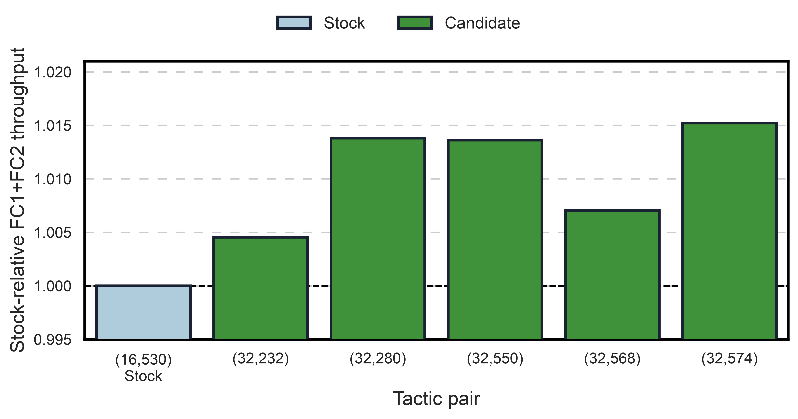

# MXFP8 MoE Tactic Audit

## END-TO-END AUDIT COMPLETE: NO PROMOTION

The production-prepacked Qwen3-30B-A3B MXFP8 expert FC1/FC2 path was replayed with CUDA Graphs enabled. Eight representative routing profiles cover 95.31% of sampled MoE GPU time. The audit measured all 920 legal FC1/FC2 tactic pairs for every selected profile, producing 7,360 successful rows.

All rows were finite and deterministic, with `max_abs_error=0` and cosine similarity between 0.99999988 and 1.00000012. These checks establish micro-kernel numerical agreement for the replayed tensors; they are not a GSM8K or end-to-end accuracy claim.

The final same-job comparison repeated stock `(16,530)` and the five strongest common candidates 50 times per profile. Candidate `(32,574)` was the best stable direction: aggregate trace-weighted FC1+FC2 time improved by 1.52%, the binding lower weighted-median gain was 1.22%, and no profile regressed. It did not pass promotion because the required weighted-median gain is 2% and its maximum CV was 3.74%, above the 3% limit.

## Same-Run Candidate Comparison

| Tactic pair | Aggregate kernel throughput | Weighted-median gain | Maximum CV | Maximum profile regression | Decision |
| --- | ---: | ---: | ---: | ---: | --- |
| `(16,530)` stock | 1.0000x | 0.00% | 4.70% | 0.00% | Baseline |
| `(32,232)` | 1.0045x | 0.02% | 3.22% | 1.77% | Reject |
| `(32,280)` | 1.0138x | 1.25% | 28.34% | 0.88% | Reject |
| `(32,550)` | 1.0136x | 1.25% | 40.86% | 0.88% | Reject |
| `(32,568)` | 1.0070x | 0.00% | 3.75% | 0.46% | Reject |
| `(32,574)` | 1.0152x | 1.22% | 3.74% | 0.00% | Reject |

The metric above is `weighted stock FC1+FC2 time / weighted candidate FC1+FC2 time`; it is a kernel-level ratio, not NeMo-RL generation throughput.

## Experimental Runtime A/B

The unqualified `(32,574)` direction was nevertheless evaluated in two matched NeMo-RL A/B repetitions to quantify its end-to-end opportunity. The candidate runtime bundle changed exactly one FlashInfer TRTLLM MoE cache leaf: the 128-token bucket used FC1 tactic `32` and FC2 tactic `574` instead of stock tactics `16` and `578`. Every other cache entry and runtime input was identical.

Both arms used Qwen3-30B-A3B, 16 GB200 GPUs across four nodes, vLLM 0.25.1, FlashInfer 0.6.13, CUDA Graphs enabled, 64 prompts times 32 generations, and a maximum sequence length of 4,096. Steps 3--8 generated exactly 47,752,694 tokens per arm in each repetition.

| Repetition | Generation tok/s/GPU | E2E tok/s/GPU | Total step time |
| --- | ---: | ---: | ---: |
| `r9` | 9,675.84 -> 9,761.53 (**+0.89%**) | 2,444.87 -> 2,443.09 (**-0.07%**) | 208.93 s -> 209.08 s (**+0.07%**, worse) |
| `r11` | 9,810.32 -> 9,834.67 (**+0.25%**) | 2,437.63 -> 2,443.78 (**+0.25%**) | 209.55 s -> 209.04 s (**-0.24%**, better) |
| Aggregate | 9,743.08 -> 9,798.10 (**+0.56%**) | 2,441.25 -> 2,443.43 (**+0.09%**) | 209.24 s -> 209.06 s (**-0.09%**, better) |

The lookup increased generation-only throughput by 0.56%, but the whole RL step improved by only 0.09%. The generation gain is below the measured 0.98% maximum run-to-run variation. Therefore, this result does not establish a repeatable production benefit.

## Execution Record

| Stage | Job | Result |
| --- | ---: | --- |
| Routing trace and prepacked capture | `2549878` | Artifacts captured; job later failed during teardown because the driver environment lacked `megatron` |
| Full 920-pair audit | `2550024` | All 7,360 JSONL rows completed; job canceled only after raw data completion while NSys finalization remained active |
| Top-five repeat run | `2550079` | All 40 JSONL rows completed; superseded by the stock-inclusive run |
| Stock plus top-five, 50 repeats | `2550086` | Completed successfully, 48/48 rows |
| Runtime A/B repetition `r9` | `2551257`, `2551259` | All eight training steps completed; evidence recovered after the original postprocessor rejected nested token masks |
| Runtime A/B repetition `r11` | `2551503`, `2551505` | Both stock and candidate jobs completed successfully |

## Qualification Status

- Weighted-gain gate: at least 2%.
- Stability gate: maximum CV at most 3%.
- Regression gate: no high-weight profile may regress by more than 1%.
- Result: no candidate passed every gate; do not enable an FC1/FC2 tactic override.
- Experimental end-to-end result: generation `+0.56%`, E2E `+0.09%`, and total step time `-0.09%`; all are below the observed run-to-run variation.
- Replayed-tensor numerical checks passed, but no new matched GSM8K run was performed for this unqualified candidate.
- Final decision: retain stock FlashInfer FC1/FC2 tactic selection for this workload.

Machine-readable summaries: [micro audit](mxfp8_moe_tactic_micro_audit_20260808.json) and [runtime A/B](mxfp8_moe_tactic_runtime_ab_20260809.json).
