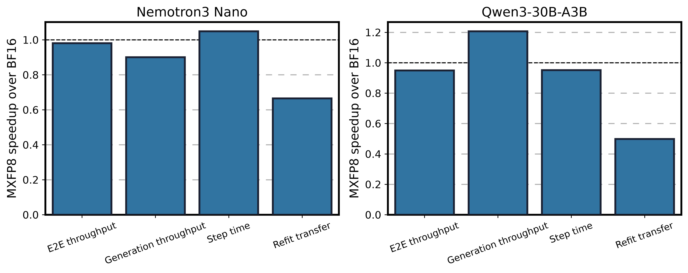

# Synchronous colocated BF16 versus MXFP8 rollout

## Method

This A/B keeps policy training in BF16 and changes only the vLLM rollout model
between BF16 and routed-expert-only MXFP8. Both arms run synchronous GRPO,
colocate training and generation, update weights through the legacy CUDA
IPC/ZMQ path, use FlashInfer TRTLLM for MoE, and enable vLLM CUDA Graphs. Runtime
logs confirm vLLM 0.25.1 and successful `FULL_AND_PIECEWISE` graph capture.

Qwen3-30B-A3B uses 16 GB200 GPUs. Nemotron3 Nano uses 32 GB200 GPUs. Each run
has 20 training steps; the tables exclude warm-up step 1. Throughput is computed
as total processed tokens divided by total measured time and GPU count over
steps 2-20. Latencies are arithmetic means over the same steps.

The Qwen recipes intentionally use different policy-ratio settings. The BF16
arm sets `force_on_policy_ratio=true`, while MXFP8 uses importance-sampling
correction because the quantized rollout policy differs from the BF16 training
policy. This is a correctness-compatible RL comparison, not an isolated kernel
benchmark.

## Results

### Qwen3-30B-A3B

| Metric | BF16 rollout | MXFP8 rollout | MXFP8 change |
|---|---:|---:|---:|
| E2E throughput (tokens/s/GPU) | 2,384.96 | 2,264.43 | -5.1% |
| Generation throughput (tokens/s/GPU) | 6,440.88 | 7,776.00 | +20.7% |
| Total step time (s) | 174.04 | 182.96 | +5.1% |
| Generation time (s) | 64.44 | 53.28 | -17.3% |
| Policy and reference logprob time (s) | 19.61 | 36.64 | +86.8% |
| Policy training time (s) | 78.00 | 78.03 | +0.0% |
| Refit total time (s) | 6.22 | 9.75 | +56.8% |
| Refit transfer and update time (s) | 3.46 | 6.95 | +100.7% |

The two arms process nearly the same token count: the MXFP8 mean is only 0.2%
lower. MXFP8 therefore shows a real generation gain, but the extra BF16 policy
logprob pass required for importance-sampling correction and the MXFP8 refit
conversion cost more than the generation stage saves.

### Nemotron3 Nano

| Metric | BF16 rollout | MXFP8 rollout | MXFP8 change |
|---|---:|---:|---:|
| E2E throughput (tokens/s/GPU) | 35.06 | 34.38 | -1.9% |
| Generation throughput (tokens/s/GPU) | 62.36 | 56.16 | -9.9% |
| Total step time (s) | 44.14 | 42.07 | -4.7% |
| Generation time (s) | 24.81 | 25.76 | +3.8% |
| Policy and reference logprob time (s) | 4.55 | 3.02 | -33.6% |
| Policy training time (s) | 3.49 | 2.84 | -18.6% |
| Refit total time (s) | 5.19 | 4.99 | -3.8% |
| Refit transfer and update time (s) | 1.79 | 2.70 | +50.3% |

The MXFP8 arm generates 6.5% fewer total tokens, so its 4.7% shorter raw step
time is not an E2E speedup. Token-normalized throughput is 1.9% lower, and
generation throughput is 9.9% lower. The refit transfer regression is the most
repeatable stage-level loss.

Values above 1.0 in the figure favor MXFP8. Throughput uses MXFP8/BF16; latency
uses BF16/MXFP8.

## Correctness and conclusion

All recorded scalar metrics are finite. Qwen mean rewards are close (0.526
BF16, 0.528 MXFP8), but 20 steps are not a convergence or accuracy gate.
Generation KL is higher with MXFP8 for both models: 0.00189 to 0.00398 on Qwen
and 0.00243 to 0.00491 on Nano. Policy KL contains large outliers, so its mean
is not suitable for an A/B claim.

The current MXFP8 path is useful at the generation stage for Qwen, but neither
model shows an E2E RL throughput improvement in this synchronous colocated
configuration. The next high-confidence optimization is to profile and reduce
MXFP8 packing, conversion, and synchronization inside the CUDA IPC weight
transfer. Nano also needs a matched-token generation profile because its
generation path regresses even with FlashInfer TRTLLM and CUDA Graphs active.

Machine-readable values are in [summary.csv](summary.csv) and
[comparison.csv](comparison.csv).
